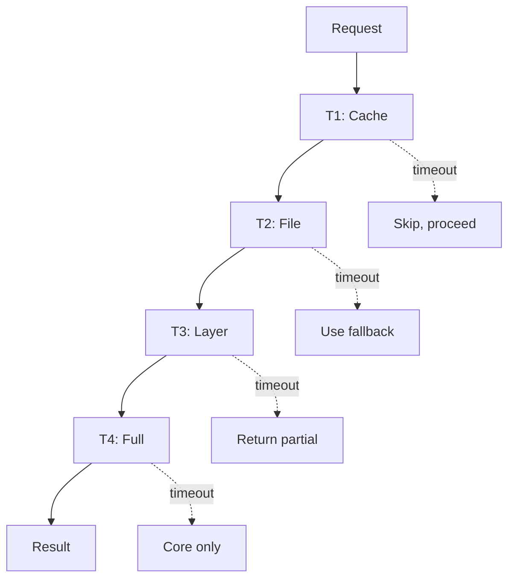

# SAGE Timeout Hierarchy

> SAGE Knowledge Base specific timeout configuration (T1-T5 levels)
>
> For universal timeout patterns, see `.knowledge/frameworks/resilience/TIMEOUT_PATTERNS.md`

---

## Table of Contents

- [1. Five-Level Hierarchy](#1-five-level-hierarchy)
- [2. Timeout Flow](#2-timeout-flow)
- [3. Fallback Strategies](#3-fallback-strategies)
- [4. Configuration](#4-configuration)
- [5. Implementation Guidelines](#5-implementation-guidelines)

---

## 1. Five-Level Hierarchy

| Level  | Name    | Timeout | Scope        | Fallback        |
|:-------|:--------|:--------|:-------------|:----------------|
| **T1** | Cache   | 100ms   | Cache lookup | Skip cache      |
| **T2** | File    | 500ms   | Single file  | Use fallback    |
| **T3** | Layer   | 2s      | Full layer   | Partial load    |
| **T4** | Full    | 5s      | Complete KB  | Core only       |
| **T5** | Complex | 10s     | Analysis     | Abort + summary |

---

## 2. Timeout Flow



---

## 3. Fallback Strategies

| Situation        | Action                 |
|:-----------------|:-----------------------|
| Cache miss       | Proceed to file        |
| File timeout     | Use embedded fallback  |
| Layer timeout    | Return loaded portion  |
| Full timeout     | Return core principles |
| Analysis timeout | Return summary         |

---

## 4. Configuration

```yaml
timeout:
  operations:
    cache_lookup: 100ms    # T1
    file_read: 500ms       # T2
    layer_load: 2s         # T3
    full_load: 5s          # T4
    analysis: 10s          # T5
  fallback:
    strategy: graceful     # graceful | strict | none
    cache_stale_ms: 60000  # Use stale cache up to 60s
```

---

## 5. Implementation Guidelines

| Guideline            | Application           |
|:---------------------|:----------------------|
| Always set timeouts  | Every external call   |
| Use appropriate tier | Match operation scope |
| Implement fallbacks  | Every timeout path    |
| Log timeouts         | For monitoring        |
| Test timeouts        | Include in test suite |

**Golden Rule**: Always return something, never hang.

---

## Related

- `.knowledge/frameworks/resilience/TIMEOUT_PATTERNS.md` — **Authoritative** universal timeout and resilience patterns
- `.knowledge/core/DEFAULTS.md` — **Authoritative** default timeout values reference
- `config/sage.yaml` — SAGE runtime timeout settings

---

*AI Collaboration Knowledge Base*
