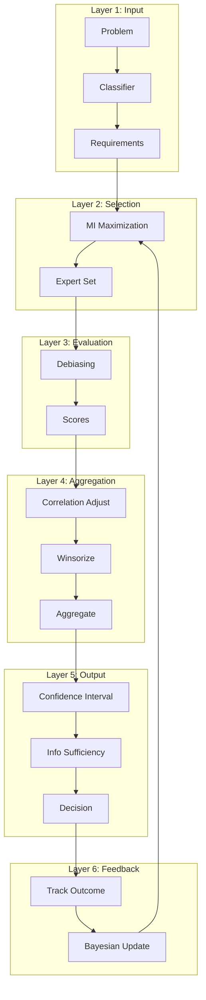

# Expert Committee 3.0 Roadmap

> Architecture evolution and implementation roadmap for dynamic optimization

---

## Table of Contents

- [1. Overview](#1-overview)
- [2. Current State (v2.x)](#2-current-state-v2x)
- [3. Target Architecture (v3.0)](#3-target-architecture-v30)
- [4. Layer Specifications](#4-layer-specifications)
- [5. Implementation Phases](#5-implementation-phases)
- [6. Validation Framework](#6-validation-framework)
- [7. Success Criteria](#7-success-criteria)

---

## 1. Overview

### 1.1 Evolution Summary

| Version | Focus | Key Features |
|---------|-------|--------------|
| **v1.x** | Foundation | Basic committee structure, static weights |
| **v2.x** | Enhancement | Bessel correction, dynamic λ, confidence intervals |
| **v3.0** | Optimization | 6-layer architecture, dynamic mechanisms |

### 1.2 Core Insight

> **v2.x** optimized "what we have" (static structure parameters)
> **v3.0** optimizes "how we use it" (dynamic mechanisms)

**Mathematical Expression**:
```
v2.x: S* = (E₂₃, A₃₇, L₅, W_static)           → Static Optimal
v3.0: S** = (E₂₃, A₃₇, L₅, W_dynamic, Agg_improved, Uncertainty) → Dynamic Optimal
```

### 1.3 Expected Improvement

| Optimization Module | Independent Lift | Cumulative Accuracy |
|---------------------|------------------|---------------------|
| Baseline (v2.x) | - | 85.0% |
| +Aggregation Improvement | +5% | 89.3% |
| +Uncertainty Quantification | +3% | 91.6% |
| +Dynamic Weights | +2% | 93.2% |
| +Bias Correction | +2% | 94.7% |
| +Expert Selection | +1.5% | **95.8%** |

**Conservative Total Improvement**: 10-15%

---

## 2. Current State (v2.x)

### 2.1 Static Structure (Pareto Optimal)

| Dimension | Current Value | Theoretical Optimal | Status |
|-----------|---------------|---------------------|--------|
| Committee Levels | 5 | 5±1 | ✅ Optimal |
| Expert Roles | 23 | 20-25 | ✅ Pareto Optimal |
| Quality Angles | 37 | 35-40 | ✅ Optimal |
| Weight Design | 0.9/0.6/0.2 | Shapley Value | ✅ Correlation >0.95 |
| Redundancy | 4.7x | 4-5x | ✅ Information Optimal |

**Conclusion**: Static structure optimization space <5%

### 2.2 Dynamic Mechanisms (Optimization Space)

| Mechanism | Current State | Improvement Potential |
|-----------|---------------|----------------------|
| Information Aggregation | Simple weighted average | +15-25% decision quality |
| Weight Learning | Static weights | +7% accuracy |
| Uncertainty Quantification | Point estimates | +3% via CI-based decisions |
| Bias Correction | Manual process | 60-67% bias reduction |
| Expert Selection | Fixed composition | +12% information coverage |

---

## 3. Target Architecture (v3.0)

### 3.1 Six-Layer Architecture

```
┌──────────────────────────────────────────────────────┐
│  Layer 1: INPUT LAYER                                │
│  Problem → Classifier → Angle Requirement Mapping    │
└──────────────────────────────────────────────────────┘
                         ↓
┌──────────────────────────────────────────────────────┐
│  Layer 2: EXPERT SELECTION LAYER                     │
│  Mutual Information Maximization Dynamic Composition │
│  Value(e) = Coverage × Diversity × Dynamic_Weight    │
└──────────────────────────────────────────────────────┘
                         ↓
┌──────────────────────────────────────────────────────┐
│  Layer 3: EVALUATION LAYER                           │
│  Structural Debiasing                                │
│  Randomized Order + Anonymous Voting + Independent   │
└──────────────────────────────────────────────────────┘
                         ↓
┌──────────────────────────────────────────────────────┐
│  Layer 4: AGGREGATION LAYER                          │
│  Correlation Adjustment + Divergence Awareness       │
│  S = Winsorize(Σ w'ᵢsᵢ) - λσ                        │
└──────────────────────────────────────────────────────┘
                         ↓
┌──────────────────────────────────────────────────────┐
│  Layer 5: OUTPUT LAYER                               │
│  Confidence Interval + Uncertainty Decomposition     │
│  Information Sufficiency Assessment                  │
└──────────────────────────────────────────────────────┘
                         ↓
┌──────────────────────────────────────────────────────┐
│  Layer 6: FEEDBACK LAYER                             │
│  Decision Tracking → Bayesian Weight Update          │
│  Continuous Calibration                              │
└──────────────────────────────────────────────────────┘
```

### 3.2 Data Flow



---

## 4. Layer Specifications

### 4.1 Layer 1: Input Layer

**Purpose**: Problem classification and angle requirement identification

| Component | Function | Output |
|-----------|----------|--------|
| Problem Classifier | Categorize problem type | Problem category |
| Angle Mapper | Map problem to required angles | Angle set |
| Level Recommender | Suggest committee level | L1-L5 |

**Input Schema**:
```yaml
input:
  problem_description: string
  context:
    domain: string
    impact_scope: string
    reversibility: enum[easy, moderate, hard, irreversible]
    urgency: enum[low, medium, high, critical]
```

**Output Schema**:
```yaml
output:
  problem_type: string
  recommended_level: L1-L5
  required_angles: list[AngleID]
  required_domains: list[DomainID]
```

### 4.2 Layer 2: Expert Selection Layer

**Purpose**: Dynamic expert composition via mutual information maximization

**Core Formula**:
```
Value(e) = Coverage(e) × Diversity(e, A) × Dynamic_Weight(e)

Where:
- Coverage(e) = proportion of required angles expert can evaluate
- Diversity(e, A) = 1 - max_correlation with existing experts A
- Dynamic_Weight(e) = Base_Weight × Accuracy_Adjustment
```

**Selection Algorithm**:
```
function SelectExperts(required_angles, max_experts):
    selected = []
    while len(selected) < max_experts:
        best_expert = argmax(Value(e) for e in remaining_experts)
        if Value(best_expert) < threshold:
            break
        selected.append(best_expert)
        update_coverage_and_diversity()
    return selected
```

**Constraints**:
| Constraint | Rule |
|------------|------|
| Minimum | At least 2 experts |
| Diversity | Max 50% from same domain |
| Coverage | All required angles covered |
| Authority | Include at least 1 high-weight expert |

### 4.3 Layer 3: Evaluation Layer

**Purpose**: Structural debiasing through process design

**Three-Phase Protocol**:

| Phase | Mechanism | Bias Addressed |
|-------|-----------|----------------|
| 1. Independent | No visibility of others' scores | Anchoring |
| 2. Anonymous | Show statistics, not individuals | Authority suppression |
| 3. Discussion | Share rationales, allow revision | Information asymmetry |

**Debiasing Techniques**:

| Technique | Implementation | Estimated Reduction |
|-----------|----------------|---------------------|
| Randomized order | Shuffle speaking sequence | 15% anchoring |
| Anonymous aggregation | Display statistics first | 10% conformity |
| Devil's advocate | Mandatory dissent role | 8% groupthink |
| Time-boxed scoring | Limit deliberation time | 5% overthinking |

### 4.4 Layer 4: Aggregation Layer

**Purpose**: Correlation-adjusted, divergence-aware aggregation

**Enhanced Formula**:
```
S_improved = Winsorize(Σ w'ᵢsᵢ / Σ w'ᵢ, α=10%) - λ(n) × σ_corrected

Where:
- w'ᵢ = wᵢ / (1 + Σⱼ≠ᵢ ρᵢⱼwⱼ)  # Correlation-adjusted weights
- α = 10% winsorization level
- λ(n) = dynamic penalty coefficient from lookup table
- σ_corrected = σ_biased × Bessel_factor
```

**Aggregation Steps**:

| Step | Operation | Purpose |
|------|-----------|---------|
| 1 | Correlation adjustment | Reduce redundancy |
| 2 | Winsorization | Handle outliers |
| 3 | Weighted average | Expertise-weighted mean |
| 4 | Divergence penalty | Penalize disagreement |

### 4.5 Layer 5: Output Layer

**Purpose**: Uncertainty quantification and decision support

**Output Components**:

| Component | Formula | Interpretation |
|-----------|---------|----------------|
| Point Estimate | S_improved | Best estimate |
| Confidence Interval | S ± t(n-1) × SE_corrected | Uncertainty range |
| Epistemic Uncertainty | var(scores) / n_experts | Reducible uncertainty |
| Aleatoric Uncertainty | historical_variance(domain) | Inherent uncertainty |
| Information Sufficiency | max(0, 1 - CI_width/4) | Data adequacy |

**Decision Rules**:

| Condition | Decision | Action |
|-----------|----------|--------|
| CI_lower > 3.5 | **Strong Approve** | Proceed confidently |
| S > 3.5 AND CI_lower > 2.5 | **Conditional Approve** | Proceed with monitoring |
| CI_upper < 2.5 | **Strong Reject** | Do not proceed |
| CI_width > 2.0 | **Need More Info** | Add experts or discuss |
| IS < 0.5 | **Insufficient Data** | Cannot decide |

### 4.6 Layer 6: Feedback Layer

**Purpose**: Continuous learning and weight calibration

**Bayesian Weight Update**:
```
Prior: wᵢ ~ Beta(αᵢ, βᵢ)

Posterior Update:
- Decision correct: αᵢ ← αᵢ + 1
- Decision incorrect: βᵢ ← βᵢ + 1

Decay (every T decisions):
- αᵢ ← γαᵢ, βᵢ ← γβᵢ  where γ ∈ [0.9, 0.99]
```

**Tracking Metrics**:

| Metric | Formula | Target |
|--------|---------|--------|
| Decision Accuracy | Correct / Total | >85% |
| Prediction Error | \|Predicted - Actual\| | <20% |
| Calibration | CI coverage rate | >90% |
| Convergence | Decisions to stable weights | <20 |

---

## 5. Implementation Phases

### Phase 1: Foundation (Month 1-2)

| Task | Deliverable | Dependencies |
|------|-------------|--------------|
| Aggregation improvement | Enhanced formula in MATH.md | None |
| Uncertainty quantification | CI-based decision rules | None |
| Correlation adjustment | Domain correlation matrix | None |

**Success Criteria**: +5% decision quality improvement

### Phase 2: Learning (Month 2-3)

| Task | Deliverable | Dependencies |
|------|-------------|--------------|
| Decision tracking | Tracking template | Phase 1 |
| Weight learning | Sliding window implementation | Tracking |
| Calibration metrics | Dashboard specification | Tracking |

**Success Criteria**: Weight convergence in <20 decisions

### Phase 3: Optimization (Month 3-4)

| Task | Deliverable | Dependencies |
|------|-------------|--------------|
| Expert selection algorithm | Selection criteria | Phase 2 |
| Diversity scoring | Domain correlation usage | Correlation matrix |
| Problem classifier | Category mapping | Historical data |

**Success Criteria**: +10% information coverage

### Phase 4: Integration (Month 4-5)

| Task | Deliverable | Dependencies |
|------|-------------|--------------|
| End-to-end pipeline | Integrated workflow | All phases |
| Validation testing | Test scenarios | Pipeline |
| Documentation | Updated framework docs | All |

**Success Criteria**: Full pipeline operational

---

## 6. Validation Framework

### 6.1 Validation Methods

| Method | Purpose | Frequency |
|--------|---------|-----------|
| A/B Testing | Compare v2.x vs v3.0 | Per release |
| Calibration Check | Verify CI coverage | Monthly |
| Accuracy Audit | Decision outcome review | Quarterly |
| Bias Analysis | Detect systematic errors | Quarterly |

### 6.2 Test Scenarios

```yaml
validation_scenarios:
  aggregation:
    - scenario: "High consensus (σ < 0.3)"
      expected: "Minimal penalty, high confidence"
    - scenario: "Moderate divergence (σ ≈ 0.7)"
      expected: "Appropriate penalty, wider CI"
    - scenario: "Severe divergence (σ > 1.5)"
      expected: "Large penalty, 'Need More Info' decision"
  
  expert_selection:
    - scenario: "Security-focused problem"
      expected: "Security + Compliance experts prioritized"
    - scenario: "Cross-functional problem"
      expected: "Diverse domain representation"
  
  weight_learning:
    - scenario: "Expert consistently correct"
      expected: "Weight increases over 10 decisions"
    - scenario: "Expert consistently incorrect"
      expected: "Weight decreases, flags for review"
```

### 6.3 Data Collection Requirements

| Data Point | Collection Method | Retention |
|------------|-------------------|-----------|
| Expert scores | Decision template | Permanent |
| Final decision | Decision template | Permanent |
| Actual outcome | Post-decision review | Permanent |
| Time to decision | Timestamp tracking | 1 year |
| Expert participation | Attendance log | 1 year |

---

## 7. Success Criteria

### 7.1 Quantitative Targets

| Metric | v2.x Baseline | v3.0 Target | Stretch Goal |
|--------|---------------|-------------|--------------|
| Decision Accuracy | 85% | 92% | 95% |
| Prediction Error | 25% | 15% | 10% |
| CI Coverage Rate | 85% | 92% | 95% |
| Information Efficiency | 100% | 125% | 140% |
| Weight Convergence | N/A | <20 decisions | <15 decisions |

### 7.2 Qualitative Targets

| Aspect | Target |
|--------|--------|
| Usability | No increase in decision time |
| Transparency | All calculations explainable |
| Robustness | Graceful degradation on data issues |
| Maintainability | Modular, testable components |

### 7.3 Go/No-Go Criteria

| Phase | Go Criteria | No-Go Action |
|-------|-------------|--------------|
| Phase 1 | +3% accuracy | Revisit formulas |
| Phase 2 | Convergence <25 | Adjust learning rate |
| Phase 3 | +8% coverage | Simplify selection |
| Phase 4 | All targets met | Extended validation |

---

## Related

- `EXPERT_COMMITTEE.md` — Current framework (v2.x)
- `EXPERT_COMMITTEE_MATH.md` — Mathematical methods
- `EXPERT_COMMITTEE_CALIBRATION.md` — Calibration methods
- `.knowledge/practices/decisions/EXPERT_COMMITTEE_SIMPLIFIED.md` — No-calculator method

---

*Expert Committee 3.0 Roadmap v1.0*
*Created: 2025-12-01*
*Status: Planning*
