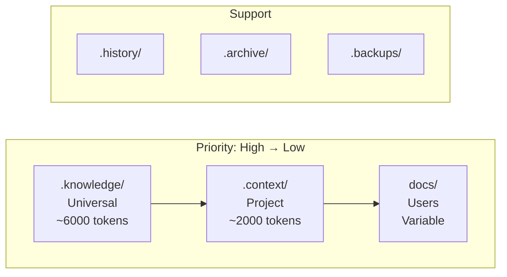

# Layer Hierarchy

> Knowledge layer structure and priority system for AI context management

---

## Table of Contents

- [1. Overview](#1-overview)
- [2. Project Directory Structure](#2-project-directory-structure)
- [3. Knowledge Layer Priority](#3-knowledge-layer-priority)
- [4. Layer Details](#4-layer-details)
- [5. Priority Resolution](#5-priority-resolution)
- [6. Navigation](#6-navigation)

---

## 1. Overview

Knowledge is organized into hierarchical layers with defined priorities, token budgets, and loading strategies. This ensures efficient context management for AI interactions.

> **Full Directory Structure**: See `.knowledge/practices/documentation/PROJECT_DIRECTORY_STRUCTURE.md` for complete project directory patterns.

---

## 2. Project Directory Structure

### 2.1 Standard Layout

```
project/
├── .context/        # Project-specific knowledge (tracked)
├── .history/        # Session history and handoffs (tracked)
├── .archive/        # Historical/deprecated content (tracked)
├── .backups/        # Backup files before changes (tracked)
├── .logs/           # Runtime log files (ignored)
├── .outputs/        # Intermediate process files (ignored)
├── .knowledge/      # Universal reusable knowledge (tracked)
├── docs/            # User-facing documentation (tracked)
├── src/             # Source code (tracked)
└── tests/           # Test suite (tracked)
```
> **Note**: `.junie/` is optional AI tool configuration. Projects may have additional directories (`scripts/`, `tools/`, `config/`) as needed.

### 2.2 Directory Categories

| Category | Directories | Git Policy |
|----------|-------------|------------|
| **Knowledge** | `.knowledge/`, `.context/` | Tracked |
| **AI Config** | `.junie/` (optional) | Tracked |
| **History** | `.history/`, `.archive/`, `.backups/` | Tracked |
| **Ephemeral** | `.logs/`, `.outputs/` | Ignored |
| **Deliverable** | `docs/`, `src/`, `tests/` | Tracked |

---

## 3. Knowledge Layer Priority


**Override Rule**: `.knowledge/` > `.context/` > `docs/`
### 3.1 Layer Definitions

| Layer | Directory | Scope | Priority | Token Budget |
|-------|-----------|-------|----------|--------------|
| 1 | `.knowledge/` | Universal | ★★★★★ | ~6,000 |
| 2 | `.context/` | Project | ★★★★☆ | ~2,000 |
| 3 | `docs/` | Users | ★★★☆☆ | Variable |
| — | `.junie/` | AI Config (optional) | ★★☆☆☆ | ~500 |

### 3.2 Support Directories

| Directory | Purpose | Load Strategy |
|-----------|---------|---------------|
| `.history/` | Session records, handoffs | On-demand |
| `.archive/` | Deprecated content | Reference only |
| `.backups/` | Pre-change snapshots | Recovery only |

---

## 4. Layer Details

> **SSOT**: See `.knowledge/practices/documentation/KNOWLEDGE_ORGANIZATION.md` for complete `.knowledge/` subdirectory definitions.

### 4.1 Layer 1: .knowledge/

**Purpose**: Universal knowledge that applies across all projects. Contains principles, guidelines, and best practices.

| Directory | Content | Load Strategy | Tokens |
|-----------|---------|---------------|--------|
| `core/` | Principles, defaults, quick ref | Always | ~500 |
| `guidelines/` | Engineering standards | On-demand | ~1,200 |
| `frameworks/` | Deep frameworks | On-demand | ~2,000 |
| `practices/` | Best practices | On-demand | ~1,500 |
| `references/` | Quick reference, glossary | On-demand | ~300 |
| `scenarios/` | Context presets | Selective | ~500 |
| `templates/` | Reusable templates | Selective | ~300 |

### 4.2 Layer 2: .context/

**Purpose**: Project-specific knowledge including conventions, architectural decisions, and runtime policies.

| Directory | Content | Load Strategy |
|-----------|---------|---------------|
| `conventions/` | Naming, templates, patterns | On-demand |
| `decisions/` | ADRs (Architecture Decision Records) | On-demand |
| `policies/` | Runtime settings, timeouts | On-demand |
| `intelligence/` | Learning, optimizations | Selective |

### 4.3 Layer 3: docs/

**Purpose**: End-user documentation including design documents, guides, and API references.

| Directory | Content | Audience |
|-----------|---------|----------|
| `design/` | Architecture, protocols | Developers |
| `guides/` | How-to guides | Users |
| `api/` | API documentation | Integrators |

### 4.4 Optional: .junie/

**Purpose**: AI assistant-specific configuration (JetBrains Junie). Optional for projects using Junie.

| File/Directory | Purpose |
|----------------|---------|
| `guidelines.md` | AI behavior guidelines |
| `project/` | Project-specific AI context |
| `mcp/` | MCP server configurations |

---

## 5. Priority Resolution

When content exists in multiple layers:

```text
.knowledge/ > .context/ > docs/
Example:
- .knowledge/guidelines/CODE_STYLE.md  ← Universal default
- .context/conventions/CODE_STYLE.md   ← Project override
```
### 5.1 Override Rules

| Scenario | Resolution |
|----------|------------|
| Same topic, different layers | Higher priority wins |
| Complementary content | Merge, prefer higher |
| Conflicting content | Higher priority wins |

> **Note**: `.junie/` follows its own conventions and does not participate in the override chain.

---

## 6. Navigation

### 6.1 Entry Points

| Entry | Path | Purpose |
|-------|------|---------|
| Knowledge | `.knowledge/INDEX.md` | Knowledge index |
| Context | `.context/INDEX.md` | Project index |
| Docs | `docs/INDEX.md` | Documentation index |

### 6.2 Cross-Reference Pattern

```markdown
## Related
- `.knowledge/guidelines/CODE_STYLE.md` — Universal style guide
- `.context/conventions/NAMING.md` — Project naming conventions
```
---

## Related

- `.knowledge/frameworks/design/INDEX.md` — Design framework index
- `.knowledge/frameworks/design/AXIOMS.md` — Design axioms
- `.knowledge/practices/documentation/KNOWLEDGE_ORGANIZATION.md` — Knowledge organization patterns
- `.knowledge/practices/documentation/PROJECT_DIRECTORY_STRUCTURE.md` — Directory structure patterns

---

*Last reviewed: 2025-12-01 by Expert Committee (L2, Strong Approve, 4.42/5)*

*AI Collaboration Knowledge Base*
