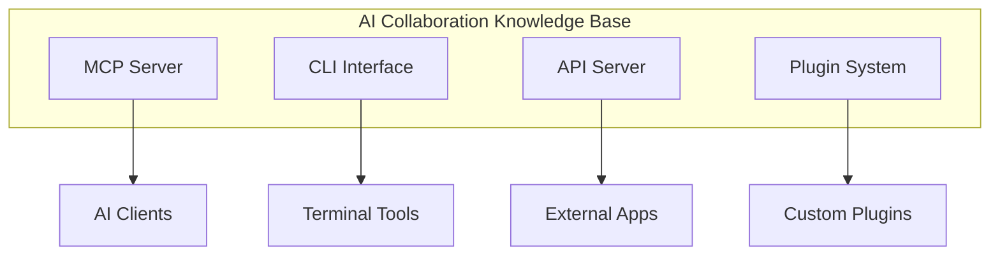
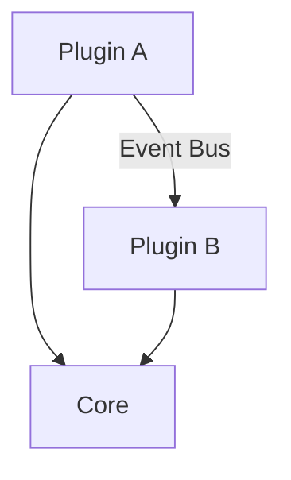

# Integration Patterns

> Patterns for integrating SAGE with AI tools, IDEs, and CI/CD systems

---

## Table of Contents

- [1. Overview](#1-overview)
- [2. AI Tool Integration](#2-ai-tool-integration)
- [3. IDE Integration](#3-ide-integration)
- [4. CI/CD Integration](#4-cicd-integration)
- [5. API Integration](#5-api-integration)
- [6. Plugin Integration](#6-plugin-integration)
- [7. Data Integration](#7-data-integration)
- [8. Best Practices](#8-best-practices)

---

## 1. Overview

### 1.1 Integration Philosophy

| Principle                | Description                                   |
|--------------------------|-----------------------------------------------|
| **Loose Coupling**       | Minimize dependencies between systems         |
| **Protocol-First**       | Define clear interfaces before implementation |
| **Graceful Degradation** | Continue working when integrations fail       |
| **Observable**           | Make integration state visible and debuggable |

### 1.2 Integration Types


---

## 2. AI Tool Integration

### 2.1 MCP Client Integration

**Supported Clients**:

| Client             | Integration Method | Status    |
|--------------------|--------------------|-----------|
| Claude Desktop     | MCP Protocol       | Native    |
| JetBrains Junie    | MCP Protocol       | Native    |
| Cursor             | MCP Protocol       | Supported |
| VS Code + Continue | MCP Protocol       | Supported |
| Custom Clients     | MCP SDK            | Manual    |

**Configuration Example**:

```json
{
  "mcpServers": {
    "knowledge-base": {
      "command": "sage",
      "args": [
        "serve",
        "--stdio"
      ],
      "env": {
        "SAGE_CONFIG": "/path/to/config"
      }
    }
  }
}
```
### 2.2 Multi-Client Pattern

```python
# Support multiple concurrent clients
from sage.services.mcp_server import create_app

app = create_app()

# Each client gets isolated session state
@app.tool()
async def get_knowledge(
    session_id: str,  # Client-provided session ID
    layer: int = 0
) -> dict:
    """Knowledge retrieval with session isolation."""
    session = get_or_create_session(session_id)
    return await session.load_knowledge(layer)
```
### 2.3 Context Synchronization

| Pattern    | Use Case          | Implementation                    |
|------------|-------------------|-----------------------------------|
| **Push**   | Real-time updates | WebSocket/SSE                     |
| **Pull**   | On-demand refresh | Periodic polling                  |
| **Hybrid** | Balanced approach | Push notifications + Pull details |

**Example: Hybrid Sync**:

```python
class ContextSync:
    def __init__(self, client):
        self.client = client
        self.last_sync = None

    async def on_change(self, change_event):
        """Push: Notify client of changes."""
        await self.client.notify(
            "context_changed", {
                "type": change_event.type,
                "path": change_event.path
            }
        )

    async def get_full_context(self):
        """Pull: Client requests full context."""
        self.last_sync = datetime.now()
        return await self.load_context()
```
---

## 3. IDE Integration

### 3.1 JetBrains IDE Integration

**Setup via .junie/guidelines.md**:

```markdown
# Project Guidelines

## Knowledge Base

- Use `sage get` for context loading
- Follow timeout hierarchy (T1-T5)
- Reference `.context/` for project-specific knowledge

## Autonomy Level

Default: L4 (Medium-High)
```
**File Watcher Integration**:

```yaml
# .idea/sage-watcher.xml
<component name="SageWatcher">
<watch path=".context/" />
<watch path=".knowledge/" />
<on-change action="sage rebuild --incremental" />
</component>
```
### 3.2 VS Code Integration

**Extension Settings** (`.vscode/settings.json`):

```json
{
  "sage.enable": true,
  "sage.configPath": "./config/app.yaml",
  "sage.autoLoad": true,
  "sage.timeout": 5000,
  "sage.layers": [
    "core",
    "guidelines"
  ]
}
```
**Tasks** (`.vscode/tasks.json`):

```json
{
  "version": "2.0.0",
  "tasks": [
    {
      "label": "SAGE: Reload Knowledge",
      "type": "shell",
      "command": "sage",
      "args": [
        "reload"
      ],
      "problemMatcher": []
    },
    {
      "label": "SAGE: Check Links",
      "type": "shell",
      "command": "sage",
      "args": [
        "check",
        "--links"
      ],
      "problemMatcher": []
    }
  ]
}
```
### 3.3 Editor-Agnostic Pattern

```python
class EditorBridge:
    """Bridge between SAGE and any editor."""

    def __init__(self, editor_type: str):
        self.editor = self._detect_editor(editor_type)

    async def provide_context(self, file_path: str) -> dict:
        """Provide context for current file."""
        return {
            "file_context"      : await self.get_file_context(file_path),
            "project_context"   : await self.get_project_context(),
            "relevant_knowledge": await self.search_relevant(file_path)
        }

    async def on_file_save(self, file_path: str):
        """Hook for file save events."""
        if self._is_knowledge_file(file_path):
            await self.trigger_rebuild()
```
---

## 4. CI/CD Integration

### 4.1 GitHub Actions

```yaml
# .github/workflows/knowledge-check.yml
name: Knowledge Base Validation

on:
  push:
    paths:
      - '.knowledge/**'
      - '.context/**'
      - 'docs/**'

jobs:
  validate:
    runs-on: ubuntu-latest
    steps:
      - uses: actions/checkout@v4

      - name: Setup Python
        uses: actions/setup-python@v5
        with:
          python-version: '3.12'

      - name: Install SAGE
        run: pip install -e .

      - name: Check Structure
        run: sage check --structure

      - name: Check Links
        run: sage check --links

      - name: Validate Content
        run: sage check --content
```
### 4.2 GitLab CI

```yaml
# .gitlab-ci.yml
stages:
  - validate
  - build
  - deploy

knowledge-validation:
  stage: validate
  image: python:3.12
  script:
    - pip install -e .
    - sage check --all
  rules:
    - changes:
        - .knowledge/**
        - .context/**

knowledge-build:
  stage: build
  script:
    - sage build --output dist/
  artifacts:
    paths:
      - dist/
```
### 4.3 Pre-commit Hooks

```yaml
# .pre-commit-config.yaml
repos:
  - repo: local
    hooks:
      - id: sage-check-links
        name: Check Knowledge Links
        entry: sage check --links --quick
        language: system
        files: '\.md$'
        pass_filenames: false

      - id: sage-validate-structure
        name: Validate Structure
        entry: sage check --structure
        language: system
        pass_filenames: false
```
### 4.4 Pipeline Patterns

| Stage        | Action                        | On Failure   |
|--------------|-------------------------------|--------------|
| **Lint**     | Check formatting, links       | Block merge  |
| **Validate** | Structure, content validation | Block merge  |
| **Build**    | Generate outputs              | Block deploy |
| **Deploy**   | Update production KB          | Rollback     |

---

## 5. API Integration

### 5.1 REST API Pattern

```python
from fastapi import FastAPI, HTTPException
from sage.core.loader import KnowledgeLoader

app = FastAPI()
loader = KnowledgeLoader()

@app.get("/api/v1/knowledge/{layer}")
async def get_knowledge(layer: int, timeout_ms: int = 5000):
    """REST endpoint for knowledge retrieval."""
    try:
        result = await loader.load_layer(layer, timeout_ms=timeout_ms)
        return {"status": "success", "data": result}
    except TimeoutError:
        raise HTTPException(504, "Knowledge loading timed out")

@app.get("/api/v1/search")
async def search(q: str, max_results: int = 10):
    """Search knowledge base."""
    results = await loader.search(q, max_results=max_results)
    return {"status": "success", "results": results}
```
### 5.2 GraphQL Pattern

```python
import strawberry
from sage.core.loader import KnowledgeLoader

@strawberry.type
class KnowledgeNode:
    id: str
    title: str
    content: str
    layer: int

@strawberry.type
class Query:
    @strawberry.field
    async def knowledge(self, layer: int = 0) -> list[KnowledgeNode]:
        loader = KnowledgeLoader()
        return await loader.load_layer(layer)

    @strawberry.field
    async def search(self, query: str) -> list[KnowledgeNode]:
        loader = KnowledgeLoader()
        return await loader.search(query)
```
### 5.3 Webhook Pattern

```python
from sage.core.events import EventBus

class WebhookIntegration:
    def __init__(self, webhook_url: str):
        self.webhook_url = webhook_url
        EventBus.subscribe("knowledge.updated", self.on_update)

    async def on_update(self, event):
        """Send webhook on knowledge update."""
        await httpx.post(
            self.webhook_url, json={
                "event"    : "knowledge.updated",
                "timestamp": event.timestamp,
                "changes"  : event.changes
            }
        )
```
---

## 6. Plugin Integration

### 6.1 Plugin Discovery

```python
from sage.plugins import PluginManager

class IntegrationPlugin:
    """Base class for integration plugins."""

    name: str = "base-integration"
    version: str = "1.0.0"

    async def initialize(self, context: dict) -> None:
        """Called when plugin is loaded."""
        pass

    async def on_knowledge_load(self, knowledge: dict) -> dict:
        """Hook for knowledge loading."""
        return knowledge

    async def on_search(self, query: str, results: list) -> list:
        """Hook for search results."""
        return results
```
### 6.2 Plugin Communication


**Event-Based Communication**:

```python
from sage.core.events import EventBus

class AnalyticsPlugin:
    async def initialize(self, context):
        EventBus.subscribe("tool.invoked", self.track_usage)

    async def track_usage(self, event):
        # Track tool usage for analytics
        await self.analytics.track(event.tool_name, event.duration)
```
---

## 7. Data Integration

### 7.1 Import Patterns

| Source     | Format        | Handler               |
|------------|---------------|-----------------------|
| Confluence | HTML/Markdown | `confluence_importer` |
| Notion     | Markdown      | `notion_importer`     |
| Git Wiki   | Markdown      | `git_importer`        |
| Docusaurus | MDX           | `mdx_importer`        |

**Import Example**:

```python
from sage.integrations import ConfluenceImporter

importer = ConfluenceImporter(
    base_url="https://company.atlassian.net",
    space_key="KB"
)

# Import with transformation
await importer.import_space(
    target_path=".knowledge/imported/",
    transform=lambda doc: doc.to_sage_format()
)
```
### 7.2 Export Patterns

```python
from sage.integrations import Exporter

exporter = Exporter(kb_path=".knowledge/")

# Export to different formats
await exporter.to_docusaurus("dist/docusaurus/")
await exporter.to_mkdocs("dist/mkdocs/")
await exporter.to_json("dist/knowledge.json")
```
### 7.3 Sync Patterns

| Pattern     | Use Case               | Complexity |
|-------------|------------------------|------------|
| **One-way** | KB as source of truth  | Low        |
| **Two-way** | Bidirectional edits    | High       |
| **Merge**   | Periodic consolidation | Medium     |

---

## 8. Best Practices

### 8.1 Integration Checklist

| Category       | Checklist Item                         |
|----------------|----------------------------------------|
| **Setup**      | □ Define clear interface contract      |
|                | □ Document authentication requirements |
|                | □ Set up error handling                |
| **Testing**    | □ Unit tests for integration points    |
|                | □ Integration tests with mocks         |
|                | □ End-to-end tests in staging          |
| **Operations** | □ Monitor integration health           |
|                | □ Set up alerts for failures           |
|                | □ Document troubleshooting steps       |

### 8.2 Error Handling

```python
from sage.integrations import IntegrationError

class ResilientIntegration:
    async def call_external(self, request):
        retries = 3
        for attempt in range(retries):
            try:
                return await self._do_call(request)
            except IntegrationError as e:
                if attempt == retries - 1:
                    # Log and return fallback
                    logger.error(f"Integration failed: {e}")
                    return self.fallback_response()
                await asyncio.sleep(2 ** attempt)  # Exponential backoff
```
### 8.3 Security Considerations

| Aspect             | Recommendation                               |
|--------------------|----------------------------------------------|
| **Authentication** | Use API keys or OAuth2                       |
| **Authorization**  | Implement RBAC for sensitive knowledge       |
| **Data Transit**   | Always use TLS                               |
| **Secrets**        | Use environment variables or secret managers |

### 8.4 Performance Optimization

| Technique              | When to Use               |
|------------------------|---------------------------|
| **Caching**            | Frequently accessed data  |
| **Batching**           | Multiple small requests   |
| **Async**              | I/O-bound operations      |
| **Connection Pooling** | Database/HTTP connections |

---

## Quick Reference

### Integration URLs

| Service     | Endpoint                        |
|-------------|---------------------------------|
| MCP (stdio) | `sage serve --stdio`            |
| MCP (SSE)   | `http://localhost:8080/sse`     |
| REST API    | `http://localhost:8080/api/v1/` |
| Health      | `http://localhost:8080/health`  |

### Environment Variables

```bash
SAGE_MCP_PORT=8080
SAGE_API_KEY=your-api-key
SAGE_WEBHOOK_SECRET=webhook-secret
SAGE_EXTERNAL_URL=https://api.example.com
```
---

## Related

- `.knowledge/frameworks/patterns/COLLABORATION.md` — Collaboration patterns
- `.knowledge/practices/engineering/API_DESIGN.md` — API design guidelines
- `.context/decisions/ADR_0008_PLUGIN_SYSTEM.md` — Plugin architecture
- `docs/api/MCP.md` — MCP API reference

---

*AI Collaboration Knowledge Base*
