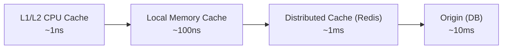
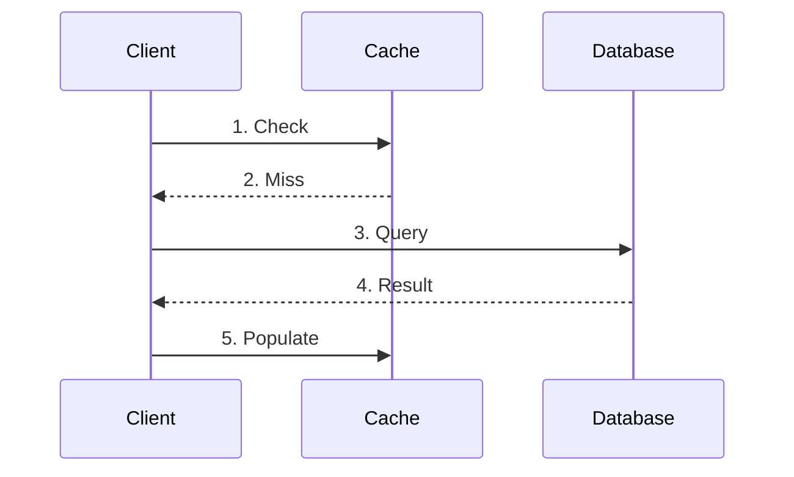

# Caching Patterns

> Data caching strategies for performance optimization

---

## Table of Contents

- [1. Overview](#1-overview)
- [2. Caching Strategies](#2-caching-strategies)
- [3. Cache Invalidation](#3-cache-invalidation)
- [4. Implementation Patterns](#4-implementation-patterns)
- [5. Distributed Caching](#5-distributed-caching)

> **Code Implementations**: See `.knowledge/practices/engineering/optimization/CACHING_IMPLEMENTATION.md`

---

## 1. Overview

### Why Cache?

| Benefit                  | Description               |
|--------------------------|---------------------------|
| **Reduced Latency**      | Faster response times     |
| **Lower Load**           | Fewer database/API calls  |
| **Cost Savings**         | Reduced compute/bandwidth |
| **Improved Scalability** | Handle more requests      |

### Cache Hierarchy

---

## 2. Caching Strategies

> **Code examples**: See `CACHING_IMPLEMENTATION.md` §1

### Strategy Comparison

| Strategy          | Hit Rate  | Freshness | Complexity | Use Case           |
|-------------------|-----------|-----------|------------|--------------------|
| **Cache-Aside**   | High      | Manual    | Low        | General purpose    |
| **Read-Through**  | High      | Auto      | Medium     | Read-heavy         |
| **Write-Through** | High      | Immediate | Medium     | Consistency needed |
| **Write-Behind**  | High      | Delayed   | High       | Write-heavy        |
| **Refresh-Ahead** | Very High | Proactive | High       | Predictable access |

### Cache-Aside (Lazy Loading)

| Step | Action | Description |
|------|--------|-------------|
| 1-2 | Check cache | Return if hit |
| 3-4 | Query origin | On cache miss |
| 5 | Populate | Store for future |

### Read-Through vs Write-Through

| Aspect | Read-Through | Write-Through |
|--------|--------------|---------------|
| Direction | Read path | Write path |
| Cache role | Loads on miss | Stores on write |
| Consistency | Eventually | Immediate |
| Latency impact | Read: low | Write: higher |

### Write-Behind (Write-Back)

| Characteristic | Description |
|----------------|-------------|
| Write latency | Very low (cache only) |
| Consistency | Eventually consistent |
| Risk | Data loss on failure |
| Use case | Write-heavy, tolerate loss |

---

## 3. Cache Invalidation

> **Code examples**: See `CACHING_IMPLEMENTATION.md` §2

### Invalidation Strategies

| Strategy          | Freshness  | Complexity | Best For        |
|-------------------|------------|------------|-----------------|
| **TTL-based**     | Eventually | Low        | Static content  |
| **Event-driven**  | Immediate  | Medium     | Dynamic content |
| **Version-based** | Immediate  | Medium     | Atomic updates  |
| **Tag-based**     | Immediate  | High       | Related content |

### TTL-Based Invalidation

| Technique | Purpose | Example |
|-----------|---------|---------|
| Fixed TTL | Simple expiration | `ttl=3600` |
| Staggered TTL | Prevent thundering herd | `ttl=3600 ± random(300)` |
| Sliding TTL | Extend on access | Reset TTL on read |

### Event-Driven Invalidation

| Event | Cache Action | Scope |
|-------|--------------|-------|
| `entity.updated` | Delete key | Single entry |
| `entity.deleted` | Delete pattern | Related entries |
| `bulk.update` | Flush namespace | Entire category |

### Version-Based Invalidation

| Component | Purpose |
|-----------|---------|
| Version number | Track data version |
| Cache key | Include version or check on read |
| Atomic update | Increment version on change |

---

## 4. Implementation Patterns

> **Code examples**: See `CACHING_IMPLEMENTATION.md` §3

### Decorator Pattern

| Benefit | Description |
|---------|-------------|
| Clean separation | Caching logic separate from business logic |
| Reusable | Apply to any async function |
| Configurable | TTL and key prefix per function |

### Cache-Stampede Prevention

| Problem | Solution |
|---------|----------|
| Many requests on miss | Lock per key |
| Redundant loading | Double-check after lock |
| Lock contention | Short-lived locks |

### Multi-Level Caching

| Level | Storage | TTL | Size | Latency |
|-------|---------|-----|------|---------|
| L1 | Local memory | Short (60s) | Small | ~1μs |
| L2 | Redis | Long (1h) | Large | ~1ms |

| Operation | L1 Action | L2 Action |
|-----------|-----------|-----------|
| Get | Check first | Check on L1 miss, populate L1 |
| Set | Set (short TTL) | Set (long TTL) |
| Delete | Delete | Delete |

---

## 5. Distributed Caching

> **Code examples**: See `CACHING_IMPLEMENTATION.md` §4

### Redis Patterns

| Pattern | Use Case | Benefit |
|---------|----------|---------|
| Simple get/set | Basic caching | Low complexity |
| Lua scripts | Atomic operations | Consistency |
| Pub/Sub | Invalidation broadcast | Real-time sync |

### Cache Cluster Considerations

| Consideration   | Solution                    |
|-----------------|-----------------------------|
| **Consistency** | Use consistent hashing      |
| **Failover**    | Configure replicas          |
| **Hot Keys**    | Local caching + replication |
| **Memory**      | Set eviction policies       |

### Eviction Policies

| Policy     | Description           | Use Case        |
|------------|-----------------------|-----------------|
| **LRU**    | Least Recently Used   | General purpose |
| **LFU**    | Least Frequently Used | Hot data        |
| **FIFO**   | First In First Out    | Simple queue    |
| **TTL**    | Time-based expiration | Time-sensitive  |
| **Random** | Random eviction       | Simple, fast    |

---

## Quick Reference

### Cache Decision Matrix

| Question              | Yes →              | No →            |
|-----------------------|--------------------|-----------------|
| Data changes rarely?  | Long TTL           | Short TTL       |
| Consistency critical? | Write-through      | Cache-aside     |
| Write-heavy?          | Write-behind       | Write-through   |
| Read-heavy?           | Aggressive caching | Minimal caching |
| Distributed system?   | Redis/Memcached    | Local cache     |

### Cache Key Best Practices

| Pattern | Example | Why |
|---------|---------|-----|
| `type:id` | `user:123` | Clear, simple |
| `type:id:subtype` | `user:123:profile` | Hierarchical |
| Versioned | `api:v2:users:list` | API versioning |

**Avoid**: Unclear keys (`u123`), no structure (`user_data`), inconsistent format.

### TTL Guidelines

| Data Type      | TTL  | Reason              |
|----------------|------|---------------------|
| Static content | 24h+ | Rarely changes      |
| User profiles  | 1h   | Moderate updates    |
| Session data   | 30m  | Security            |
| Search results | 5m   | Freshness important |
| Real-time data | 10s  | High change rate    |

---

## Related

- `.knowledge/practices/engineering/optimization/CACHING_IMPLEMENTATION.md` — **Code implementations (full details)**
- `.knowledge/frameworks/performance/OPTIMIZATION_STRATEGIES.md` — General optimization
- `.knowledge/frameworks/performance/PROFILING_FRAMEWORK.md` — Performance analysis
- `.knowledge/frameworks/resilience/TIMEOUT_PATTERNS.md` — Timeout handling

---

*Caching Patterns v1.0*

