# Performance Framework

> Optimization patterns and best practices for high-performance systems

---

## Table of Contents

- [1. Overview](#1-overview)
- [2. Contents](#2-contents)
- [3. Performance Principles](#3-performance-principles)
- [4. Quick Reference](#4-quick-reference)

---

## 1. Overview

This framework provides performance optimization guidelines for:

- **Caching**: Data caching strategies and patterns
- **Optimization**: System and code optimization techniques
- **Profiling**: Performance measurement and analysis

---

## 2. Contents

### Framework Documents (Concepts)

| Document                                                                                  | Purpose                 | When to Use               |
|-------------------------------------------------------------------------------------------|-------------------------|---------------------------|
| [Caching Patterns](CACHING_PATTERNS.md)                                                   | Data caching strategies | Reducing latency, load    |
| [Optimization Strategies](OPTIMIZATION_STRATEGIES.md)                                     | Performance improvement | Scaling, efficiency       |
| [Profiling Framework](PROFILING_FRAMEWORK.md)                                             | Performance concepts    | Understanding approach    |

### Practice Documents (Implementation)

| Document                                                                                  | Purpose                 | When to Use               |
|-------------------------------------------------------------------------------------------|-------------------------|---------------------------|
| [Caching Implementation](../../practices/engineering/optimization/CACHING_IMPLEMENTATION.md) | Caching code examples | Implementing cache patterns |
| [Optimization Recipes](../../practices/engineering/optimization/OPTIMIZATION_RECIPES.md) | Optimization code examples | Implementing optimizations |
| [Profiling Guide](../../practices/engineering/optimization/PROFILING_GUIDE.md)                         | Detailed profiling how-to | Bottleneck identification |

---

## 3. Performance Principles

### The Three Pillars

> "You can't improve what you don't measure"

### Core Principles

| Principle                        | Description                            |
|----------------------------------|----------------------------------------|
| **Measure First**                | Profile before optimizing              |
| **80/20 Rule**                   | Focus on the 20% causing 80% of issues |
| **Avoid Premature Optimization** | Make it work, then make it fast        |
| **Set Targets**                  | Define acceptable performance metrics  |
| **Test Under Load**              | Real-world conditions reveal issues    |

### Performance Metrics

| Metric            | Description                | Target              |
|-------------------|----------------------------|---------------------|
| **Latency (P50)** | Median response time       | < 100ms             |
| **Latency (P99)** | 99th percentile response   | < 500ms             |
| **Throughput**    | Requests per second        | Depends on capacity |
| **Error Rate**    | Failed requests percentage | < 0.1%              |
| **CPU Usage**     | Processor utilization      | < 70% average       |
| **Memory**        | RAM utilization            | < 80% peak          |

---

## 4. Quick Reference

### Performance Quick Wins

| Area         | Quick Win              | Impact |
|--------------|------------------------|--------|
| **Caching**  | Add response caching   | High   |
| **Database** | Add missing indexes    | High   |
| **Network**  | Enable compression     | Medium |
| **Code**     | Batch database queries | High   |
| **Frontend** | Lazy load images       | Medium |

### Common Bottlenecks

```mermaid
flowchart LR
    subgraph Problems["🔍 Bottleneck"]
        CPU["💻 High CPU"]
        MEM["🧠 High Memory"]
        IO["💾 High I/O Wait"]
        NET["🌐 Network Latency"]
        DB["🗄️ Database Slow"]
    end
    subgraph Solutions["✅ Solutions"]
        CPU_FIX["Profile code<br/>Check algorithms<br/>Optimize hot paths"]
        MEM_FIX["Check for leaks<br/>Reduce caching<br/>Optimize data types"]
        IO_FIX["Add caching<br/>Optimize queries<br/>Use async I/O"]
        NET_FIX["Reduce payload<br/>Add CDN<br/>Connection pooling"]
        DB_FIX["Add indexes<br/>Optimize queries<br/>Read replicas"]
    end
    CPU --> CPU_FIX
    MEM --> MEM_FIX
    IO --> IO_FIX
    NET --> NET_FIX
    DB --> DB_FIX
```

### Performance Checklist

- [ ] Response time targets defined
- [ ] Baseline performance measured
- [ ] Bottlenecks identified
- [ ] Caching strategy implemented
- [ ] Database queries optimized
- [ ] Load testing performed
- [ ] Monitoring in place

---

## Related

- `.knowledge/frameworks/resilience/TIMEOUT_PATTERNS.md` — Timeout strategies
- `.context/policies/TIMEOUT_HIERARCHY.md` — the system timeout config
- `.knowledge/practices/engineering/optimization/BATCH_OPTIMIZATION.md` — Batch processing
- `tools/timeout_manager.py` — Performance testing tool

---

*AI Collaboration Knowledge Base*
