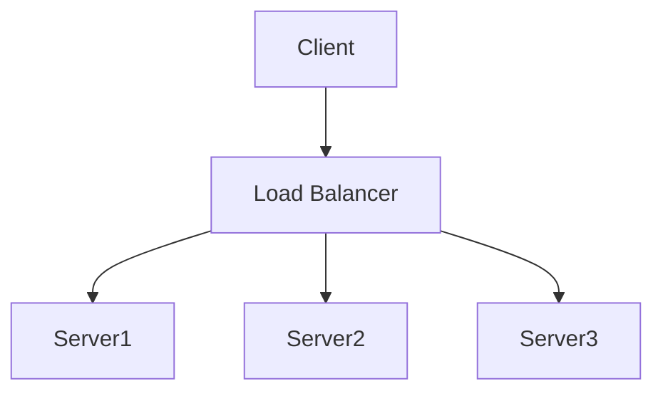

# Optimization Strategies

> Systematic approaches to improving system performance

---

## Table of Contents

- [1. Overview](#1-overview)
- [2. Code Optimization](#2-code-optimization)
- [3. Database Optimization](#3-database-optimization)
- [4. Network Optimization](#4-network-optimization)
- [5. System Optimization](#5-system-optimization)
- [6. Scaling Strategies](#6-scaling-strategies)

> **Code Examples**: See `.knowledge/practices/engineering/optimization/OPTIMIZATION_RECIPES.md`

---

## 1. Overview

### Optimization Process

> **Rule**: Measure → Analyze → Optimize → Verify → Repeat

### Optimization Priorities

| Priority | Focus                | Expected Impact |
|----------|----------------------|-----------------|
| 1        | Algorithm complexity | 10x-1000x       |
| 2        | I/O and database     | 10x-100x        |
| 3        | Caching              | 5x-50x          |
| 4        | Concurrency          | 2x-10x          |
| 5        | Micro-optimizations  | 1.1x-2x         |

---

## 2. Code Optimization

> **Code examples**: See `OPTIMIZATION_RECIPES.md` §1

### Algorithm Complexity

| Complexity | Name         | Example       | Scalability |
|------------|--------------|---------------|-------------|
| O(1)       | Constant     | Hash lookup   | Excellent   |
| O(log n)   | Logarithmic  | Binary search | Excellent   |
| O(n)       | Linear       | Array scan    | Good        |
| O(n log n) | Linearithmic | Merge sort    | Good        |
| O(n²)      | Quadratic    | Nested loops  | Poor        |
| O(2ⁿ)      | Exponential  | Brute force   | Terrible    |

### Data Structure Selection

| Need             | Best Choice       | Why                 |
|------------------|-------------------|---------------------|
| Fast lookup      | dict, set         | O(1) average        |
| Ordered data     | list, deque       | Sequence access     |
| Sorted iteration | sorted containers | Maintained order    |
| Queue operations | deque             | O(1) both ends      |
| Priority queue   | heapq             | O(log n) operations |

### Key Techniques

| Technique | Problem | Solution |
|-----------|---------|----------|
| Loop hoisting | Repeated computation | Move invariants outside loop |
| String building | O(n²) concatenation | Use join() or StringIO |
| Generators | Memory exhaustion | Yield instead of return list |
| Batch processing | Many small operations | Group into batches |

---

## 3. Database Optimization

> **Code examples**: See `OPTIMIZATION_RECIPES.md` §2

### Query Optimization Principles

| Principle | Bad Practice | Good Practice |
|-----------|--------------|---------------|
| Select columns | `SELECT *` | `SELECT id, name, email` |
| Avoid N+1 | Loop queries | JOIN or batch fetch |
| Use indexes | Full table scan | Indexed lookup |
| Limit results | Unbounded query | Pagination |

### Index Strategies

| Index Type    | Use Case               | Example                   |
|---------------|------------------------|---------------------------|
| **B-tree**    | Range queries, sorting | `created_at`, `price`     |
| **Hash**      | Equality lookups       | `user_id`, `email`        |
| **Composite** | Multi-column queries   | `(user_id, created_at)`   |
| **Partial**   | Filtered subset        | `WHERE status = 'active'` |
| **Covering**  | Avoid table lookup     | Include all query columns |

### Connection Pool Settings

| Parameter | Typical Value | Purpose |
|-----------|---------------|---------|
| pool_size | 10 | Maintained connections |
| max_overflow | 20 | Extra connections when needed |
| pool_timeout | 30s | Wait time for connection |
| pool_recycle | 1800s | Recycle connections periodically |

---

## 4. Network Optimization

> **Code examples**: See `OPTIMIZATION_RECIPES.md` §3

### Request Optimization

| Technique        | Benefit               | Implementation  |
|------------------|-----------------------|-----------------|
| **Compression**  | 60-80% size reduction | gzip, brotli    |
| **Minification** | 20-40% size reduction | JS/CSS minify   |
| **Bundling**     | Fewer requests        | Webpack, rollup |
| **CDN**          | Lower latency         | CloudFlare, AWS |
| **HTTP/2**       | Multiplexing          | Server config   |

### Connection Management Principles

| Principle | Anti-pattern | Best Practice |
|-----------|--------------|---------------|
| Reuse connections | New client per request | Shared client instance |
| Pool limits | Unlimited connections | max_connections limit |
| Keep-alive | Close after each request | keepalive_expiry setting |

### Response Optimization

| Technique | Use Case | Benefit |
|-----------|----------|---------|
| Pagination | Large result sets | Bounded response size |
| Field selection | Varying client needs | Reduced payload |
| Compression | Text responses | 60-80% smaller |

---

## 5. System Optimization

> **Code examples**: See `OPTIMIZATION_RECIPES.md` §4

### Concurrency Selection

| Workload Type | Best Approach | Reason |
|---------------|---------------|--------|
| I/O-bound | asyncio | Non-blocking, efficient |
| CPU-bound | ProcessPoolExecutor | True parallelism |
| Mixed | Hybrid | Combine approaches |

### Memory Optimization Techniques

| Technique | Use Case | Benefit |
|-----------|----------|---------|
| `__slots__` | Many instances | 40-50% memory reduction |
| Generators | Large datasets | Constant memory |
| NumPy arrays | Numerical data | Faster operations |

### Resource Pooling

| Resource | Pool Implementation | Key Settings |
|----------|---------------------|--------------|
| Database | SQLAlchemy QueuePool | pool_size, max_overflow |
| HTTP | httpx.Limits | max_connections |
| Custom | asyncio.Queue | maxsize |

---

## 6. Scaling Strategies

### Vertical vs Horizontal

| Aspect         | Vertical       | Horizontal    |
|----------------|----------------|---------------|
| **Method**     | Bigger machine | More machines |
| **Limit**      | Hardware max   | Unlimited     |
| **Cost**       | Exponential    | Linear        |
| **Downtime**   | Required       | Zero          |
| **Complexity** | Low            | High          |

### Load Balancing

### Load Balancing Algorithms

| Algorithm             | Use Case         | Pros            | Cons                |
|-----------------------|------------------|-----------------|---------------------|
| **Round Robin**       | Equal servers    | Simple          | Ignores load        |
| **Least Connections** | Varying requests | Adaptive        | More overhead       |
| **IP Hash**           | Session affinity | Sticky sessions | Uneven distribution |
| **Weighted**          | Mixed capacity   | Flexible        | Manual config       |

### Read Replicas Pattern

| Operation | Target | Rationale |
|-----------|--------|-----------|
| SELECT | Replica (round-robin) | Distribute read load |
| INSERT/UPDATE/DELETE | Primary | Maintain consistency |

> **Implementation**: See `OPTIMIZATION_RECIPES.md` §5

---

## Quick Reference

### Optimization Checklist

- [ ] Profile before optimizing
- [ ] Fix algorithmic complexity first
- [ ] Add database indexes
- [ ] Implement caching
- [ ] Enable compression
- [ ] Use connection pooling
- [ ] Implement pagination
- [ ] Consider async/concurrent processing
- [ ] Set up monitoring
- [ ] Load test regularly

### Performance Anti-Patterns

| Anti-Pattern           | Problem       | Solution               |
|------------------------|---------------|------------------------|
| N+1 queries            | Many DB calls | Batch/JOIN             |
| Premature optimization | Wasted effort | Profile first          |
| Missing indexes        | Slow queries  | Add indexes            |
| No caching             | Repeated work | Cache results          |
| Blocking I/O           | Wasted CPU    | Use async              |
| Large payloads         | Slow transfer | Pagination/compression |

---

## Related

- `.knowledge/practices/engineering/optimization/OPTIMIZATION_RECIPES.md` — **Code examples (full details)**
- `.knowledge/frameworks/performance/CACHING_PATTERNS.md` — Caching strategies
- `.knowledge/frameworks/performance/PROFILING_FRAMEWORK.md` — Performance measurement
- `.knowledge/practices/engineering/optimization/BATCH_OPTIMIZATION.md` — Batch processing

---

*Optimization Strategies v1.0*

