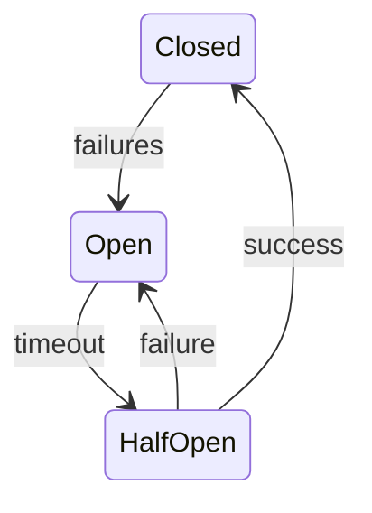

# Timeout Design Patterns

> Universal timeout and resilience patterns for system design

---

## Table of Contents

- [1. Core Patterns](#1-core-patterns)
- [2. Timeout Pattern](#2-timeout-pattern)
- [3. Retry Pattern](#3-retry-pattern)
- [4. Circuit Breaker Pattern](#4-circuit-breaker-pattern)
- [5. Fallback Pattern](#5-fallback-pattern)
- [6. Bulkhead Pattern](#6-bulkhead-pattern)
- [7. Combined Pattern](#7-combined-pattern)

---

## 1. Core Patterns

| Pattern             | Purpose                   | Use Case           |
|---------------------|---------------------------|--------------------|
| **Timeout**         | Limit wait time           | All external calls |
| **Retry**           | Handle transient failures | Network, I/O       |
| **Circuit Breaker** | Prevent cascade failures  | External services  |
| **Bulkhead**        | Isolate failures          | Resource pools     |
| **Fallback**        | Provide alternatives      | Degraded operation |

---

## 2. Timeout Pattern

### 2.1 Implementation

```python
async def with_timeout(coro, timeout_ms: int, fallback=None):
    try:
        return await asyncio.wait_for(
            coro,
            timeout=timeout_ms / 1000
        )
    except asyncio.TimeoutError:
        return fallback
```
### 2.2 Guidelines

| Guideline              | Description                     |
|------------------------|---------------------------------|
| Set appropriate values | Match operation characteristics |
| Always have fallback   | Never leave caller hanging      |
| Log timeouts           | Enable monitoring               |
| Make configurable      | Allow runtime adjustment        |

---

## 3. Retry Pattern

### 3.1 Strategies

| Strategy            | Description          | Use Case                |
|---------------------|----------------------|-------------------------|
| Fixed delay         | Same wait each retry | Simple cases            |
| Exponential backoff | Increasing delays    | Network calls           |
| Jitter              | Random component     | Prevent thundering herd |

### 3.2 Configuration

| Parameter          | Typical Value |
|--------------------|---------------|
| Max retries        | 3             |
| Initial delay      | 100ms         |
| Max delay          | 5s            |
| Backoff multiplier | 2x            |

---

## 4. Circuit Breaker Pattern

### 4.1 States


### 4.2 Configuration

| Parameter         | Value  | Purpose           |
|-------------------|--------|-------------------|
| Failure threshold | 3-5    | Trips to open     |
| Reset timeout     | 30-60s | Time before retry |
| Success threshold | 1-3    | Trips to close    |

---

## 5. Fallback Pattern

### 5.1 Fallback Hierarchy

| Level | Fallback      | Quality             |
|-------|---------------|---------------------|
| 1     | Cached value  | Best available      |
| 2     | Stale cache   | Acceptable          |
| 3     | Default value | Minimum viable      |
| 4     | Error message | Informative failure |

### 5.2 Implementation

```python
async def get_with_fallback(key: str) -> Result:
    # Try primary
    result = await with_timeout(primary.get(key), 500)
    if result:
        return result
    # Try cache
    cached = cache.get(key)
    if cached:
        return cached.with_warning("stale")
    # Return default
    return default_value(key)
```
---

## 6. Bulkhead Pattern

### 6.1 Isolation Types

| Type            | Description          | Use Case      |
|-----------------|----------------------|---------------|
| Thread pool     | Separate threads     | CPU-bound     |
| Connection pool | Separate connections | I/O-bound     |
| Semaphore       | Limit concurrency    | Rate limiting |

### 6.2 Configuration

| Resource     | Pool Size | Queue |
|--------------|-----------|-------|
| Database     | 10-20     | 100   |
| External API | 5-10      | 50    |
| File I/O     | 5         | 20    |

---

## 7. Combined Pattern

```python
@circuit_breaker(failure_threshold=3)
@retry(max_attempts=3, backoff=exponential)
@timeout(ms=5000)
async def resilient_call(params):
    return await external_service.call(params)
```
---

## Related

- `.context/policies/TIMEOUT_HIERARCHY.md` — the system-specific T1-T5 timeout hierarchy
- `.knowledge/frameworks/patterns/PERSISTENCE.md` — Data persistence patterns

---

*Last reviewed: 2025-12-01 by Expert Committee (L2, Strong Approve, 4.32/5)*

*AI Collaboration Knowledge Base*
