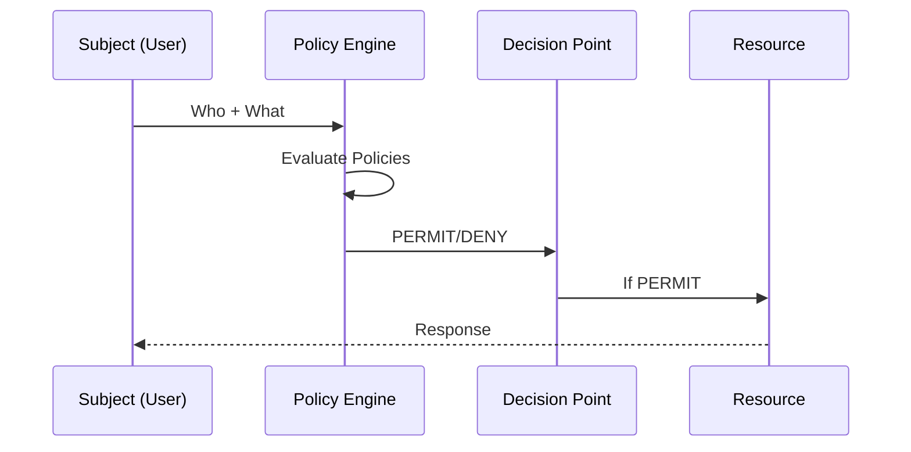
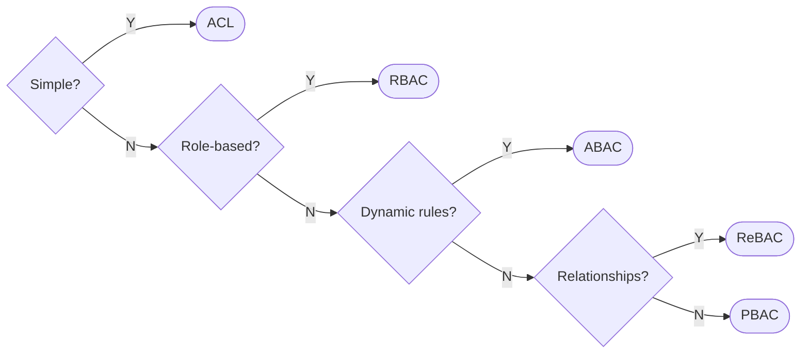
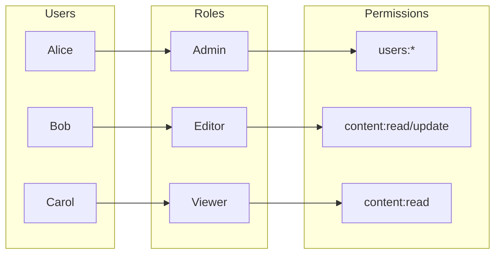
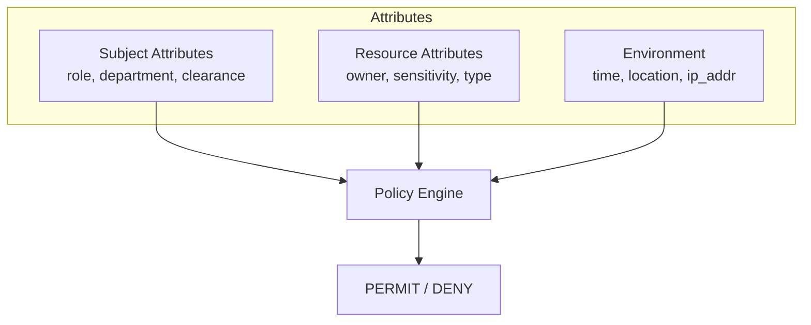

# Authorization Patterns

> Access control strategies and permission management

---

## Table of Contents

- [1. Overview](#1-overview)
- [2. Authorization Models](#2-authorization-models)
- [3. RBAC](#3-rbac)
- [4. ABAC](#4-abac)
- [5. Implementation Patterns](#5-implementation-patterns)
- [6. API Authorization](#6-api-authorization)

> **Code Implementations**: See `.knowledge/practices/engineering/security/AUTHORIZATION_IMPLEMENTATION.md`

---

## 1. Overview

### Authorization Flow

### Key Concepts

| Concept      | Description            | Example                |
|--------------|------------------------|------------------------|
| **Subject**  | Who is requesting      | User, Service, Process |
| **Resource** | What is being accessed | File, API, Database    |
| **Action**   | What operation         | Read, Write, Delete    |
| **Policy**   | Rules for access       | "Admins can delete"    |
| **Context**  | Environmental factors  | Time, Location, Device |

---

## 2. Authorization Models

### Model Comparison

| Model     | Complexity | Flexibility | Use Case              |
|-----------|------------|-------------|-----------------------|
| **ACL**   | Low        | Low         | Simple file systems   |
| **RBAC**  | Medium     | Medium      | Enterprise apps       |
| **ABAC**  | High       | High        | Complex policies      |
| **ReBAC** | Medium     | High        | Social networks       |
| **PBAC**  | High       | Very High   | Regulatory compliance |

### Decision Matrix

---

## 3. RBAC

> **Code examples**: See `AUTHORIZATION_IMPLEMENTATION.md` §1

### Role-Based Access Control

### RBAC Components

| Component | Description | Example |
|-----------|-------------|---------|
| **User** | Identity | alice@example.com |
| **Role** | Named collection of permissions | admin, editor, viewer |
| **Permission** | Allowed action on resource | users:create, content:read |
| **Assignment** | User-to-role mapping | Alice → Admin |

### Role Hierarchy

| Level | Role | Inherits From |
|-------|------|---------------|
| 1 | super_admin | admin |
| 2 | admin | editor, moderator |
| 3 | editor | viewer |
| 3 | moderator | viewer |
| 4 | viewer | (base) |

---

## 4. ABAC

> **Code examples**: See `AUTHORIZATION_IMPLEMENTATION.md` §2

### Attribute-Based Access Control

### ABAC Policy Components

| Attribute Type | Examples | Use Case |
|----------------|----------|----------|
| **Subject** | role, department, clearance_level | Who is requesting |
| **Resource** | owner_id, sensitivity, classification | What is being accessed |
| **Action** | read, write, delete, execute | What operation |
| **Environment** | time, location, ip_address, device | Context of request |

### Common Policy Patterns

| Pattern | Description | Example |
|---------|-------------|---------|
| Owner access | Users can access their own resources | owner_id == user_id |
| Department scope | Access within department | user.dept == resource.dept |
| Time-based | Restrict by time window | 9:00 <= time <= 18:00 |
| Clearance level | Hierarchical access | user.clearance >= resource.level |

---

## 5. Implementation Patterns

> **Code examples**: See `AUTHORIZATION_IMPLEMENTATION.md` §3

### Decorator Pattern

| Benefit | Description |
|---------|-------------|
| Clean separation | Authorization logic separate from business logic |
| Reusable | Apply to any function/endpoint |
| Declarative | Permissions declared at definition |

### Resource-Level Authorization

| Check | Order | Description |
|-------|-------|-------------|
| Owner | 1 | Is user the resource owner? |
| Direct | 2 | Does user have explicit permission? |
| Group | 3 | Does user's group have permission? |
| Default | 4 | Apply default deny |

### Policy Enforcement Point (PEP)

| Component | Role |
|-----------|------|
| **PEP** | Intercepts requests, enforces decisions |
| **PDP** | Makes authorization decisions |
| **PAP** | Manages policies |
| **PIP** | Provides attribute data |

---

## 6. API Authorization

> **Code examples**: See `AUTHORIZATION_IMPLEMENTATION.md` §4

### Endpoint Protection Strategies

| Strategy | Use Case | Granularity |
|----------|----------|-------------|
| Role-based | Simple applications | Coarse |
| Permission-based | Fine control | Medium |
| Scope-based (OAuth2) | API access | Fine |
| Resource-based | Per-object | Very fine |

### OAuth2 Scopes

| Scope | Description | Access Level |
|-------|-------------|--------------|
| `read:content` | Read content | Read-only |
| `write:content` | Create/update content | Read-write |
| `delete:content` | Delete content | Destructive |
| `admin` | Full access | Administrative |

---

## Quick Reference

### Authorization Checklist

- [ ] Define clear permission model (RBAC/ABAC)
- [ ] Implement server-side validation (never trust client)
- [ ] Verify resource ownership
- [ ] Log all authorization decisions
- [ ] Implement deny-by-default
- [ ] Regular permission audits
- [ ] Test authorization bypass scenarios

### HTTP Status Codes

| Code | Meaning      | When to Use                         |
|------|--------------|-------------------------------------|
| 401  | Unauthorized | No/invalid authentication           |
| 403  | Forbidden    | Authenticated but not authorized    |
| 404  | Not Found    | Resource exists but user can't know |

---

## Related

- `.knowledge/practices/engineering/security/AUTHORIZATION_IMPLEMENTATION.md` — **Code implementations (full details)**
- `.knowledge/frameworks/security/AUTHENTICATION.md` — Identity verification
- `.knowledge/frameworks/security/SECRETS_MANAGEMENT.md` — Credential handling
- `.knowledge/frameworks/security/SECURITY_CHECKLIST.md` — Implementation checklist

---

*AI Collaboration Knowledge Base*
