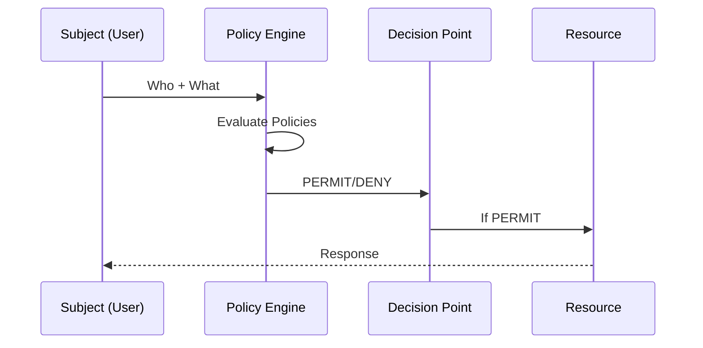
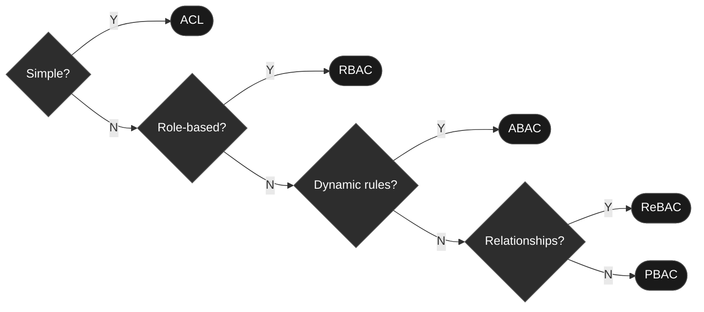
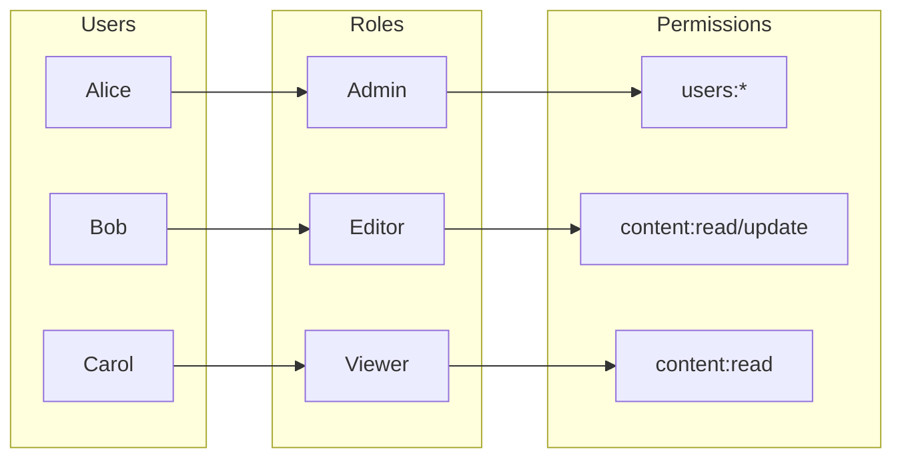
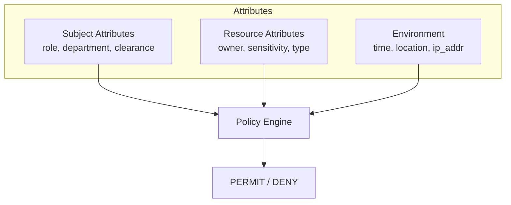

# Authorization Patterns

> Access control strategies and permission management

---

## Table of Contents

- [1. Overview](#1-overview)
- [2. Authorization Models](#2-authorization-models)
- [3. RBAC](#3-rbac)
- [4. ABAC](#4-abac)
- [5. Implementation Patterns](#5-implementation-patterns)
- [6. API Authorization](#6-api-authorization)

---

## 1. Overview

### Authorization Flow


### Key Concepts

| Concept      | Description            | Example                |
|--------------|------------------------|------------------------|
| **Subject**  | Who is requesting      | User, Service, Process |
| **Resource** | What is being accessed | File, API, Database    |
| **Action**   | What operation         | Read, Write, Delete    |
| **Policy**   | Rules for access       | "Admins can delete"    |
| **Context**  | Environmental factors  | Time, Location, Device |

---

## 2. Authorization Models

### Model Comparison

| Model     | Complexity | Flexibility | Use Case              |
|-----------|------------|-------------|-----------------------|
| **ACL**   | Low        | Low         | Simple file systems   |
| **RBAC**  | Medium     | Medium      | Enterprise apps       |
| **ABAC**  | High       | High        | Complex policies      |
| **ReBAC** | Medium     | High        | Social networks       |
| **PBAC**  | High       | Very High   | Regulatory compliance |

### Decision Matrix


---

## 3. RBAC

### Role-Based Access Control


### RBAC Implementation

```python
from enum import Enum
from typing import Set, Dict
from dataclasses import dataclass
class Permission(Enum):
    """Available permissions."""
    USERS_CREATE = "users:create"
    USERS_READ = "users:read"
    USERS_UPDATE = "users:update"
    USERS_DELETE = "users:delete"
    CONTENT_CREATE = "content:create"
    CONTENT_READ = "content:read"
    CONTENT_UPDATE = "content:update"
    CONTENT_DELETE = "content:delete"
@dataclass
class Role:
    """Role with permissions."""
    name: str
    permissions: Set[Permission]
# Define roles
ROLES: Dict[str, Role] = {
    "admin": Role(
        name="admin",
        permissions={p for p in Permission}  # All permissions
    ),
    "editor": Role(
        name="editor",
        permissions={
            Permission.CONTENT_CREATE,
            Permission.CONTENT_READ,
            Permission.CONTENT_UPDATE,
        }
    ),
    "viewer": Role(
        name="viewer",
        permissions={
            Permission.CONTENT_READ,
        }
    ),
}
class RBACAuthorizer:
    """Role-based access control."""
    
    def __init__(self, roles: Dict[str, Role]):
        self.roles = roles
    
    def has_permission(
        self,
        user_roles: Set[str],
        required_permission: Permission
    ) -> bool:
        """Check if user has required permission."""
        for role_name in user_roles:
            role = self.roles.get(role_name)
            if role and required_permission in role.permissions:
                return True
        return False
    
    def get_permissions(self, user_roles: Set[str]) -> Set[Permission]:
        """Get all permissions for user's roles."""
        permissions = set()
        for role_name in user_roles:
            role = self.roles.get(role_name)
            if role:
                permissions.update(role.permissions)
        return permissions
```
### Role Hierarchy

```python
class HierarchicalRBAC:
    """RBAC with role inheritance."""
    
    def __init__(self):
        self.role_hierarchy = {
            "super_admin": ["admin"],
            "admin": ["editor", "moderator"],
            "editor": ["viewer"],
            "moderator": ["viewer"],
            "viewer": [],
        }
    
    def get_effective_roles(self, role: str) -> Set[str]:
        """Get role and all inherited roles."""
        effective = {role}
        for inherited in self.role_hierarchy.get(role, []):
            effective.update(self.get_effective_roles(inherited))
        return effective
```
---

## 4. ABAC

### Attribute-Based Access Control


### ABAC Policy Examples

```python
from dataclasses import dataclass
from typing import Any, Dict, Callable
from datetime import datetime, time
@dataclass
class AccessContext:
    """Context for access decision."""
    subject: Dict[str, Any]    # User attributes
    resource: Dict[str, Any]   # Resource attributes
    action: str                # Requested action
    environment: Dict[str, Any]  # Environmental attributes
class ABACPolicy:
    """ABAC policy definition."""
    
    def __init__(self, name: str, condition: Callable[[AccessContext], bool]):
        self.name = name
        self.condition = condition
    
    def evaluate(self, context: AccessContext) -> bool:
        return self.condition(context)
# Policy examples
policies = [
    # Users can read their own documents
    ABACPolicy(
        name="owner_read",
        condition=lambda ctx: (
            ctx.action == "read" and
            ctx.subject.get("user_id") == ctx.resource.get("owner_id")
        )
    ),
    
    # Managers can access their department's documents
    ABACPolicy(
        name="department_access",
        condition=lambda ctx: (
            ctx.subject.get("role") == "manager" and
            ctx.subject.get("department") == ctx.resource.get("department")
        )
    ),
    
    # Sensitive documents only during business hours
    ABACPolicy(
        name="sensitive_business_hours",
        condition=lambda ctx: (
            ctx.resource.get("sensitivity") != "high" or
            time(9, 0) <= datetime.now().time() <= time(18, 0)
        )
    ),
    
    # High clearance users can access classified
    ABACPolicy(
        name="clearance_access",
        condition=lambda ctx: (
            ctx.resource.get("classification", 0) <=
            ctx.subject.get("clearance_level", 0)
        )
    ),
]
class ABACAuthorizer:
    """ABAC authorization engine."""
    
    def __init__(self, policies: list[ABACPolicy]):
        self.policies = policies
    
    def authorize(self, context: AccessContext) -> bool:
        """Evaluate all policies (any match = permit)."""
        return any(policy.evaluate(context) for policy in self.policies)
```
---

## 5. Implementation Patterns

### Decorator Pattern

```python
from functools import wraps
from typing import Callable, Set
def require_permissions(*permissions: Permission):
    """Decorator to require specific permissions."""
    def decorator(func: Callable) -> Callable:
        @wraps(func)
        async def wrapper(request, *args, **kwargs):
            user_permissions = request.state.permissions
            
            for permission in permissions:
                if permission not in user_permissions:
                    raise ForbiddenError(
                        f"Missing permission: {permission.value}"
                    )
            
            return await func(request, *args, **kwargs)
        return wrapper
    return decorator
# Usage
@require_permissions(Permission.CONTENT_CREATE)
async def create_content(request, content: ContentCreate):
    return await content_service.create(content)
```
### Resource-Level Authorization

```python
class ResourceAuthorizer:
    """Authorize access to specific resources."""
    
    async def can_access(
        self,
        user_id: str,
        resource_id: str,
        action: str
    ) -> bool:
        """Check if user can perform action on resource."""
        resource = await self.get_resource(resource_id)
        
        # Owner check
        if resource.owner_id == user_id:
            return True
        
        # Check explicit permissions
        permission = await self.get_resource_permission(
            resource_id, user_id
        )
        if permission and action in permission.allowed_actions:
            return True
        
        # Check group permissions
        user_groups = await self.get_user_groups(user_id)
        for group_id in user_groups:
            group_perm = await self.get_resource_permission(
                resource_id, group_id, is_group=True
            )
            if group_perm and action in group_perm.allowed_actions:
                return True
        
        return False
```
### Policy Enforcement Point

```python
class PolicyEnforcementPoint:
    """Central authorization enforcement."""
    
    def __init__(self, policy_decision_point):
        self.pdp = policy_decision_point
    
    async def enforce(
        self,
        subject: str,
        resource: str,
        action: str,
        context: dict = None
    ) -> None:
        """Enforce authorization policy."""
        decision = await self.pdp.decide(
            subject=subject,
            resource=resource,
            action=action,
            context=context or {}
        )
        
        if not decision.permitted:
            self.audit_log.record(
                "access_denied",
                subject=subject,
                resource=resource,
                action=action,
                reason=decision.reason
            )
            raise ForbiddenError(decision.reason)
        
        self.audit_log.record(
            "access_granted",
            subject=subject,
            resource=resource,
            action=action
        )
```
---

## 6. API Authorization

### Endpoint Protection

```python
from fastapi import APIRouter, Depends, HTTPException
router = APIRouter()
async def get_current_user(token: str = Depends(oauth2_scheme)):
    """Extract and validate current user."""
    return await validate_token(token)
async def require_role(required_roles: Set[str]):
    """Dependency for role-based protection."""
    async def dependency(user = Depends(get_current_user)):
        if not user.roles.intersection(required_roles):
            raise HTTPException(status_code=403, detail="Insufficient role")
        return user
    return dependency
# Protected endpoints
@router.get("/admin/users")
async def list_users(user = Depends(require_role({"admin"}))):
    return await user_service.list_all()
@router.post("/content")
async def create_content(
    content: ContentCreate,
    user = Depends(require_role({"admin", "editor"}))
):
    return await content_service.create(content, user.id)
```
### Scope-Based Authorization (OAuth2)

```python
from fastapi.security import OAuth2PasswordBearer, SecurityScopes
oauth2_scheme = OAuth2PasswordBearer(
    tokenUrl="token",
    scopes={
        "read:content": "Read content",
        "write:content": "Create and update content",
        "delete:content": "Delete content",
        "admin": "Full administrative access",
    }
)
async def get_current_user(
    security_scopes: SecurityScopes,
    token: str = Depends(oauth2_scheme)
):
    """Validate token and check scopes."""
    credentials_exception = HTTPException(
        status_code=401,
        detail="Could not validate credentials",
        headers={"WWW-Authenticate": authenticate_value},
    )
    
    payload = decode_token(token)
    token_scopes = payload.get("scopes", [])
    
    for scope in security_scopes.scopes:
        if scope not in token_scopes:
            raise HTTPException(
                status_code=403,
                detail=f"Missing scope: {scope}"
            )
    
    return payload
# Usage with scopes
@router.get("/content", dependencies=[Security(get_current_user, scopes=["read:content"])])
async def read_content():
    return await content_service.list()
@router.delete("/.knowledge/{id}", dependencies=[Security(get_current_user, scopes=["delete:content"])])
async def delete_content(id: str):
    return await content_service.delete(id)
```
---

## Quick Reference

### Authorization Checklist

- [ ] Define clear permission model (RBAC/ABAC)
- [ ] Implement server-side validation (never trust client)
- [ ] Verify resource ownership
- [ ] Log all authorization decisions
- [ ] Implement deny-by-default
- [ ] Regular permission audits
- [ ] Test authorization bypass scenarios

### HTTP Status Codes

| Code | Meaning      | When to Use                         |
|------|--------------|-------------------------------------|
| 401  | Unauthorized | No/invalid authentication           |
| 403  | Forbidden    | Authenticated but not authorized    |
| 404  | Not Found    | Resource exists but user can't know |

---

## Related

- `.knowledge/frameworks/security/AUTHENTICATION.md` — Identity verification
- `.knowledge/frameworks/security/SECRETS_MANAGEMENT.md` — Credential handling
- `.knowledge/frameworks/security/SECURITY_CHECKLIST.md` — Implementation checklist

---

*AI Collaboration Knowledge Base*
