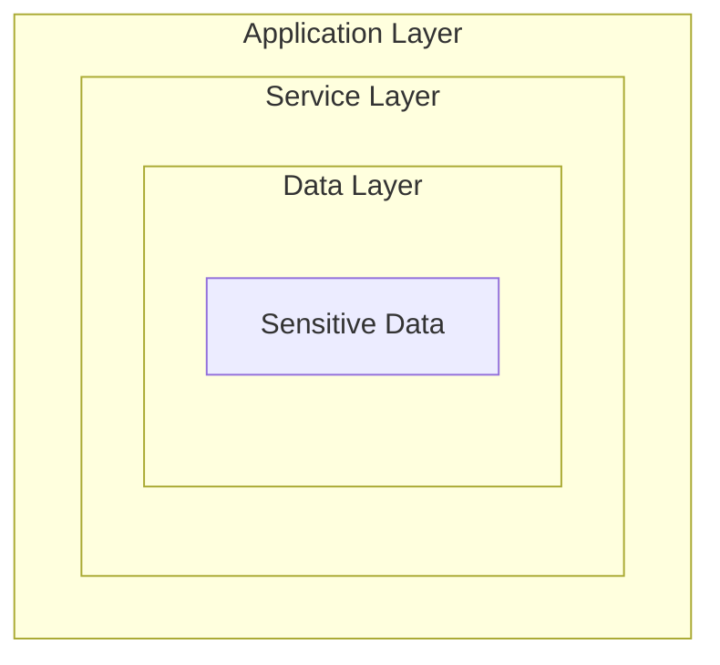

# Security Framework

> Comprehensive security patterns and best practices for software development

---

## Table of Contents

- [1. Overview](#1-overview)
- [2. Contents](#2-contents)
- [3. Security Principles](#3-security-principles)
- [4. Quick Reference](#4-quick-reference)

---

## 1. Overview

This framework provides security guidelines and patterns for:

- **Authentication**: Identity verification mechanisms
- **Authorization**: Access control and permissions
- **Secrets Management**: Secure handling of sensitive data
- **Security Checklist**: Comprehensive security review guide

---

## 2. Contents

### Framework Documents (Concepts)

| Document                 | Purpose                        | When to Use                        |
|--------------------------|--------------------------------|------------------------------------|
| `AUTHENTICATION.md`      | Identity verification patterns | Implementing login, tokens, SSO    |
| `AUTHORIZATION.md`       | Access control strategies      | Role-based, attribute-based access |
| `SECRETS_MANAGEMENT.md`  | Secure data handling           | API keys, passwords, certificates  |
| `SECURITY_CHECKLIST.md`  | Security review guide          | Code review, deployment, audit     |

### Practice Documents (Implementation)

| Document                 | Purpose                        | When to Use                        |
|--------------------------|--------------------------------|------------------------------------|
| [Authorization Implementation](../../practices/engineering/security/AUTHORIZATION_IMPLEMENTATION.md) | Authorization code examples | Implementing RBAC, ABAC, API auth |

---

## 3. Security Principles

### 3.1 Defense in Depth

### 3.2 Core Principles

| Principle                | Description                         |
|--------------------------|-------------------------------------|
| **Least Privilege**      | Grant minimum necessary permissions |
| **Defense in Depth**     | Multiple layers of security         |
| **Fail Secure**          | Default to secure state on failure  |
| **Zero Trust**           | Verify everything, trust nothing    |
| **Separation of Duties** | Distribute critical functions       |

### 3.3 STRIDE Threat Model

| Threat                     | Mitigation                         |
|----------------------------|------------------------------------|
| **S**poofing               | Strong authentication              |
| **T**ampering              | Input validation, integrity checks |
| **R**epudiation            | Audit logging                      |
| **I**nformation Disclosure | Encryption, access control         |
| **D**enial of Service      | Rate limiting, resource quotas     |
| **E**levation of Privilege | Authorization, least privilege     |

---

## 4. Quick Reference

### 4.1 Authentication Quick Check

- [ ] Strong password policy enforced
- [ ] Multi-factor authentication available
- [ ] Session management secure
- [ ] Token expiration configured
- [ ] Brute force protection enabled

### 4.2 Authorization Quick Check

- [ ] Role-based access control implemented
- [ ] Permissions validated server-side
- [ ] Resource ownership verified
- [ ] Admin functions protected
- [ ] API endpoints authorized

### 4.3 Data Security Quick Check

- [ ] Sensitive data encrypted at rest
- [ ] TLS for data in transit
- [ ] Secrets in secure storage
- [ ] PII handled appropriately
- [ ] Logs sanitized

---

## Related

- `.knowledge/practices/engineering/design/ERROR_HANDLING.md` — Secure error handling
- `.knowledge/practices/engineering/operations/LOGGING.md` — Security logging
- `config/core/security.yaml` — Security configuration
- `.context/decisions/ADR_0001_ARCHITECTURE.md` — Security architecture decisions

---

*Security Framework v1.0*
*Last reviewed: 2025-12-01 by Expert Committee (L2, Conditional Approve, 4.27/5)*
