# Junie Configuration Template System

> A reusable template system for JetBrains Junie AI collaboration configuration.

---

## Table of Contents

- [1. Overview](#1-overview)
- [2. Design Philosophy](#2-design-philosophy)
- [3. File Structure](#3-file-structure)
- [4. File Descriptions](#4-file-descriptions)
- [5. Usage Guide](#5-usage-guide)
- [6. Best Practices](#6-best-practices)
- [7. Customization](#7-customization)

---

## 1. Overview

The `.junie/` directory serves as a **thin layer** configuration system for JetBrains Junie AI collaboration. It
provides:

- **Generic AI collaboration rules** that apply to any project
- **Project-specific variables** centralized in one location
- **Separation of concerns** between reusable and customizable content

### Key Principles

| Principle         | Description                                                 |
|-------------------|-------------------------------------------------------------|
| **Thin Layer**    | Minimal configuration that delegates to deeper knowledge    |
| **Separation**    | Generic rules vs. project-specific content clearly divided  |
| **Reusability**   | Generic files can be copied to new projects without changes |
| **Single Source** | Project variables defined once, referenced everywhere       |

---

## 2. Design Philosophy

### 2.1 Two-Category Architecture

All files in `.junie/` are categorized as either:

| Category    | Symbol | Description                    | Examples                                     |
|-------------|--------|--------------------------------|----------------------------------------------|
| **Generic** | 🔄     | Reusable across projects       | `guidelines.md`, `generic/config.yaml`       |
| **Project** | 📌     | Must be customized per project | `project/config.yaml`, `project/QUICKREF.md` |

### 2.2 Variable Centralization

Project-specific values are centralized in `project/config.yaml`:

```yaml
# project/config.yaml - Single source of truth for project variables
project:
  name: "My Project"
  short_name: "my-project"
  version: "1.0.0"
tech_stack:
  language: "Python 3.12+"
  framework: "FastAPI"
commands:
  test: "pytest tests/ -v"
  lint: "ruff check src/"
```
Other files reference `project/config.yaml` instead of duplicating values.

### 2.3 Delegation Pattern

The `.junie/` thin layer delegates detailed knowledge to:

| Target        | Content Type                                   |
|---------------|------------------------------------------------|
| `.context/`   | Project-specific knowledge (ADRs, conventions) |
| `.knowledge/` | Generic, reusable knowledge                    |
| `docs/`       | User-facing documentation                      |

---

## 3. File Structure

```text
.junie/
├── guidelines.md           # 🔄 Main entry point (generic AI rules)
├── README.md               # 🔄 Directory documentation
│
├── docs/                   # 🔄 Documentation hub
│   ├── guides/             # Getting started guides
│   ├── mcp/                # MCP server documentation
│   ├── operations/         # Operations & maintenance
│   ├── reference/          # Reference materials
│   ├── vision/             # Future roadmap
│   └── README.md           # Docs index
│
├── generic/                # 🔄 Generic settings (reusable)
│   ├── config.yaml         # Junie settings
│   ├── INDEX.md            # Generic index
│   └── QUICKREF.md         # Quick reference card
│
├── mcp/                    # 🔄 MCP server configuration
│   └── mcp.json            # MCP servers definition
│
├── schema/                 # 🔄 JSON Schema definitions
│   ├── config.schema.json  # Config validation schema
│   └── mcp.schema.json     # MCP config schema
│
└── project/                # 📌 Project-specific files (must customize)
    ├── config.yaml         # Project variables definition
    ├── INDEX.md            # Project index
    └── QUICKREF.md         # Project-specific quick reference
```
### File Relationships

```mermaid
flowchart LR
    G["📋 guidelines.md"]
    subgraph GRP1[" 🔄 Generic "]
        GEN["⚙️ generic/"]
        MCP["🔌 mcp/"]
        DOC["📖 docs/"]
        SCH["📐 schema/"]
    end
    subgraph GRP2[" 📌 Project "]
        PY["📝 config.yaml"]
        PQ["📑 QUICKREF.md"]
    end
    G -->|loads| GRP1
    G -->|loads| GRP2
    PY -.->|referenced by| PQ
    classDef entry fill:#1a1a1a,stroke:#555,color:#fff,stroke-width:2px
    classDef generic fill:#2d2d2d,stroke:#444,color:#fff
    classDef project fill:#2d2d2d,stroke:#666,color:#fff
    class G entry
    class GEN,MCP,DOC,SCH generic
    class PY,PQ project
```


---

## 4. File Descriptions

### 4.1 Root Files (🔄)

#### `guidelines.md` — Entry Point

The primary entry point for AI collaboration. Contains:

- Autonomy levels (L1-L6) with examples
- Key behaviors and expectations
- Session history management rules
- Expert committee pattern
- Timeout hierarchy reference
- Coding and documentation standards
- Standard directory structure

**Size Target**: ~200-250 lines

#### `README.md` — Directory Documentation

Documents the `.junie/` directory structure and usage:

- File listing with types
- New project setup guide
- Customization guidelines
- File relationship diagram

**Size Target**: ~100 lines

### 4.2 Generic Directory (`generic/`) — 🔄

#### `generic/config.yaml` — Settings

YAML configuration for Junie behavior:

```yaml
collaboration:
  default_autonomy_level: L4
  preferred_language: en
  session_history:
    enabled: true
    location: ".history/"
context_loading:
  priority:
    - ".context/intelligence/"
    - ".context/conventions/"
output:
  temp_directory: ".outputs/"
timeouts:
  enabled: true
  tiers:
    T1: "100ms"
    T2: "500ms"
    T3: "2s"
    T4: "5s"
    T5: "10s"
```
**Size Target**: ~100 lines

#### `generic/QUICKREF.md` — Quick Reference

Instant lookup card for common information:

- Autonomy levels summary
- Timeout tiers table
- Session end checklist
- Standard paths
- Naming conventions

**Size Target**: ~100 lines

### 4.3 MCP Directory (`mcp/`) — 🔄

#### `mcp/mcp.json` — MCP Configuration

MCP server configuration with profiles:

```json
{
  "mcpServers": {
    "filesystem": {
      ...
    },
    "memory": {
      ...
    },
    "github": {
      ...
    }
  }
}
```
Supports environment variables like `${PROJECT_ROOT}`.

### 4.4 Project Directory (`project/`) — 📌

#### `project/config.yaml` — Variables Definition

Centralizes all project-specific values:

```yaml
project:
  name: "Project Name"
  short_name: "project-name"
  description: "Brief description"
  version: "1.0.0"
tech_stack:
  language: "Python 3.12+"
  framework: "FastAPI"
  testing: "pytest"
directories:
  source: "src/"
  tests: "tests/"
  docs: "docs/"
commands:
  test: "pytest tests/ -v"
  lint: "ruff check src/"
key_files:
  main_config: "config/settings.yaml"
  entry_point: "src/main.py"
```
#### `project/QUICKREF.md` — Project Quick Reference

Project-specific quick reference including:

- Project overview and philosophy
- Tech stack details
- Directory structure
- Important files and paths
- Quick commands
- Project-specific tips

---

## 5. Usage Guide

### 5.1 New Project Setup

```bash
# 1. Copy the entire .junie directory from template
cp -r template/.junie .junie
# 2. The directory structure will be:
#    .junie/
#    ├── guidelines.md          # Keep as-is (generic)
#    ├── README.md              # Keep as-is (generic)
#    ├── docs/                  # Keep as-is (documentation)
#    │   ├── guides/
#    │   ├── mcp/
#    │   ├── operations/
#    │   ├── reference/
#    │   └── vision/
#    ├── generic/               # Keep as-is (generic settings)
#    │   ├── config.yaml
#    │   ├── INDEX.md
#    │   └── QUICKREF.md
#    ├── mcp/                   # Keep as-is (MCP config)
#    │   └── mcp.json
#    ├── schema/                # Keep as-is (JSON schemas)
#    │   ├── config.schema.json
#    │   └── mcp.schema.json
#    └── project/               # Customize these files
#        ├── config.yaml
#        ├── INDEX.md
#        └── QUICKREF.md
# 3. Edit project/config.yaml with your project's information
# 4. Edit project/QUICKREF.md with project-specific documentation
```
### 5.2 Updating Generic Files

When the template system is updated:

1. Review changelog for breaking changes
2. Back up existing generic files
3. Copy new generic files
4. Verify project-specific files still work

### 5.3 Project Migration

To migrate an existing project:

1. Copy the entire `.junie/` directory from template
2. Keep `generic/`, `mcp/`, `docs/`, and `schema/` directories unchanged
3. Extract project-specific values into `project/config.yaml`
4. Move project quick reference to `project/QUICKREF.md`
5. Remove duplicated content from other files

---

## 6. Best Practices

### 6.1 Keep the Thin Layer Thin

| Do                        | Don't                         |
|---------------------------|-------------------------------|
| Reference detailed docs   | Duplicate detailed content    |
| Use short summaries       | Include full specifications   |
| Link to `.context/`       | Copy from `.context/`         |
| Keep files ~100-250 lines | Create large monolithic files |

### 6.2 Variable Naming in project/config.yaml

```yaml
# Good - Clear, hierarchical
project:
  name: "My API Server"
tech_stack:
  language: "Python 3.12+"
commands:
  test: "pytest tests/"
# Bad - Flat, unclear
name: "My API Server"
lang: "Python"
cmd_test: "pytest"
```
### 6.3 Separation Discipline

**Never include in generic files:**

- Project names or identifiers
- Specific file paths (use placeholders like `src/`)
- Technology-specific commands
- Team or organization names

**Always include in project files:**

- All project-specific identifiers
- Actual commands and paths
- Technology choices and versions
- Project philosophy and goals

### 6.4 Version Control

```yaml
# Include schema version in each file
schema_version: "1.0"
```
This enables:

- Compatibility checking
- Migration scripts
- Breaking change detection

---

## 7. Customization

### 7.1 Adding New Generic Sections

When adding to `guidelines.md`:

1. Ensure content is truly generic (applies to any project)
2. Use placeholder paths (`src/`, `tests/`, etc.)
3. Reference `project/config.yaml` for specific values
4. Keep under 50 lines per section

### 7.2 Extending project/config.yaml

Add new sections as needed:

```yaml
# Custom sections for specific needs
deployment:
  environment: "production"
  region: "us-east-1"
team:
  contact: "team@example.com"
  slack_channel: "#project-dev"
```
### 7.3 MCP Profile Customization

Define profiles in `generic/config.yaml`:

```yaml
mcp:
  profiles:
    minimal:
      - filesystem
      - memory
    standard:
      - filesystem
      - memory
      - github
      - fetch
    full:
      - all
```
---

## Related

- `.knowledge/practices/ai_collaboration/SESSION_MANAGEMENT.md` — Session history practices
- `.knowledge/practices/ai_collaboration/INTERACTION_PATTERNS.md` — AI interaction patterns
- `.knowledge/practices/ai_collaboration/CONTEXT_MANAGEMENT.md` — Context loading strategies
- `.knowledge/practices/ai_collaboration/WORKFLOW.md` — AI collaboration workflow

---

*AI Collaboration Knowledge Base*
