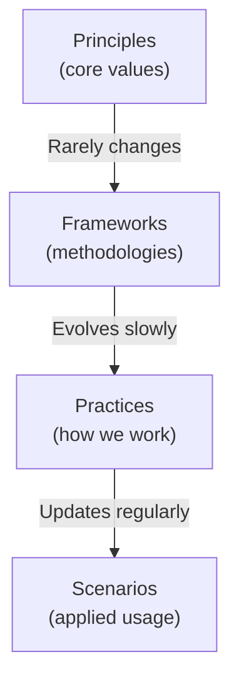

# Knowledge Capture

> When and how to document knowledge during AI collaboration

---

## Table of Contents

- [1. Overview](#1-overview)
- [2. Capture Triggers](#2-capture-triggers)
- [3. Knowledge Types](#3-knowledge-types)
- [4. Capture Process](#4-capture-process)
- [5. Storage Locations](#5-storage-locations)
- [6. Quality Standards](#6-quality-standards)

---

## 1. Overview

### 1.1 Why Capture Knowledge?

Knowledge capture transforms ephemeral collaboration insights into persistent, reusable assets:

- **Prevent Re-discovery**: Don't solve the same problem twice
- **Enable Continuity**: Future sessions benefit from past learnings
- **Build Institutional Memory**: Project knowledge survives personnel changes
- **Improve Efficiency**: Faster onboarding and context loading

### 1.2 Capture Philosophy

| Principle              | Description                      |
|------------------------|----------------------------------|
| **Capture at Source**  | Document while context is fresh  |
| **Right-size Content** | Not too brief, not too verbose   |
| **Structured Storage** | Consistent locations and formats |
| **Living Documents**   | Update as understanding evolves  |

---

## 2. Capture Triggers

### 2.1 Automatic Triggers

These situations should always trigger knowledge capture:

| Trigger                   | What to Capture                 | Where                                    |
|---------------------------|---------------------------------|------------------------------------------|
| **Architecture Decision** | Decision, context, alternatives | `.context/decisions/ADR-*.md`            |
| **New Convention**        | Pattern, rationale, examples    | `.context/conventions/*.md`              |
| **Bug Resolution**        | Problem, cause, solution        | Session notes or postmortem              |
| **Performance Finding**   | Benchmark, optimization         | `.context/intelligence/OPTIMIZATIONS.md` |

### 2.2 Conditional Triggers

Capture if the insight is likely to be useful again:

| Trigger                              | Capture If...             |
|--------------------------------------|---------------------------|
| **Solved a tricky problem**          | Solution wasn't obvious   |
| **Made a workaround**                | Underlying issue persists |
| **Discovered undocumented behavior** | Others might encounter it |
| **Found useful tool/command**        | Not common knowledge      |
| **Identified a pattern**             | Applicable to future work |

### 2.3 Session-End Triggers

Always review at session end:

`````markdown
## Session-End Knowledge Check
1. [ ] Any decisions worth documenting as ADR?
2. [ ] Any new patterns or conventions established?
3. [ ] Any gotchas or pitfalls discovered?
4. [ ] Any useful commands or snippets?
5. [ ] Any calibration insights for AI collaboration?
```
---

## 3. Knowledge Types

### 3.1 Knowledge Categories

| Category        | Description           | Examples                                  |
|-----------------|-----------------------|-------------------------------------------|
| **Declarative** | Facts and information | API endpoints, config values              |
| **Procedural**  | How to do something   | Setup steps, deployment process           |
| **Conceptual**  | Why things work       | Architecture rationale, design principles |
| **Contextual**  | Project-specific      | Conventions, team preferences             |

### 3.2 Knowledge Hierarchy


### 3.3 Knowledge Lifecycle

| Stage           | Action                          | Duration        |
|-----------------|---------------------------------|-----------------|
| **Emerging**    | Capture in session notes        | Hours           |
| **Validated**   | Promote to appropriate location | Days            |
| **Established** | Reference in guidelines         | Weeks-Months    |
| **Deprecated**  | Archive with reason             | When superseded |

---

## 4. Capture Process

### 4.1 In-Session Capture

Quick capture during active work:

`````markdown
<!-- Quick Note: Drop in session state -->
## Notable Findings
### [Topic]
- **What**: Brief description
- **Why it matters**: Impact or importance
- **Details**: Specifics if needed
```
### 4.2 Post-Session Processing

After session, promote valuable knowledge:

```text
1. Review session notes and conversation
2. Identify knowledge worth preserving
3. Determine appropriate storage location
4. Format according to target template
5. Create/update document
6. Link from relevant indexes
7. Commit changes
```
### 4.3 Capture Templates

#### Decision Capture

`````markdown
## Decision: [Title]
**Date**: YYYY-MM-DD
**Status**: Accepted | Superseded | Deprecated
### Context
What situation prompted this decision?
### Decision
What was decided?
### Consequences
What are the implications?
```
#### Pattern Capture

`````markdown
## Pattern: [Name]
### Context
When does this pattern apply?
### Problem
What problem does it solve?
### Solution
How does it work?
### Example
```code
// Concrete example
```
### Related
- Links to related patterns
```
#### Gotcha Capture

`````markdown
## Gotcha: [Brief Title]
**Discovered**: YYYY-MM-DD
**Severity**: Low | Medium | High
### Symptom
What does it look like when you hit this?
### Cause
Why does this happen?
### Solution
How to fix or avoid it?
```
---

## 5. Storage Locations

### 5.1 Location Guide

| Knowledge Type            | Location                  | Format               |
|---------------------------|---------------------------|----------------------|
| Architecture decisions    | `.context/decisions/`     | ADR template         |
| Coding conventions        | `.context/conventions/`   | Standard doc         |
| AI collaboration insights | `.context/intelligence/`  | Patterns/calibration |
| Configuration docs        | `.context/policies/`      | Config reference     |
| General practices         | `.knowledge/practices/`   | Practice guide       |
| Reusable frameworks       | `.knowledge/frameworks/`  | Framework doc        |
| Scenario contexts         | `.knowledge/scenarios/`   | Context file         |
| Session records           | `.history/conversations/` | Conversation record  |
| User documentation        | `docs/`                   | User-facing docs     |

### 5.2 Decision Tree

```
Is this knowledge...
├─ A significant technical decision?
│  └─ YES → .context/decisions/ADR_NNNN_*.md
│
├─ A coding pattern or standard?
│  └─ YES → .context/conventions/*.md
│
├─ About AI collaboration?
│  └─ YES → .context/intelligence/*.md
│
├─ A reusable practice?
│  └─ YES → .knowledge/practices/*/*.md
│
├─ Scenario-specific guidance?
│  └─ YES → .knowledge/scenarios/*/CONTEXT.md
│
├─ A session insight worth preserving?
│  └─ YES → .history/conversations/*.md
│
└─ User-facing documentation?
   └─ YES → docs/*/*.md
```
### 5.3 Cross-Referencing

Always link related knowledge:

`````markdown
## Related
- `path/to/related/DOC.md` — Brief description
- `another/related/DOC.md` — Why it's relevant
```
---

## 6. Quality Standards

### 6.1 Content Checklist

- [ ] **Clear title** that describes the content
- [ ] **Purpose statement** explaining why this exists
- [ ] **Structured format** following templates
- [ ] **Concrete examples** where applicable
- [ ] **Related links** to connected knowledge
- [ ] **Date/version** for tracking currency

### 6.2 Writing Guidelines

| Do                        | Don't                          |
|---------------------------|--------------------------------|
| Be concise but complete   | Write novels                   |
| Use examples              | Only use abstract descriptions |
| Include rationale         | Just state rules               |
| Link to sources           | Leave references vague         |
| Update when things change | Let docs go stale              |

### 6.3 Review Criteria

Before committing knowledge documents:

`````markdown
## Knowledge Quality Check
1. [ ] Would this help someone new to the project?
2. [ ] Is it findable in the right location?
3. [ ] Does it follow the appropriate template?
4. [ ] Are examples accurate and tested?
5. [ ] Are related documents linked?
```
---

## Quick Reference

### Capture Commands

```bash
# Create new ADR
touch .context/decisions/ADR_NNNN_TITLE.md
# Add to conventions
touch .context/conventions/NEW_CONVENTION.md
# Record conversation insight
touch .history/conversations/$(date +%Y%m%d)_TOPIC.md
```
### Capture Checklist

| When                | What              | Where                    |
|---------------------|-------------------|--------------------------|
| Made a decision     | ADR               | `.context/decisions/`    |
| Found a pattern     | Pattern doc       | `.context/conventions/`  |
| Learned something   | Session note      | `.history/`              |
| Optimized something | Optimization note | `.context/intelligence/` |

---

## Related

- `.knowledge/practices/ai_collaboration/SESSION_MANAGEMENT.md` — Session handling
- `.knowledge/practices/documentation/DOCUMENTATION_STANDARDS.md` — Documentation standards
- `.knowledge/templates/ADR.md` — ADR template
- `.context/intelligence/PATTERNS.md` — AI patterns

---

*AI Collaboration Knowledge Base*
