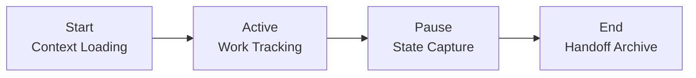

# Session Management

> Best practices for managing AI collaboration sessions effectively

---

## Table of Contents

- [1. Overview](#1-overview)
- [2. Session Lifecycle](#2-session-lifecycle)
- [3. Context Preservation](#3-context-preservation)
- [4. State Tracking](#4-state-tracking)
- [5. Handoff Strategies](#5-handoff-strategies)
- [6. Recovery Patterns](#6-recovery-patterns)

---

## 1. Overview

### 1.1 What is a Session?

A session represents a continuous period of AI-human collaboration on a specific task or set of related tasks. Effective
session management ensures:

- **Continuity**: Work can be resumed without loss
- **Context**: Relevant information is preserved
- **Efficiency**: No redundant exploration or re-discovery
- **Traceability**: Decisions and changes are documented

### 1.2 Session Types

| Type          | Duration      | Scope                   | Storage             |
|---------------|---------------|-------------------------|---------------------|
| **Quick**     | < 30 min      | Single task             | Memory only         |
| **Standard**  | 30 min - 2 hr | Multiple related tasks  | `.history/current/` |
| **Extended**  | > 2 hr        | Complex feature/project | Full documentation  |
| **Multi-day** | Days/weeks    | Major initiative        | Handoff required    |

---

## 2. Session Lifecycle

### 2.1 Session Phases


### 2.2 Session Start Checklist

- [ ] Review `.junie/GUIDELINES.md` for project context
- [ ] Check `.history/current/` for active sessions
- [ ] Review recent git commits for context
- [ ] Identify task scope and success criteria
- [ ] Establish autonomy level for the session

### 2.3 Session End Checklist

- [ ] Summarize completed work
- [ ] Document any pending items
- [ ] Update or create handoff document
- [ ] Commit all changes
- [ ] Archive session state if needed

---

## 3. Context Preservation

### 3.1 Context Layers

| Layer         | Content                               | Persistence |
|---------------|---------------------------------------|-------------|
| **Project**   | Guidelines, conventions, architecture | Permanent   |
| **Task**      | Current objective, requirements       | Session     |
| **Working**   | Files modified, decisions made        | Session     |
| **Transient** | Temporary notes, exploration          | Memory      |

### 3.2 Critical Context Elements

`````markdown
## Session Context Template
### Objective
What are we trying to accomplish?
### Scope
- Included: [specific items]
- Excluded: [out of scope items]
### Constraints
- Time: [deadline if any]
- Dependencies: [blockers or requirements]
- Autonomy: [L1-L6 level]
### Key Files
- `path/to/main/file.py` — Primary file being modified
- `path/to/test/file.py` — Related test file
### Decisions Made
1. Decision with rationale
2. Another decision
```
### 3.3 Context Loading Strategy

```
Priority Order:
1. Guidelines (.junie/GUIDELINES.md)
2. Active session state (.history/current/)
3. Recent handoffs (.history/handoffs/)
4. Relevant conventions (.context/conventions/)
5. Task-specific knowledge (.knowledge/scenarios/)
```
---

## 4. State Tracking

### 4.1 Session State Document

Location: `.history/current/session-YYYYMMDD-HHMM.md`
`````markdown
# Session State: [Task Name]
> **Session ID**: session-20251129-2230
> **Started**: 2025-11-29 22:30
> **Last Updated**: 2025-11-29 23:15
> **Status**: Active
---
## Current Task
### Objective
[Clear description of what we're doing]
### Progress
- [x] Step 1 completed
- [x] Step 2 completed
- [ ] Step 3 in progress
- [ ] Step 4 pending
### Files Modified
| File                    | Changes          | Status      |
|-------------------------|------------------|-------------|
| `src/module.py`         | Added function X | Done        |
| `tests/test_module.py`  | Added tests      | In Progress |
### Decisions
1. Chose approach A because [reason]
### Blockers
- None currently
---
## Quick Resume
To continue: [specific next action]
```
### 4.2 Progress Tracking

| Status      | Marker | Meaning                 |
|-------------|--------|-------------------------|
| Completed   | `✓`    | Fully done this session |
| In Progress | `*`    | Currently working on    |
| Blocked     | `!`    | Cannot proceed          |
| Pending     | (none) | Not yet started         |

### 4.3 When to Update State

- After completing each major step
- Before any break or context switch
- When making significant decisions
- When encountering blockers
- At natural pause points

---

## 5. Handoff Strategies

### 5.1 Handoff Types

| Type             | When          | Content Level           |
|------------------|---------------|-------------------------|
| **Self-handoff** | Break/pause   | Minimal, resume context |
| **AI-to-AI**     | Session limit | Full context transfer   |
| **AI-to-Human**  | Review needed | Detailed explanation    |
| **Human-to-AI**  | New session   | Task description        |

### 5.2 Handoff Document Structure

Location: `.history/handoffs/YYYY-MM-DD-TASK-HANDOFF.md`
`````markdown
# Task Handoff: [Task Name]
> **From**: Session session-20251129-2230
> **Date**: 2025-11-29
> **Status**: Partial completion
---
## Summary
Brief description of what was accomplished and what remains.
## Completed Work
1. Item 1 with details
2. Item 2 with details
## Pending Items
1. [ ] Remaining task 1
2. [ ] Remaining task 2
## Context for Continuation
### Key Files
- `path/to/file.py` — Description of state
### Important Decisions
- Decision 1: Rationale
### Potential Issues
- Issue to watch for
## Recommended Next Steps
1. Immediate next action
2. Following action
```
### 5.3 Handoff Best Practices

- Write for someone with no prior context
- Include specific file paths and line numbers
- Document why, not just what
- List assumptions made
- Highlight any risks or concerns

---

## 6. Recovery Patterns

### 6.1 Session Recovery

When resuming after interruption:

```text
1. Load session state from .history/current/
2. Verify file states match documented state
3. Check git status for uncommitted changes
4. Review last action taken
5. Continue from documented position
```
### 6.2 Context Loss Recovery

When context is lost mid-session:

`````markdown
## Recovery Checklist
1. [ ] Check .history/current/ for session state
2. [ ] Review git log for recent commits
3. [ ] Check git diff for uncommitted changes
4. [ ] Search for TODO/FIXME comments added
5. [ ] Review test files for hints about work
```
### 6.3 Conflict Resolution

When multiple sessions conflict:

| Situation               | Resolution                       |
|-------------------------|----------------------------------|
| Overlapping changes     | Merge carefully, test thoroughly |
| Contradicting decisions | Escalate to human review         |
| Stale handoff           | Refresh context from codebase    |
| Missing context         | Ask for clarification            |

---

## Quick Reference

### Session Commands

```bash
# Check for active sessions
ls .history/current/
# View recent handoffs
ls -la .history/handoffs/
# Check uncommitted work
git status
git diff
# View recent activity
git log --oneline -10
```
### State File Naming

```text
.history/current/session-YYYYMMDD-HHMM.md
.history/handoffs/YYYY-MM-DD-TASK-NAME-HANDOFF.md
.history/conversations/YYYY-MM-DD-TOPIC.md
```
---

## Related

- `.knowledge/templates/SESSION_STATE.md` — Session state template
- `.knowledge/templates/TASK_HANDOFF.md` — Handoff template
- `.knowledge/practices/ai_collaboration/CONTEXT_MANAGEMENT.md` — Context strategies
- `.context/intelligence/calibration/PATTERNS.md` — AI collaboration patterns

---

*AI Collaboration Knowledge Base*
