# Diagram Standards (SSOT)

> Single source of truth for diagram creation standards using Mermaid

---

## Table of Contents

- [1. Overview](#1-overview)
- [2. Design Principles](#2-design-principles)
- [3. Diagram Types](#3-diagram-types)
- [4. Primary Diagrams](#4-primary-diagrams)
- [5. Common Diagrams](#5-common-diagrams)
- [6. Occasional Diagrams](#6-occasional-diagrams)
- [7. Rare Diagrams](#7-rare-diagrams)
- [8. Naming Conventions](#8-naming-conventions)
- [9. Layout Best Practices](#9-layout-best-practices)
- [10. IDE Configuration](#10-ide-configuration)
- [11. Troubleshooting](#11-troubleshooting)

---

## 1. Overview

| Rule | Requirement |
|------|-------------|
| **Tool** | Must use Mermaid |
| **Simplicity** | Clear, minimal styling |
| **Consistency** | Uniform style across project |
| **Compatibility** | GitHub/GitLab native support |

---

## 2. Design Principles

Apply 信达雅 (Xin-Da-Ya) philosophy to create effective diagrams.

**Priority**: 信 → 达 → 雅 (Faithfulness → Clarity → Elegance)

### 2.1 信 (Faithfulness) — Accurate Representation

| Checkpoint | Requirement |
|------------|-------------|
| **Completeness** | All essential steps/components included |
| **Accuracy** | Flow direction matches actual process |
| **Consistency** | Node types match their semantic meaning |
| **Traceability** | Diagram matches source documentation |

**Anti-patterns**:
- ❌ Omitting error paths or edge cases
- ❌ Misleading arrow directions
- ❌ Using wrong node shapes (e.g., decision diamond for a process)

### 2.2 达 (Clarity) — Clear Communication

| Checkpoint | Requirement |
|------------|-------------|
| **Readability** | Labels concise yet descriptive |
| **Structure** | Logical grouping with subgraphs |
| **Flow** | Single, clear direction (TD or LR) |
| **Density** | Max 15 nodes, max 2 nesting levels |

**Anti-patterns**:
- ❌ Cryptic abbreviations without context
- ❌ Crossing lines that confuse flow
- ❌ Mixing multiple directions in one diagram

### 2.3 雅 (Elegance) — Refined Simplicity

| Checkpoint | Requirement |
|------------|-------------|
| **Minimalism** | No redundant nodes or connections |
| **Balance** | Visual symmetry where possible |
| **Consistency** | Uniform naming and styling |
| **Whitespace** | Adequate spacing for readability |

**Anti-patterns**:
- ❌ Excessive styling or colors
- ❌ Duplicate information in labels
- ❌ Inconsistent node ID patterns

### 2.4 Design Checklist

Before finalizing any diagram:

1. **信**: Does this accurately represent the system/process?
2. **达**: Can a newcomer understand this in 30 seconds?
3. **雅**: Is every element necessary? Can anything be simplified?

---

## 3. Diagram Types

Mermaid supports 21 diagram types, organized by recommended usage frequency.

| Priority | Types | Count |
|----------|-------|-------|
| ⭐ **Primary** | Flowchart, Sequence | 2 |
| **Common** | Class, State, ER, User Journey, Timeline, C4 | 6 |
| **Occasional** | Gantt, Pie, Quadrant, XY Chart, Block, Architecture | 6 |
| **Rare** | Mindmap, Git Graph, Requirement, Sankey, Kanban, Packet, Radar | 7 |

### 3.1 Complete Type Reference

| Type | Syntax | Use Case | Priority |
|------|--------|----------|----------|
| Flowchart | `flowchart TD/LR` | Process flows, workflows, decision trees | ⭐ Primary |
| Sequence | `sequenceDiagram` | API calls, system interactions | ⭐ Primary |
| Class | `classDiagram` | Data models, OOP structures | Common |
| State | `stateDiagram-v2` | State machines, lifecycle | Common |
| ER | `erDiagram` | Database schemas, entity relationships | Common |
| User Journey | `journey` | User experience, customer journey | Common |
| Timeline | `timeline` | Historical events, version history | Common |
| C4 | `C4Context` | Software architecture (C4 model) | Common |
| Gantt | `gantt` | Project timelines, schedules | Occasional |
| Pie | `pie` | Proportions, distributions | Occasional |
| Quadrant | `quadrantChart` | Priority matrix, SWOT analysis | Occasional |
| XY Chart | `xychart-beta` | Line/bar charts, data visualization | Occasional |
| Block | `block-beta` | System components, module relationships | Occasional |
| Architecture | `architecture-beta` | Cloud architecture, infrastructure | Occasional |
| Mindmap | `mindmap` | Brainstorming, concept mapping | Rare |
| Git Graph | `gitGraph` | Branch strategies, commit flows | Rare |
| Requirement | `requirementDiagram` | Requirement tracking, specs | Rare |
| Sankey | `sankey-beta` | Flow analysis, energy/resource flow | Rare |
| Kanban | `kanban` | Task boards, workflow status | Rare |
| Packet | `packet-beta` | Network protocols, packet structure | Rare |
| Radar | `radar-beta` | Multi-dimensional comparison | Rare |

### 3.2 Selection Guide

| Scenario | Recommended Type |
|----------|------------------|
| Bootstrap/startup process | Flowchart (LR with subgraphs) |
| API request/response | Sequence diagram |
| Domain model | Class diagram |
| Object lifecycle | State diagram |
| Database design | ER diagram |
| User experience flow | User Journey |
| Version/release history | Timeline |
| Software architecture | C4 diagram |
| Project roadmap | Gantt chart |
| Data distribution | Pie chart |
| Priority/risk matrix | Quadrant chart |
| Metrics over time | XY Chart |
| System modules | Block diagram |
| Cloud infrastructure | Architecture diagram |

---

## 4. Primary Diagrams

### 4.1 Flowchart

> **Priority**: ⭐ Primary — Most common diagram type

#### Layout Direction

| Direction | Code | Use Case |
|-----------|------|----------|
| Top-down | `flowchart TD` | Vertical flow, many steps |
| Left-right | `flowchart LR` | Horizontal flow, phases |

#### Node Styles

| Style | Syntax | Purpose |
|-------|--------|---------|
| Rectangle | `[text]` | Normal step |
| Rounded | `(text)` | Process/operation |
| Stadium | `(["text"])` | Start/end node |
| Diamond | `{text}` | Decision |
| Hexagon | `{{text}}` | Condition |

#### Connection Styles

| Style | Syntax | Purpose |
|-------|--------|---------|
| Solid arrow | `-->` | Main flow |
| Dotted line | `-.-` | Annotation |
| With text | `--text-->` | Conditional branch |

#### Subgraph Grouping

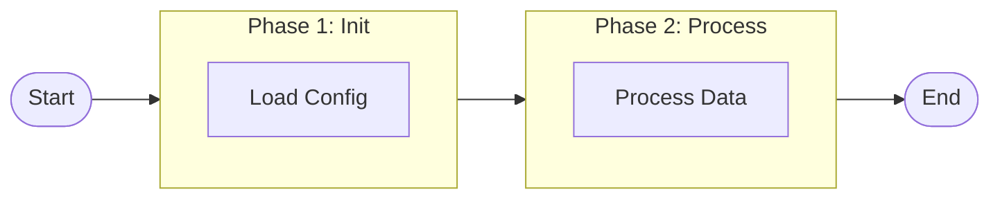

**Best Practices**:
- Use `subgraph` to group related nodes
- ID in English, display name can use other languages
- Keep 2-5 nodes per subgraph

### 4.2 Sequence Diagram

> **Priority**: ⭐ Primary — For system interactions and API flows

#### Basic Syntax

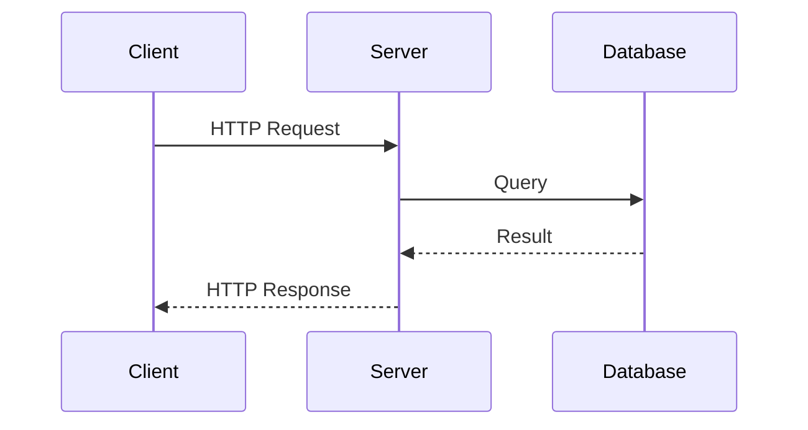

#### Message Types

| Syntax | Meaning | Use Case |
|--------|---------|----------|
| `->>` | Solid line, filled arrow | Synchronous call |
| `-->>` | Dotted line, filled arrow | Response/return |
| `--)` | Solid line, open arrow | Async message |
| `-x` | Solid line with X | Failed/cancelled |

#### Participant Aliases

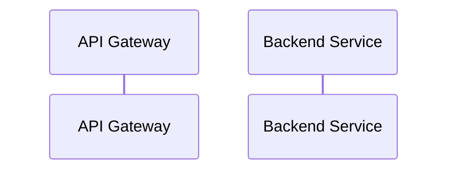

#### Advanced Features

| Feature | Syntax | Purpose |
|---------|--------|---------|
| Activation | `activate A` / `deactivate A` | Show processing time |
| Notes | `Note over A,B: text` | Add explanations |
| Loops | `loop Description` | Repeated actions |
| Alt/Else | `alt condition` | Conditional flows |

---

## 5. Common Diagrams

### 5.1 Class Diagram

> **Priority**: Common — For data models and OOP structures

#### Basic Syntax

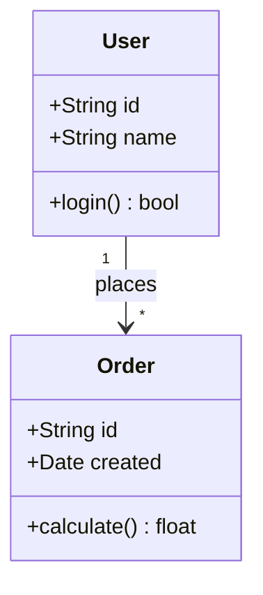

#### Visibility Modifiers

| Symbol | Meaning |
|--------|---------|
| `+` | Public |
| `-` | Private |
| `#` | Protected |
| `~` | Package/Internal |

#### Relationships

| Syntax | Meaning | Example |
|--------|---------|---------|
| `<\|--` | Inheritance | `Animal <\|-- Dog` |
| `*--` | Composition | `Car *-- Engine` |
| `o--` | Aggregation | `Team o-- Player` |
| `-->` | Association | `User --> Order` |
| `..>` | Dependency | `Service ..> Config` |

#### Cardinality

| Syntax | Meaning |
|--------|---------|
| `"1"` | Exactly one |
| `"*"` | Many |
| `"1..*"` | One or more |
| `"0..1"` | Zero or one |

### 5.2 State Diagram

> **Priority**: Common — For state machines and lifecycles

#### Basic Syntax

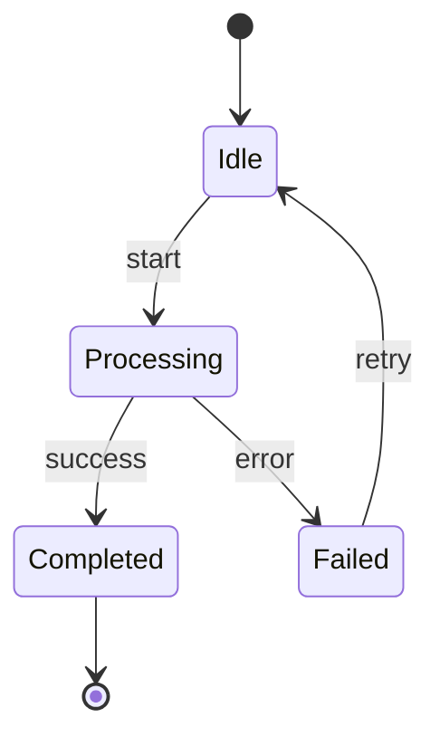

#### Special States

| Syntax | Meaning |
|--------|---------|
| `[*]` | Start/End state |
| `state "Name" as s1` | State with alias |

#### Composite States

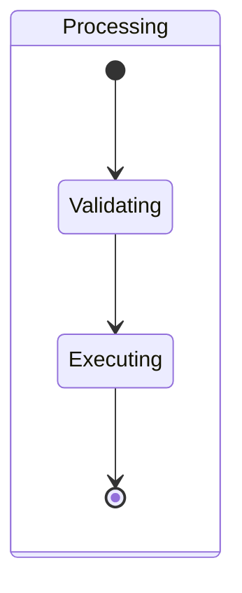

#### Transitions

| Element | Syntax |
|---------|--------|
| Basic | `A --> B` |
| With label | `A --> B : event` |
| With guard | `A --> B : [condition]` |

### 5.3 Entity Relationship Diagram

> **Priority**: Common — For database schemas

#### Basic Syntax

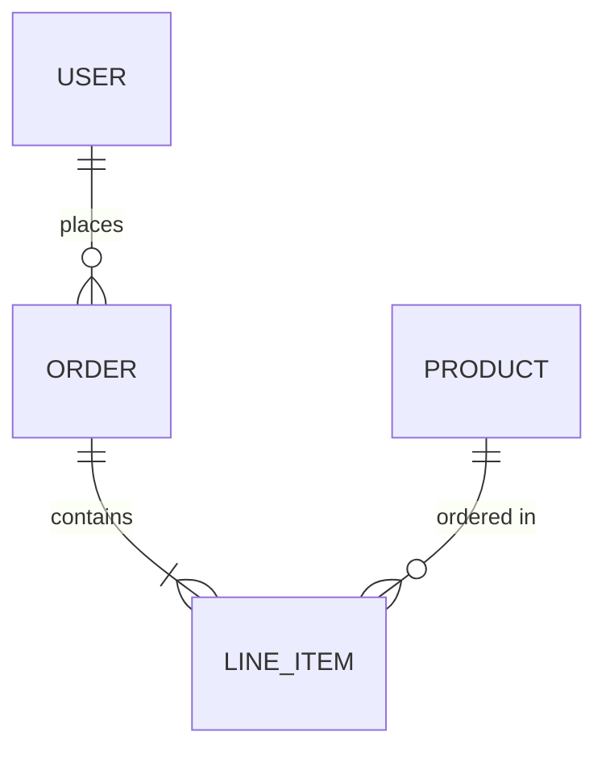

#### Relationship Symbols

| Left | Right | Meaning |
|------|-------|---------|
| `\|\|` | `\|\|` | Exactly one |
| `o\|` | `\|o` | Zero or one |
| `}o` | `o{` | Zero or more |
| `}\|` | `\|{` | One or more |

#### Entity Attributes

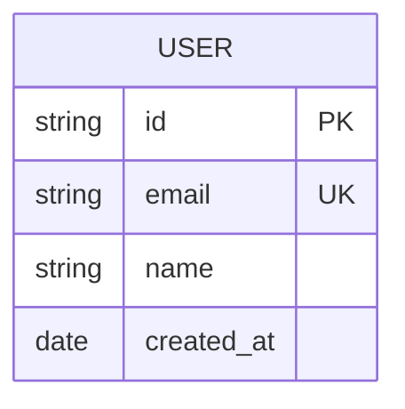

| Marker | Meaning |
|--------|---------|
| `PK` | Primary Key |
| `FK` | Foreign Key |
| `UK` | Unique Key |

### 5.4 User Journey Diagram

> **Priority**: Common — For user experience flows

#### Basic Syntax

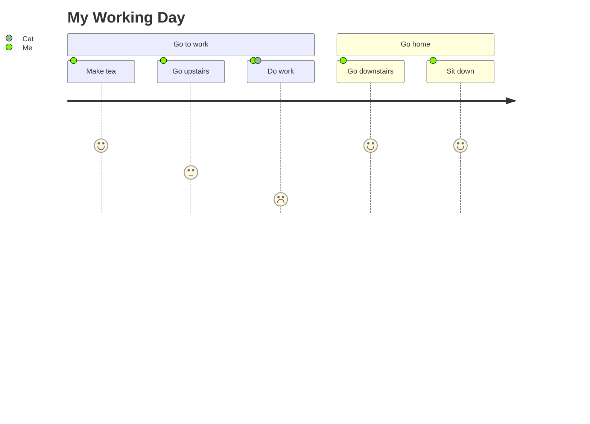

#### Elements

| Element | Format | Description |
|---------|--------|-------------|
| Title | `title Text` | Journey title |
| Section | `section Name` | Group of tasks |
| Task | `Task name: score: actors` | Individual task |

#### Score Scale

| Score | Meaning |
|-------|---------|
| 1 | Very negative |
| 3 | Neutral |
| 5 | Very positive |

### 5.5 Timeline Diagram

> **Priority**: Common — For historical events and version history

#### Basic Syntax

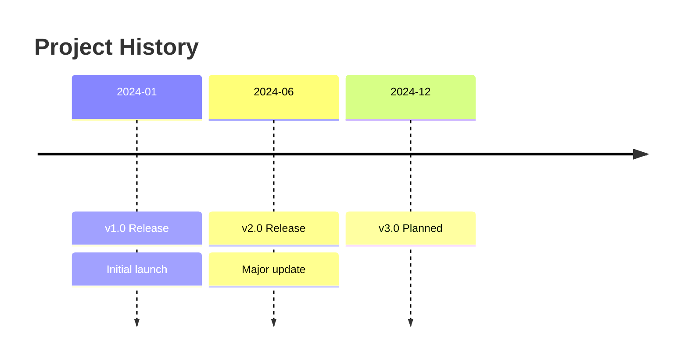

#### Elements

| Element | Description |
|---------|-------------|
| `title` | Timeline title |
| Date | Time period (flexible format) |
| Events | Multiple events per date supported |

### 5.6 C4 Diagram

> **Priority**: Common — For software architecture (C4 model)

#### Context Diagram

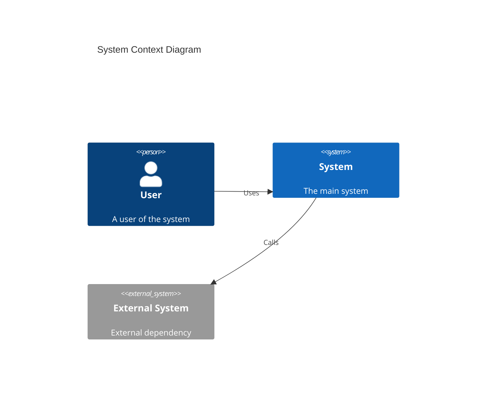

#### Container Diagram

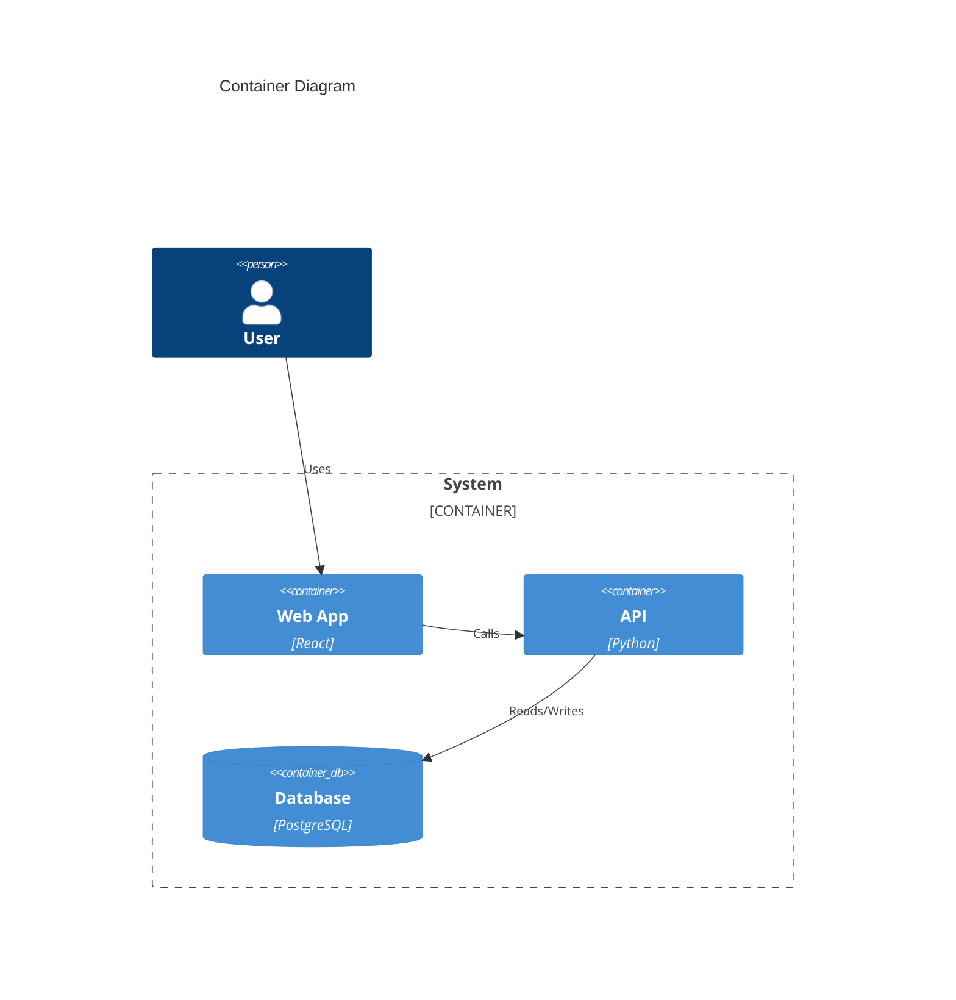

#### C4 Elements

| Element | Syntax | Use |
|---------|--------|-----|
| Person | `Person(id, name, desc)` | User/actor |
| System | `System(id, name, desc)` | Internal system |
| System_Ext | `System_Ext(id, name, desc)` | External system |
| Container | `Container(id, name, tech)` | Application component |
| ContainerDb | `ContainerDb(id, name, tech)` | Database |
| Rel | `Rel(from, to, desc)` | Relationship |

---

## 6. Occasional Diagrams

### 6.1 Gantt Chart

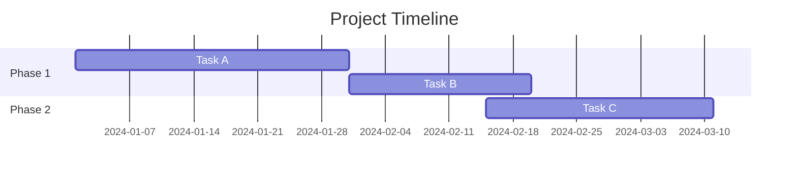

### 6.2 Pie Chart

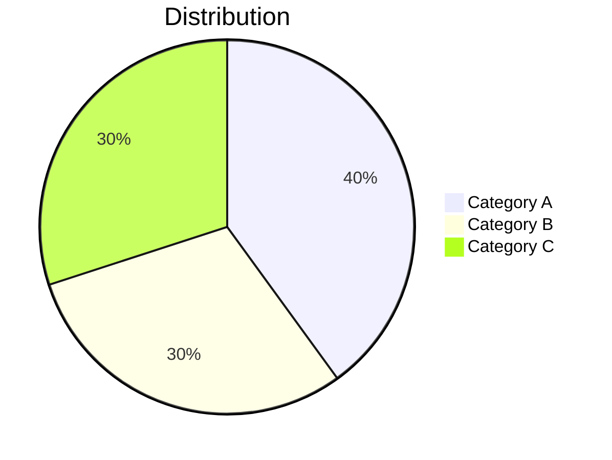

### 6.3 Quadrant Chart

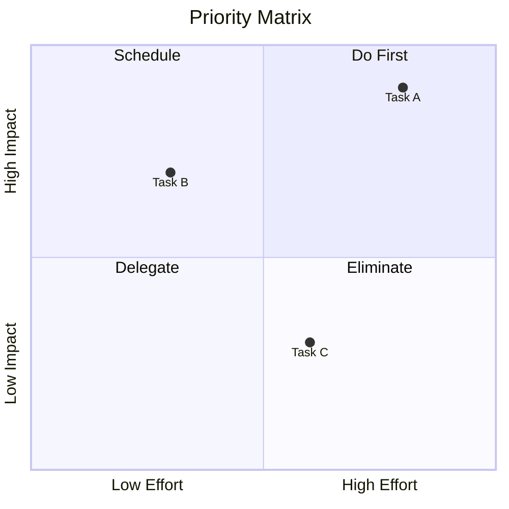

### 6.4 XY Chart

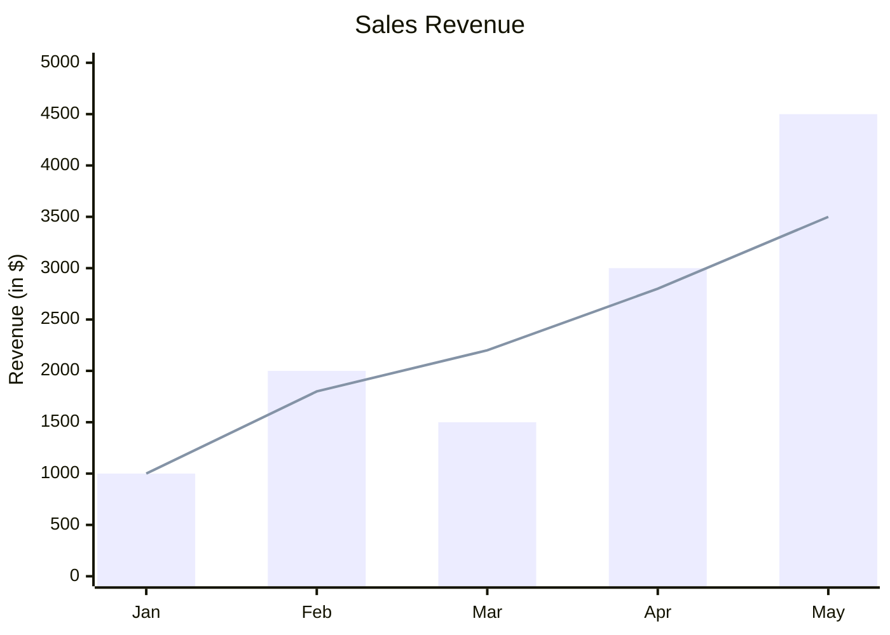

### 6.5 Block Diagram

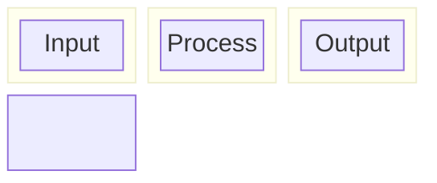

### 6.6 Architecture Diagram

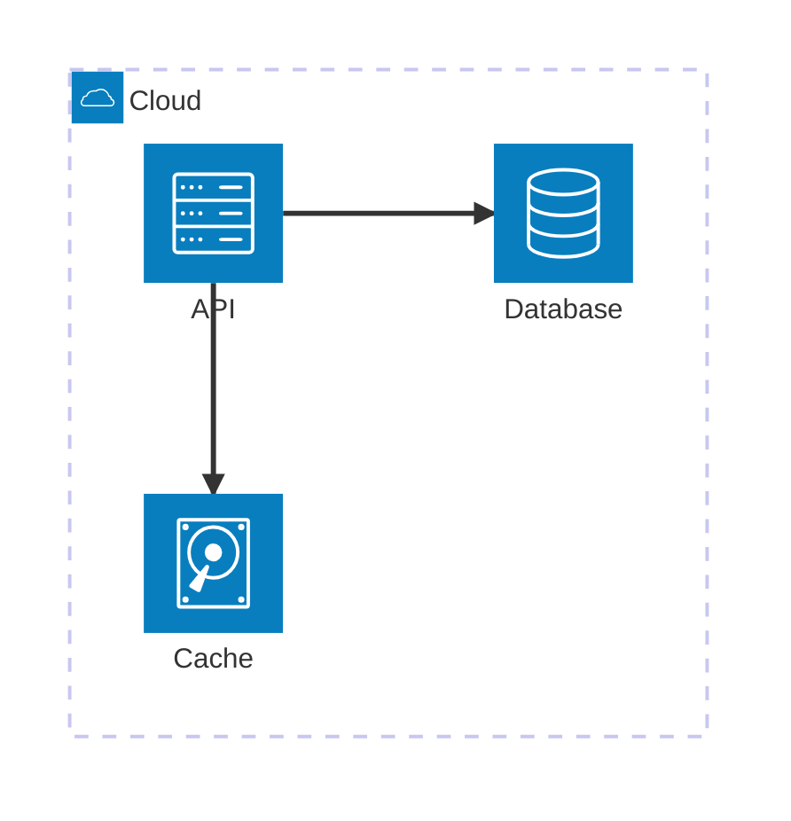

---

## 7. Rare Diagrams

### 7.1 Mindmap

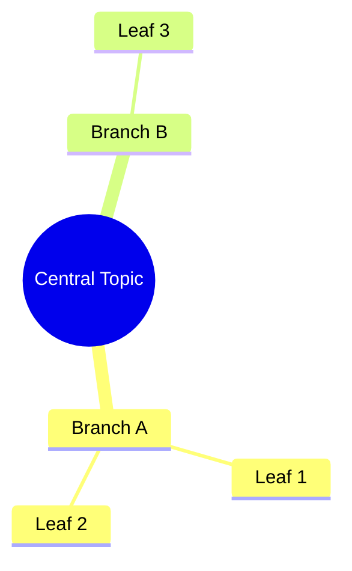

### 7.2 Git Graph

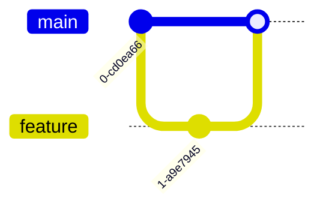

### 7.3 Requirement Diagram

```mermaid
requirementDiagram
    requirement test_req {
        id: 1
        text: The system shall do X
        risk: high
        verifymethod: test
    }
    
    element test_entity {
        type: simulation
    }
    
    test_entity - satisfies -> test_req
```

### 7.4 Sankey Diagram

```mermaid
sankey-beta
    Source A,Target X,100
    Source A,Target Y,50
    Source B,Target Y,75
    Source B,Target Z,25
```

### 7.5 Kanban Board

```mermaid
kanban
    column1[To Do]
        task1[Task 1]
        task2[Task 2]
    column2[In Progress]
        task3[Task 3]
    column3[Done]
        task4[Task 4]
```

### 7.6 Packet Diagram

```mermaid
packet-beta
    0-15: "Source Port"
    16-31: "Destination Port"
    32-63: "Sequence Number"
    64-95: "Acknowledgment Number"
```

### 7.7 Radar Chart

```mermaid
radar-beta
    title Skills Assessment
    axis Performance, Quality, Speed, Reliability, Scalability
    curve a[Team A]: 4, 3, 5, 4, 3
    curve b[Team B]: 3, 4, 4, 5, 4
```

---

## 8. Naming Conventions

| Element | Convention | Example |
|---------|------------|---------|
| Node ID | UPPER + number | `A1`, `B2`, `PHASE1` |
| Display text | Concise description | `["Load Config"]` |
| Subgraph ID | UPPER English | `PHASE1`, `INIT` |
| Participant ID | Short uppercase | `C`, `S`, `DB` |
| Class name | PascalCase | `UserService` |
| State name | PascalCase or UPPER | `Processing`, `IDLE` |

---

## 9. Layout Best Practices

| Principle | Description |
|-----------|-------------|
| Phase grouping | Use subgraph for logical phases |
| Consistent direction | Maintain uniform flow direction |
| Node limit | Max 15 nodes per diagram |
| Nesting limit | Max 2 levels deep |
| Participant limit | Max 6-8 participants in sequence diagrams |

### 9.1 Complex Diagram Handling

When diagram is too complex:

1. **Split diagrams**: Break into multiple smaller diagrams
2. **Hierarchical view**: Show overview first, then details
3. **Use tables**: Consider tables when steps exceed limits
4. **Focus on key paths**: Omit edge cases in overview diagrams

---

## 10. IDE Configuration

### 10.1 PyCharm

**Mermaid support**:
1. `File` → `Settings` → `Languages & Frameworks` → `Markdown`
2. Check `Mermaid` in "Markdown Extensions" (if available)
3. Set Preview browser to `JCEF`

**Alternative**: Install Mermaid plugin from JetBrains Marketplace

### 10.2 VS Code

- Built-in Mermaid support
- Recommended: "Markdown Preview Mermaid Support" extension

### 10.3 Platform Support

| Platform | Mermaid |
|----------|---------|
| GitHub | ✅ Native |
| GitLab | ✅ Native |

---

## 11. Troubleshooting

| Issue | Solution |
|-------|----------|
| Shows raw code | Check IDE Markdown Extensions settings |
| Rendering issues | Use simplest syntax, avoid complex styling |
| Inconsistent display | Test on target platform |
| Beta feature not working | Check Mermaid version compatibility |

---

## Related

- `.knowledge/guidelines/DOCUMENTATION.md` — Documentation guidelines
- `.knowledge/practices/documentation/DOCUMENTATION_STANDARDS.md` — Documentation standards
- `docs/design/core_engine/BOOTSTRAP.md` — Example: Flowchart usage

---

*AI Collaboration Knowledge Base*
