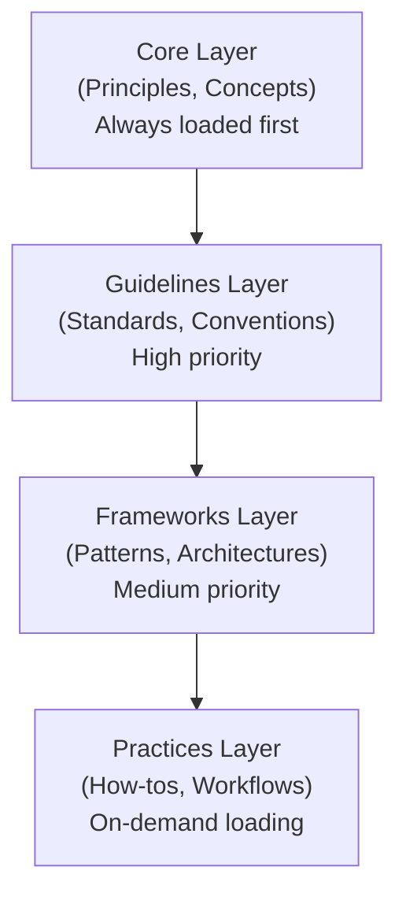

# Knowledge Management Scenario Context

> Pre-configured context for knowledge management system development

---

## Table of Contents

- [1. Scenario Profile](#1-scenario-profile)
- [2. Relevant Knowledge](#2-relevant-knowledge)
- [3. Project Structure](#3-project-structure)
- [4. Knowledge Architecture](#4-knowledge-architecture)
- [5. Content Patterns](#5-content-patterns)
- [6. Common Tasks](#6-common-tasks)
- [7. Autonomy Calibration](#7-autonomy-calibration)
- [8. Quick Commands](#8-quick-commands)
- [9. Best Practices](#9-best-practices)

---

## 1. Scenario Profile

```yaml
scenario: knowledge_management
languages: [ markdown, yaml, python ]
tools: [ kb-cli, mkdocs, sphinx, obsidian ]
focus: [ content-organization, taxonomy, search, ai-integration ]
autonomy_default: L3
```

---

## 2. Relevant Knowledge

| Priority      | Files                                                      |
|---------------|------------------------------------------------------------|
| **Auto-Load** | `.knowledge/core/PRINCIPLES.md`<br/>`.knowledge/references/KNOWLEDGE_QUICK_REF.md` |
| **On-Demand** | `.knowledge/practices/documentation/KNOWLEDGE_ORGANIZATION.md`<br/>`.knowledge/frameworks/design/`<br/>`.knowledge/practices/documentation/DOCUMENTATION_STANDARDS.md`<br/>`.knowledge/practices/ai_collaboration/KNOWLEDGE_EXTRACTION.md` |

---

## 3. Project Structure

| Directory     | Purpose                      |
|---------------|------------------------------|
| `.knowledge/` | Generic, reusable knowledge  |
| `.context/`   | Project-specific knowledge   |
| `docs/`       | User-facing documentation    |
| `config/`     | Configuration files          |
| `.history/`   | Session history and handoffs |

---

## 4. Knowledge Architecture

### 4.1 Layer Model


### 4.2 Content Types

| Type          | Purpose                     | Format                            |
|---------------|-----------------------------|-----------------------------------|
| **Principle** | Fundamental truth or belief | Declarative statement             |
| **Concept**   | Abstract idea or notion     | Definition + examples             |
| **Guideline** | Recommended practice        | Rule + rationale                  |
| **Pattern**   | Reusable solution           | Problem → Solution → Consequences |
| **Practice**  | Step-by-step guide          | Procedure + tips                  |
| **Reference** | Lookup information          | Tables, lists                     |

### 4.3 Document Standards

> **Note**: This project does NOT use YAML frontmatter. Version tracking is handled by Git, and token estimates are not maintained in files.

| Standard              | Requirement                                    |
|-----------------------|------------------------------------------------|
| **No Frontmatter**    | Documents start with `# Title`, no YAML header |
| **No Version Tags**   | Version history via Git                        |
| **No Token Counts**   | Token estimates not maintained in files        |
| **Content-First**     | Document content speaks for itself             |
| **Standard Footer**   | `*AI Collaboration Knowledge Base*`            |

---

## 5. Content Patterns

### 5.1 Document Template

`````markdown
# Title
> One-line description
---
## Table of Contents
- [Section 1](#section-1)
- [Section 2](#section-2)
---
## Section 1
### 1.1 Subsection
Content...
---
## Related
- Related doc 1
- Related doc 2
---
*AI Collaboration Knowledge Base*
```
### 5.2 Index Pattern

<!-- Example template - replace placeholder links with actual document paths -->

`````markdown
# Category Index
> Navigation for [category] knowledge
---
## Quick Links
| Document       | Purpose     | Tokens |
|----------------|-------------|--------|
| [Doc 1](path1) | Description | ~200   |
| [Doc 2](path2) | Description | ~300   |
---
## By Topic
### Topic A
- Document 1
- Document 2
### Topic B
- Document 3
---
*AI Collaboration Knowledge Base*
```
### 5.3 Cross-Reference Pattern

`````markdown
## References
### Internal
- `.knowledge/core/PRINCIPLES.md` — Core principles
- `.knowledge/practices/ai_collaboration/WORKFLOW.md` — Implementation guide
### External
- [External Resource](https://example.com) — Description
### Related Decisions
- ADR-0001: Architecture decision
```

---

## 6. Common Tasks

| Task                        | Steps                                                        |
|-----------------------------|--------------------------------------------------------------|
| **Add knowledge content**   | Choose layer → Create file → Add metadata → Link in index    |
| **Reorganize structure**    | Analyze current → Plan changes → Update links → Verify       |
| **Create taxonomy**         | Identify concepts → Define hierarchy → Apply tags → Document |
| **Improve discoverability** | Add metadata → Create indexes → Enhance cross-refs           |
| **Integrate with AI**       | Define context → Configure loading → Test retrieval          |
| **Quality audit**           | Check completeness → Verify links → Validate format          |

### 6.1 Adding New Knowledge

```bash
# 1. Create content file
touch .knowledge/practices/new_topic/guide.md
# 2. Add content with metadata
# (Use standard template)
# 3. Update layer index
# Edit .knowledge/practices/INDEX.md
# 4. Verify integration
kb-cli search "new topic"
```
### 6.2 Knowledge Extraction Workflow

```text
1. Source Identification
   └── Identify knowledge source (docs, code, conversations)
2. Content Extraction
   └── Extract key information
   └── Identify patterns and principles
3. Structuring
   └── Choose appropriate layer
   └── Apply document template
   └── Add metadata
4. Integration
   └── Link to related content
   └── Update indexes
   └── Verify searchability
5. Validation
   └── Review for accuracy
   └── Check for completeness
   └── Test AI retrieval
```

---

## 7. Autonomy Calibration

| Task Type              | Level | Notes                 |
|------------------------|-------|-----------------------|
| Fix typos in content   | L5    | Low risk, routine     |
| Add new content file   | L3-L4 | Follow templates      |
| Reorganize structure   | L2-L3 | May affect navigation |
| Change taxonomy        | L2    | Cross-cutting impact  |
| Modify metadata schema | L1-L2 | Affects all content   |
| Update core principles | L1    | Fundamental changes   |
| Create new layer       | L1    | Architecture decision |

---

## 8. Quick Commands

| Category       | Commands                                                          |
|----------------|-------------------------------------------------------------------|
| **Search**     | `kb-cli search "query"`<br/>`grep -r "pattern" .knowledge/`       |
| **Validate**   | `kb-cli validate --all`<br/>`markdownlint .knowledge/`            |
| **Index**      | `kb-cli index --rebuild`<br/>`find content -name "*.md"`          |
| **Statistics** | `kb-cli info --layers`<br/>`wc -l .knowledge/**/*.md`             |

---

## 9. Best Practices

### 9.1 Content Organization

| Practice                    | Description                    |
|-----------------------------|--------------------------------|
| **Single Responsibility**   | Each document covers one topic |
| **Appropriate Granularity** | Not too broad, not too narrow  |
| **Consistent Naming**       | Follow naming conventions      |
| **Rich Metadata**           | Enable discovery and filtering |
| **Cross-References**        | Connect related content        |

### 9.2 Knowledge Quality

| Dimension           | Criteria                      |
|---------------------|-------------------------------|
| **Accuracy**        | Factually correct, up-to-date |
| **Completeness**    | Covers topic adequately       |
| **Clarity**         | Easy to understand            |
| **Consistency**     | Follows standards             |
| **Discoverability** | Easy to find                  |

### 9.3 AI Integration

| Aspect                | Consideration                          |
|-----------------------|----------------------------------------|
| **Token Budget**      | Estimate and document token count      |
| **Loading Priority**  | Set appropriate auto_load flags        |
| **Context Relevance** | Tag content for scenario-based loading |
| **Chunking**          | Structure for partial retrieval        |

---

## Related

- `.knowledge/practices/documentation/KNOWLEDGE_ORGANIZATION.md` — Organization patterns
- `.knowledge/practices/documentation/DOCUMENTATION_STANDARDS.md` — Documentation standards
- `.knowledge/practices/ai_collaboration/KNOWLEDGE_CAPTURE.md` — Capture techniques
- `.knowledge/frameworks/design/INDEX.md` — Design patterns

---

*AI Collaboration Knowledge Base*

