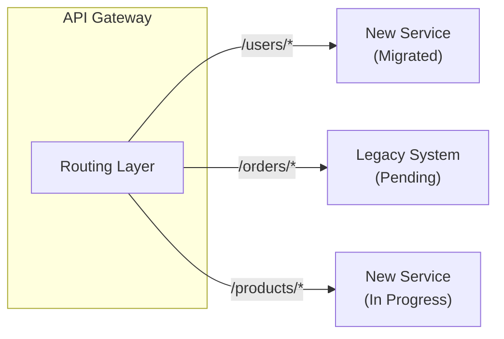

# Legacy Modernization Scenario Context

> Pre-configured context for modernizing legacy systems

---

## Table of Contents

- [1. Scenario Profile](#1-scenario-profile)
- [2. Relevant Knowledge](#2-relevant-knowledge)
- [3. Modernization Strategies](#3-modernization-strategies)
- [4. Assessment](#4-assessment)
- [5. Migration Patterns](#5-migration-patterns)
- [6. Risk Management](#6-risk-management)
- [7. Common Tasks](#7-common-tasks)
- [8. Autonomy Calibration](#8-autonomy-calibration)

---

## 1. Scenario Profile

```yaml
scenario: legacy_modernization
languages: [ python, java, csharp, cobol ]
focus: [ refactoring, migration, testing, documentation ]
autonomy_default: L2
```
---

## 2. Relevant Knowledge

| Priority      | Files                                                                                                   |
|---------------|---------------------------------------------------------------------------------------------------------|
| **Auto-Load** | `core/PRINCIPLES.md`<br/>`.knowledge/guidelines/ENGINEERING.md`<br/>`.knowledge/practices/engineering/methodology/INCREMENTAL_IMPROVEMENT.md` |
| **On-Demand** | `.knowledge/practices/engineering/quality/TESTING_STRATEGY.md`<br/>`.knowledge/practices/engineering/quality/CODE_REVIEW.md`                    |

---

## 3. Modernization Strategies

### 3.1 Strategy Overview

| Strategy        | Description                          | Risk    | Timeline  |
|-----------------|--------------------------------------|---------|-----------|
| **Rehost**      | Move to new infrastructure           | Low     | Short     |
| **Replatform**  | Minor optimizations during move      | Low-Med | Short-Med |
| **Refactor**    | Restructure code, keep functionality | Medium  | Medium    |
| **Rearchitect** | Redesign for new paradigm            | High    | Long      |
| **Rebuild**     | Rewrite from scratch                 | High    | Long      |
| **Replace**     | Use commercial/SaaS solution         | Medium  | Medium    |

### 3.2 Strategy Selection Matrix

| Factor                 | Rehost      | Refactor   | Rebuild      |
|------------------------|-------------|------------|--------------|
| Time pressure          | ✅ Best      | ⚠️ Medium  | ❌ Worst      |
| Budget limited         | ✅ Best      | ⚠️ Medium  | ❌ Worst      |
| Code quality           | N/A         | ✅ Improves | ✅ Fresh      |
| Business logic complex | ✅ Preserves | ⚠️ Risk    | ❌ Risk       |
| Technical debt         | ❌ Keeps     | ✅ Reduces  | ✅ Eliminates |

### 3.3 Strangler Fig Pattern


---

## 4. Assessment

### 4.1 Code Assessment Checklist

| Area              | Questions                                        |
|-------------------|--------------------------------------------------|
| **Documentation** | Is there documentation? Is it current?           |
| **Testing**       | What test coverage exists? Are tests passing?    |
| **Dependencies**  | What external dependencies? Are they maintained? |
| **Architecture**  | Is architecture documented? Clear boundaries?    |
| **Data**          | What data stores? Schema documented?             |
| **Deployment**    | How is it deployed? CI/CD exists?                |

### 4.2 Technical Debt Categories

| Category     | Examples                                       | Priority |
|--------------|------------------------------------------------|----------|
| **Critical** | Security vulnerabilities, data corruption risk | P0       |
| **High**     | No tests, outdated dependencies                | P1       |
| **Medium**   | Code duplication, poor naming                  | P2       |
| **Low**      | Style inconsistencies, minor optimizations     | P3       |

### 4.3 Risk Assessment

````markdown
## Risk Assessment Template
### System: [Name]
| Risk                        | Likelihood | Impact   | Mitigation                     |
|-----------------------------|------------|----------|--------------------------------|
| Data loss during migration  | Medium     | Critical | Backup strategy, rollback plan |
| Extended downtime           | Low        | High     | Blue-green deployment          |
| Feature regression          | Medium     | Medium   | Comprehensive testing          |
| Performance degradation     | Low        | Medium   | Load testing, monitoring       |
````
---

## 5. Migration Patterns

### 5.1 Data Migration

| Pattern          | Use Case                  | Approach            |
|------------------|---------------------------|---------------------|
| **Big Bang**     | Simple, short downtime OK | Migrate all at once |
| **Trickle**      | Zero downtime required    | Sync incrementally  |
| **Parallel Run** | High risk data            | Run both, compare   |

### 5.2 Incremental Migration Steps

```text
1. Add Tests
   └── Cover existing behavior before changes
2. Create Adapter Layer
   └── Abstract legacy dependencies
3. Extract Component
   └── Move to new architecture
4. Parallel Run
   └── Both old and new active
5. Migrate Traffic
   └── Gradually shift to new
6. Decommission
   └── Remove legacy code
```
### 5.3 Database Migration

```python
# Example: Dual-write pattern
class UserRepository:
    def __init__(self, legacy_db, new_db):
        self.legacy = legacy_db
        self.new = new_db
        self.migration_complete = False
    def save(self, user):
        # Write to both during migration
        self.legacy.save(user)
        self.new.save(self._transform(user))
    def get(self, user_id):
        if self.migration_complete:
            return self.new.get(user_id)
        # Read from legacy, verify with new
        legacy_user = self.legacy.get(user_id)
        new_user = self.new.get(user_id)
        if legacy_user != self._transform_back(new_user):
            self._log_discrepancy(user_id)
        return legacy_user
```
### 5.4 Feature Flag Migration

```python
from feature_flags import FeatureFlags
def get_user(user_id: str):
    if FeatureFlags.is_enabled("use_new_user_service", user_id):
        return new_user_service.get(user_id)
    else:
        return legacy_user_service.get(user_id)
```
---

## 6. Risk Management

### 6.1 Rollback Strategy

| Level  | Trigger          | Action              |
|--------|------------------|---------------------|
| **L1** | Minor issues     | Fix forward         |
| **L2** | Significant bugs | Feature flag off    |
| **L3** | Data issues      | Restore from backup |
| **L4** | Critical failure | Full rollback       |

### 6.2 Testing Strategy

| Phase          | Test Type              | Coverage                  |
|----------------|------------------------|---------------------------|
| **Before**     | Characterization tests | Document current behavior |
| **During**     | Contract tests         | Ensure compatibility      |
| **After**      | Regression tests       | Verify no breakage        |
| **Continuous** | Integration tests      | End-to-end flows          |

### 6.3 Monitoring During Migration

```yaml
# Key metrics to watch
metrics:
  - name: error_rate
    threshold: 1%
    action: alert
  - name: latency_p99
    threshold: 500ms
    action: alert
  - name: data_sync_lag
    threshold: 5min
    action: pause_migration
```
---

## 7. Common Tasks

| Task                         | Steps                                                                    |
|------------------------------|--------------------------------------------------------------------------|
| **Add tests to legacy code** | Identify critical paths → Write characterization tests → Verify behavior |
| **Extract module**           | Define interface → Create adapter → Migrate code → Update callers        |
| **Update dependency**        | Assess impact → Create branch → Update → Test thoroughly → Deploy        |
| **Document system**          | Interview stakeholders → Trace code flows → Create diagrams → Review     |
| **Migrate database**         | Schema analysis → Create migration → Test with prod data copy → Execute  |

### 7.1 Modernization Checklist

| Phase           | Item                        | Status |
|-----------------|-----------------------------|--------|
| **Discovery**   | ☐ System inventory complete |        |
|                 | ☐ Dependencies documented   |        |
|                 | ☐ Risks identified          |        |
| **Planning**    | ☐ Strategy selected         |        |
|                 | ☐ Rollback plan defined     |        |
|                 | ☐ Success metrics defined   |        |
| **Preparation** | ☐ Tests added               |        |
|                 | ☐ Monitoring in place       |        |
|                 | ☐ Team trained              |        |
| **Execution**   | ☐ Incremental migration     |        |
|                 | ☐ Data validation           |        |
|                 | ☐ Performance testing       |        |
| **Completion**  | ☐ Legacy decommissioned     |        |
|                 | ☐ Documentation updated     |        |
|                 | ☐ Lessons learned captured  |        |

---

## 8. Autonomy Calibration

| Task Type                  | Level | Notes               |
|----------------------------|-------|---------------------|
| Add tests to existing code | L3-L4 | Non-breaking        |
| Refactor within module     | L3    | Keep behavior       |
| Update dependencies        | L2-L3 | Test thoroughly     |
| Database schema change     | L1-L2 | Data risk           |
| Extract to new service     | L2    | Architecture impact |
| Decommission legacy        | L1    | Point of no return  |
| Production data migration  | L1    | Full review         |

---

## Key Principles

| Principle         | Description                     |
|-------------------|---------------------------------|
| **Incremental**   | Small, reversible steps         |
| **Test First**    | Add tests before changing       |
| **Parallel Run**  | Verify before switching         |
| **Feature Flags** | Control rollout                 |
| **Monitor**       | Watch metrics closely           |
| **Document**      | Capture decisions and learnings |

---

## Pitfalls to Avoid

| Pitfall                   | Solution                         |
|---------------------------|----------------------------------|
| **Big bang rewrite**      | Use strangler pattern            |
| **No tests**              | Add characterization tests first |
| **Skip documentation**    | Document as you go               |
| **Ignore data migration** | Plan data strategy early         |
| **Rush to production**    | Parallel run first               |

---

## Related

- `.knowledge/guidelines/ENGINEERING.md` — Engineering practices
- `.knowledge/practices/engineering/methodology/INCREMENTAL_IMPROVEMENT.md` — Incremental approach
- `.knowledge/practices/engineering/quality/TESTING_STRATEGY.md` — Testing practices
- `.knowledge/frameworks/patterns/DECISION.md` — Decision framework

---

*AI Collaboration Knowledge Base*

