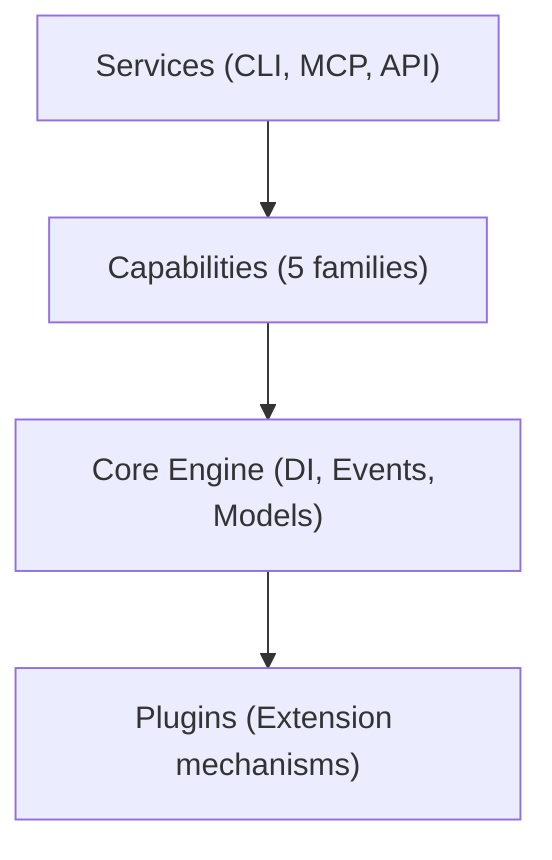

# SAGE Design Overview

> Comprehensive design documentation for SAGE Knowledge Base system

---

## 1. What is SAGE?

SAGE (Source, Analyze, Generate, Evolve) is an intelligent knowledge management system that:

- **Sources** knowledge from multiple inputs
- **Analyzes** and structures information
- **Generates** multi-channel outputs
- **Evolves** through continuous improvement

---

## 2. Design Principles

| Principle | Description |
|-----------|-------------|
| **信 (Faithfulness)** | Accurate representation of knowledge |
| **达 (Expressiveness)** | Clear and effective communication |
| **雅 (Elegance)** | Refined and maintainable design |

---

## 3. Architecture Layers

---

## 4. Documentation Structure

| Directory | Purpose | Priority |
|-----------|---------|----------|
| `philosophy/` | Design philosophy and axioms | ★★★★★ |
| `protocols/` | SAGE protocol specifications | ★★★★★ |
| `architecture/` | System architecture | ★★★★★ |
| `core_engine/` | Core components | ★★★★☆ |
| `timeout_resilience/` | Timeout and resilience | ★★★★☆ |
| `services/` | Service layer | ★★★☆☆ |
| `capabilities/` | Capability families | ★★★☆☆ |
| `plugins/` | Plugin system | ★★★☆☆ |
| `knowledge_system/` | Knowledge management | ★★★☆☆ |
| `memory_state/` | State and persistence | ★★★☆☆ |
| `configuration/` | Configuration system | ★★★☆☆ |
| `evolution/` | Roadmap and evolution | ★★☆☆☆ |

---

## 5. Quick Navigation

### 5.1 Core Concepts
- `philosophy/XIN_DA_YA.md` — Design philosophy
- `protocols/SAGE_PROTOCOL.md` — Core protocol

### 5.2 Technical Design
- `architecture/THREE_LAYER.md` — Layer architecture
- `core_engine/DI_CONTAINER.md` — Dependency injection
- `timeout_resilience/TIMEOUT_HIERARCHY.md` — Timeout design

### 5.3 Implementation
- `services/SERVICE_LAYER.md` — Service architecture
- `capabilities/CAPABILITY_MODEL.md` — Capability system
- `plugins/PLUGIN_ARCHITECTURE.md` — Plugin design

### 5.4 Operations
- `configuration/CONFIG_HIERARCHY.md` — Configuration
- `evolution/ROADMAP.md` — Project roadmap

---

## 6. Reading Order

For new readers, recommended order:

1. **Philosophy** → Understand the "why"
2. **Protocols** → Learn the core patterns
3. **Architecture** → See the big picture
4. **Core Engine** → Dive into internals
5. **Services** → Understand interfaces
6. **Capabilities** → Explore extensibility

---

## Related

- `docs/design/INDEX.md` — Document index
- `.context/conventions/FILE_STRUCTURE.md` — Structure conventions
- `README.md` — Project readme

---

*AI Collaboration Knowledge Base*
