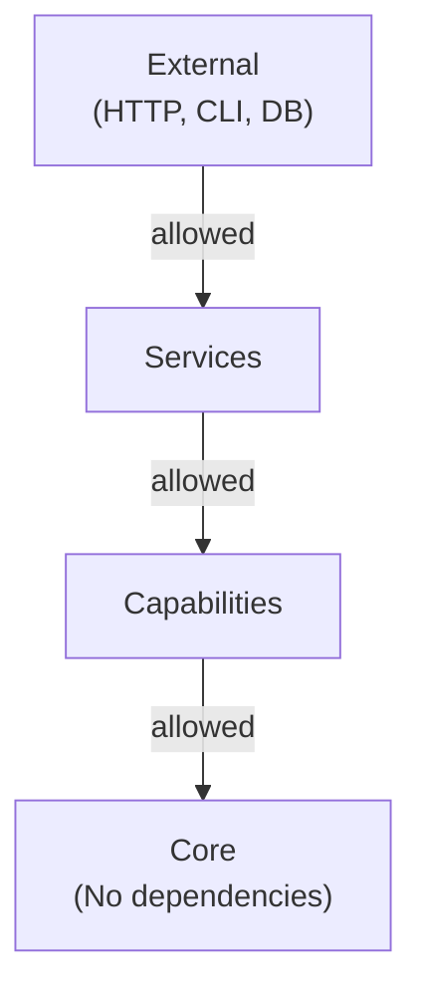

# Dependency Rules

> Strict dependency boundaries for maintainable architecture

---

## 1. Overview

SAGE enforces strict dependency rules to maintain clean architecture, prevent circular dependencies, and ensure
testability.


## Table of Contents

- [1. Overview](#1-overview)
- [2. Dependency Matrix](#2-dependency-matrix)
- [3. Core Layer Rules](#3-core-layer-rules)
- [4. Capabilities Layer Rules](#4-capabilities-layer-rules)
- [5. Services Layer Rules](#5-services-layer-rules)
- [6. Import Conventions](#6-import-conventions)
- [7. Dependency Injection](#7-dependency-injection)
- [8. Violation Detection](#8-violation-detection)
- [9. Common Violations](#9-common-violations)
- [10. Enforcement Checklist](#10-enforcement-checklist)
- [Related](#related)

---

## 2. Dependency Matrix

### 2.1 Layer Dependencies

| From ↓ / To →    | Core       | Capabilities | Services   | External   |
|------------------|------------|--------------|------------|------------|
| **Core**         | ✅ Internal | ❌            | ❌          | ❌          |
| **Capabilities** | ✅          | ✅ Internal   | ❌          | ⚠️ Limited |
| **Services**     | ✅          | ✅            | ✅ Internal | ✅          |

**Legend:**

- ✅ Allowed
- ❌ Forbidden
- ⚠️ Allowed with restrictions

### 2.2 Visual Representation


---

## 3. Core Layer Rules

### 3.1 Allowed

```python
# ✅ Core can import from Python stdlib
from typing import Protocol
from dataclasses import dataclass

# ✅ Core can import from other Core modules
from sage.core.models import KnowledgeAsset
from sage.core.events import EventBus
```
### 3.2 Forbidden

```python
# ❌ Core cannot import from Capabilities
from sage.capabilities.analyzers import Analyzer  # FORBIDDEN

# ❌ Core cannot import from Services
from sage.services.cli import CLIService  # FORBIDDEN

# ❌ Core cannot import external libraries (except approved list)
import requests  # FORBIDDEN in core
```
### 3.3 Approved External Dependencies

| Package             | Purpose         | Justification    |
|---------------------|-----------------|------------------|
| `typing_extensions` | Type hints      | Standard typing  |
| `pydantic`          | Data validation | Core data models |

---

## 4. Capabilities Layer Rules

### 4.1 Allowed

```python
# ✅ Capabilities can import from Core
from sage.core.models import KnowledgeAsset
from sage.core.events import publish

# ✅ Capabilities can import from other Capabilities
from sage.capabilities.analyzers import BaseAnalyzer
from sage.capabilities.checkers import ValidationResult

# ✅ Limited external dependencies
import yaml  # For parsing
```
### 4.2 Forbidden

```python
# ❌ Capabilities cannot import from Services
from sage.services.mcp import MCPService  # FORBIDDEN
```
### 4.3 External Dependency Guidelines

| Category     | Examples               | Policy                           |
|--------------|------------------------|----------------------------------|
| **Parsing**  | `yaml`, `json`, `toml` | ✅ Allowed                        |
| **File I/O** | `pathlib`, `os`        | ✅ Allowed                        |
| **Network**  | `requests`, `httpx`    | ⚠️ Only in specific capabilities |
| **Heavy**    | `numpy`, `pandas`      | ⚠️ Optional, lazy-loaded         |

---

## 5. Services Layer Rules

### 5.1 Allowed

```python
# ✅ Services can import from Core
from sage.core.di import Container

# ✅ Services can import from Capabilities
from sage.capabilities.analyzers import analyze

# ✅ Services can import external libraries
from fastapi import FastAPI  # For API service
import click  # For CLI service
```
### 5.2 Guidelines

| Guideline                  | Description                        |
|----------------------------|------------------------------------|
| **Thin services**          | Delegate logic to capabilities     |
| **Adapter pattern**        | Convert external to internal types |
| **Validation at boundary** | Validate all external input        |

---

## 6. Import Conventions

### 6.1 Absolute Imports

```python
# ✅ Always use absolute imports
from sage.core.models import KnowledgeAsset

# ❌ Avoid relative imports across layers
from ...core.models import KnowledgeAsset  # AVOID
```
### 6.2 Import Order

```python
# 1. Standard library
import os
from typing import Protocol

# 2. Third-party packages
import yaml
from pydantic import BaseModel

# 3. Core layer
from sage.core.models import KnowledgeAsset
from sage.core.events import EventBus

# 4. Capabilities layer (if in services)
from sage.capabilities.analyzers import analyze

# 5. Local module
from .helpers import format_output
```
---

## 7. Dependency Injection

### 7.1 Purpose

DI allows upper layers to receive dependencies without importing them directly.

### 7.2 Pattern

```python
# In Core: Define protocol
class AnalyzerProtocol(Protocol):
    def analyze(self, data: str) -> Result: ...


# In Capabilities: Implement protocol
class ContentAnalyzer:
    def analyze(self, data: str) -> Result: ...


# In Services: Receive via DI
class CLIService:
    def __init__(self, analyzer: AnalyzerProtocol):
        self.analyzer = analyzer
```
---

## 8. Violation Detection

### 8.1 Automated Checks

```bash
# Run dependency check
python -m scripts.check.check_architecture

# Check specific module
python -m scripts.check.check_architecture --module sage.core
```
### 8.2 CI Integration

```yaml
# In CI pipeline
- name: Check Dependencies
  run: python -m scripts.check.check_architecture --strict
```
---

## 9. Common Violations

| Violation             | Example                       | Fix                     |
|-----------------------|-------------------------------|-------------------------|
| **Upward dependency** | Core imports Service          | Move code to capability |
| **Circular import**   | A imports B, B imports A      | Extract shared code     |
| **Heavy in core**     | Core imports pandas           | Move to capability      |
| **Skip layer**        | Service imports Core directly | Go through capability   |

---

## 10. Enforcement Checklist

- [ ] Core has no capability/service imports
- [ ] Capabilities have no service imports
- [ ] No circular dependencies
- [ ] External deps only in approved locations
- [ ] DI used for cross-layer dependencies
- [ ] CI checks pass

---

## Related

- `THREE_LAYER.md` — Layer architecture
- `../core_engine/DI_CONTAINER.md` — Dependency injection
- `../plugins/INDEX.md` — Plugin system

---

*AI Collaboration Knowledge Base*
