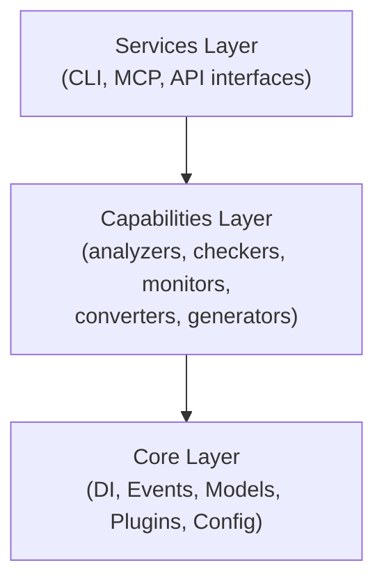

# Architecture

> System architecture and structural design for SAGE

---

## 1. Overview

This directory documents the architectural foundations of SAGE, including layer structure, dependencies, and infrastructure.

---

## 2. Documents

| Document | Description | Status |
|----------|-------------|--------|
| `THREE_LAYER.md` | Three-layer architecture (Core, Services, Capabilities) | Planned |
| `DEPENDENCIES.md` | Dependency rules and boundaries | Planned |
| `DIRECTORY_LAYOUT.md` | Project directory structure | Planned |
| `INFRASTRUCTURE.md` | Infrastructure and deployment | Planned |

---

## 3. Architecture Overview

---

## 4. Key Principles

| Principle | Description |
|-----------|-------------|
| **Layered** | Clear separation of concerns |
| **Pluggable** | Extension via plugin system |
| **Configurable** | Flexible configuration |
| **Resilient** | Timeout and fault tolerance |

---

## Related

- `../philosophy/INDEX.md` — Design philosophy
- `../core_engine/INDEX.md` — Core engine details
- `.context/conventions/FOUR_LAYER_MODEL.md` — Four layer model

---

*Part of SAGE Knowledge Base*
