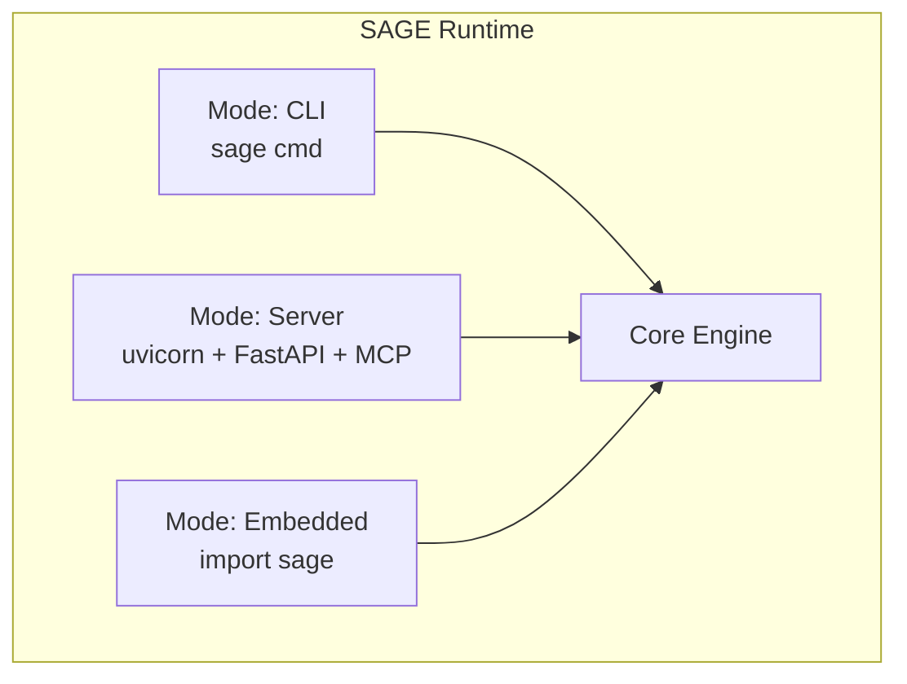
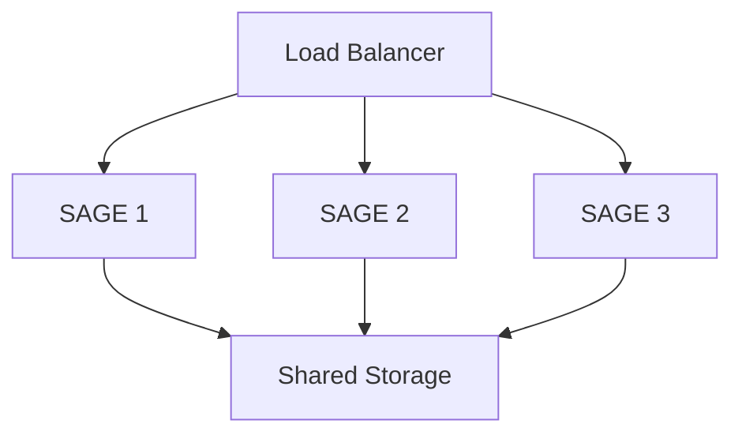

# Infrastructure

> Deployment, operations, and runtime infrastructure for SAGE

---

## 1. Overview

This document covers the infrastructure requirements, deployment options, and operational considerations for SAGE.

## Table of Contents

- [1. Overview](#1-overview)
- [2. Runtime Requirements](#2-runtime-requirements)
- [3. Deployment Options](#3-deployment-options)
- [4. Configuration](#4-configuration)
- [5. Service Architecture](#5-service-architecture)
- [6. Monitoring](#6-monitoring)
- [7. Security](#7-security)
- [8. Performance](#8-performance)
- [9. Disaster Recovery](#9-disaster-recovery)
- [10. Scaling](#10-scaling)
- [Related](#related)

---

## 2. Runtime Requirements

### 2.1 System Requirements

| Component | Minimum | Recommended |
|-----------|---------|-------------|
| **Python** | 3.11+ | 3.12+ |
| **Memory** | 512 MB | 2 GB |
| **Disk** | 100 MB | 500 MB |
| **OS** | Linux, macOS, Windows | Linux |

### 2.2 Python Dependencies

| Category | Packages |
|----------|----------|
| **Core** | `pydantic`, `typing_extensions` |
| **Services** | `click` (CLI), `fastapi` (API), `mcp` (MCP) |
| **Optional** | `uvicorn`, `rich`, `httpx` |

---

## 3. Deployment Options

### 3.1 Local Development

```bash
# Install in development mode
pip install -e ".[dev]"
# Run CLI
sage --help
# Run tests
pytest
```
### 3.2 Production Installation

```bash
# Install from PyPI
pip install sage-kb
# Or with extras
pip install "sage-kb[api,mcp]"
```
### 3.3 Docker Deployment

```dockerfile
FROM python:3.12-slim
WORKDIR /app
COPY . .
RUN pip install --no-cache-dir .
EXPOSE 8000
CMD ["sage", "serve", "--port", "8000"]
```
```bash
# Build and run
docker build -t sage-kb .
docker run -p 8000:8000 sage-kb
```
---

## 4. Configuration

### 4.1 Configuration Files

| File | Location | Purpose |
|------|----------|---------|
| `sage.yaml` | Project root | Project config |
| `~/.sage/config.yaml` | User home | User config |
| `.env` | Project root | Environment variables |

### 4.2 Environment Variables

| Variable | Description | Default |
|----------|-------------|---------|
| `SAGE_CONFIG_PATH` | Config file path | `./sage.yaml` |
| `SAGE_LOG_LEVEL` | Logging level | `INFO` |
| `SAGE_CACHE_DIR` | Cache directory | `~/.sage/cache` |
| `SAGE_DEBUG` | Debug mode | `false` |

---

## 5. Service Architecture

### 5.1 Service Modes


### 5.2 Port Assignments

| Service | Default Port | Environment Variable |
|---------|--------------|---------------------|
| API | 8000 | `SAGE_API_PORT` |
| MCP | 8001 | `SAGE_MCP_PORT` |
| Metrics | 9000 | `SAGE_METRICS_PORT` |

---

## 6. Monitoring

### 6.1 Logging

```python
# Structured logging format
{
    "timestamp": "2025-11-30T12:00:00Z",
    "level": "INFO",
    "logger": "sage.core",
    "message": "Operation completed",
    "context": {
        "operation": "analyze",
        "duration_ms": 150
    }
}
```
### 6.2 Metrics

| Metric | Type | Description |
|--------|------|-------------|
| `sage_operations_total` | Counter | Total operations |
| `sage_operation_duration` | Histogram | Operation duration |
| `sage_errors_total` | Counter | Error count |
| `sage_cache_hits` | Counter | Cache hit count |

### 6.3 Health Checks

```bash
# CLI health check
sage health
# API health endpoint
curl http://localhost:8000/health
```
```json
{
    "status": "healthy",
    "version": "0.1.0",
    "components": {
        "core": "healthy",
        "cache": "healthy",
        "knowledge": "healthy"
    }
}
```
---

## 7. Security

### 7.1 Authentication

| Service | Method | Configuration |
|---------|--------|---------------|
| API | API Key | `SAGE_API_KEY` |
| MCP | Token | MCP protocol |
| CLI | None | Local only |

### 7.2 Security Checklist

- [ ] API keys rotated regularly
- [ ] HTTPS enabled in production
- [ ] Input validation on all endpoints
- [ ] Rate limiting configured
- [ ] Audit logging enabled

---

## 8. Performance

### 8.1 Caching

| Cache Level | Storage | TTL |
|-------------|---------|-----|
| **Memory** | In-process | Session |
| **Disk** | File system | Configurable |
| **External** | Redis (optional) | Configurable |

### 8.2 Performance Targets

| Operation | Target | Max |
|-----------|--------|-----|
| Cache lookup | < 50ms | 100ms |
| File read | < 200ms | 500ms |
| Analysis | < 1s | 5s |
| Full load | < 5s | 30s |

---

## 9. Disaster Recovery

### 9.1 Backup

| Data | Frequency | Retention |
|------|-----------|-----------|
| Configuration | On change | 30 days |
| Knowledge base | Daily | 90 days |
| Metrics | Hourly | 7 days |

### 9.2 Recovery

```bash
# Restore from backup
sage restore --backup /path/to/backup
# Verify integrity
sage verify --all
```
---

## 10. Scaling

### 10.1 Horizontal Scaling


### 10.2 Resource Limits

| Resource | Per Instance | Cluster |
|----------|--------------|---------|
| CPU | 2 cores | 8 cores |
| Memory | 2 GB | 8 GB |
| Connections | 100 | 400 |

---

## Related

- `THREE_LAYER.md` — Architecture overview
- `../configuration/INDEX.md` — Configuration details
- `../timeout_resilience/INDEX.md` — Resilience patterns

---

*AI Collaboration Knowledge Base*
