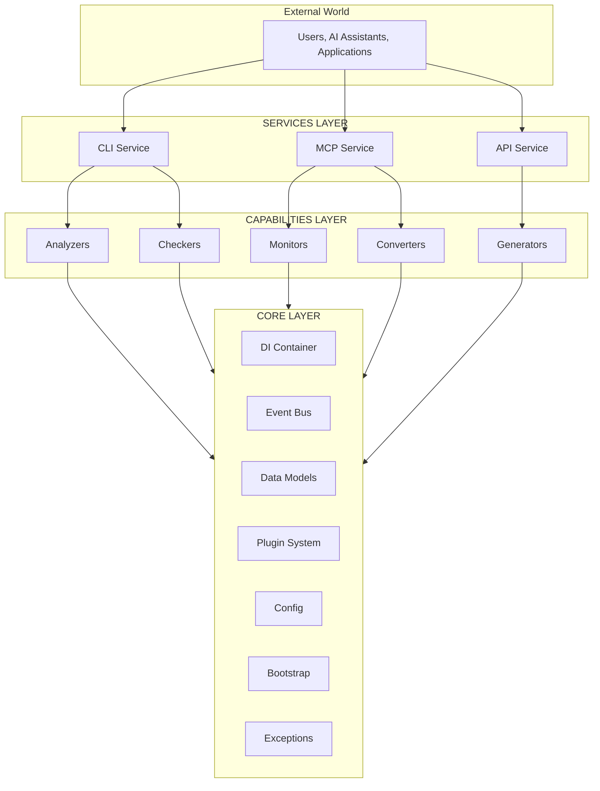

# Three-Layer Architecture

> Core, Services, and Capabilities — the foundation of SAGE

---

## 1. Overview

SAGE uses a three-layer architecture that separates concerns and enables modularity:

| Layer | Purpose | Stability |
|-------|---------|-----------|
| **Core** | Foundation and infrastructure | ★★★★★ |
| **Services** | User-facing interfaces | ★★★★☆ |
| **Capabilities** | Functional operations | ★★★☆☆ |

## Table of Contents

- [1. Overview](#1-overview)
- [2. Architecture Diagram](#2-architecture-diagram)
- [3. Core Layer](#3-core-layer)
- [4. Services Layer](#4-services-layer)
- [5. Capabilities Layer](#5-capabilities-layer)
- [6. Layer Communication](#6-layer-communication)
- [7. Benefits](#7-benefits)
- [8. Anti-Patterns](#8-anti-patterns)
- [Related](#related)

---

## 2. Architecture Diagram


---

## 3. Core Layer

### 3.1 Purpose

The Core layer provides foundational infrastructure that all other layers depend on.

### 3.2 Components

| Component | Responsibility | Location |
|-----------|---------------|----------|
| **DI Container** | Dependency injection | `src/sage/core/di/` |
| **Event Bus** | Event-driven communication | `src/sage/core/events/` |
| **Data Models** | Core types and structures | `src/sage/core/models/` |
| **Plugin System** | Extension mechanisms | `src/sage/core/plugins/` |
| **Config** | Configuration management | `src/sage/core/config/` |
| **Bootstrap** | Application startup | `src/sage/core/bootstrap/` |
| **Exceptions** | Error hierarchy | `src/sage/core/exceptions/` |

### 3.3 Characteristics

- **Stable**: Rarely changes
- **No external dependencies**: Self-contained
- **No business logic**: Pure infrastructure
- **Fully tested**: 100% coverage target

---

## 4. Services Layer

### 4.1 Purpose

The Services layer provides user-facing interfaces for interacting with SAGE.

### 4.2 Services

| Service | Interface | Use Case |
|---------|-----------|----------|
| **CLI** | Command line | Developer interaction |
| **MCP** | Model Context Protocol | AI assistant integration |
| **API** | HTTP REST | External applications |

### 4.3 Characteristics

- **Thin**: Minimal logic, delegates to Capabilities
- **Adapters**: Convert external formats to internal
- **Stateless**: No session state in services
- **Validated**: Input validation at boundary

### 4.4 Location

```
src/sage/services/
├── cli/
│   ├── __init__.py
│   └── service.py
├── mcp/
│   ├── __init__.py
│   └── service.py
└── api/
    ├── __init__.py
    └── service.py
```
---

## 5. Capabilities Layer

### 5.1 Purpose

The Capabilities layer implements the functional operations organized into MECE families.

### 5.2 Families

| Family | Responsibility | Key Question |
|--------|---------------|--------------|
| **Analyzers** | Analysis, diagnosis | What is it? |
| **Checkers** | Validation, verification | Is it correct? |
| **Monitors** | Observation, alerting | What's happening? |
| **Converters** | Transformation, migration | How to transform? |
| **Generators** | Creation, building | How to produce? |

### 5.3 Characteristics

- **MECE**: Mutually exclusive, collectively exhaustive
- **Composable**: Capabilities can use other capabilities
- **Pluggable**: Extended via plugin system
- **Testable**: Each capability unit-testable

### 5.4 Location

```
src/sage/capabilities/
├── analyzers/
├── checkers/
├── monitors/
├── converters/
└── generators/
```
---

## 6. Layer Communication

### 6.1 Allowed Dependencies


### 6.2 Forbidden Dependencies

| From | To | Reason |
|------|----|----|
| Core | Services | Core is foundation |
| Core | Capabilities | Core is foundation |
| Capabilities | Services | Would create cycle |

### 6.3 Communication Patterns

| Pattern | Use Case | Example |
|---------|----------|---------|
| **Direct Call** | Synchronous ops | Service calls capability |
| **Event** | Decoupled notification | Publish metrics |
| **DI** | Dependency injection | Get capability instance |

---

## 7. Benefits

| Benefit | Description |
|---------|-------------|
| **Separation of Concerns** | Each layer has clear responsibility |
| **Testability** | Layers can be tested independently |
| **Maintainability** | Changes isolated to specific layer |
| **Scalability** | Add services/capabilities without core changes |
| **Flexibility** | Swap implementations easily |

---

## 8. Anti-Patterns

| Anti-Pattern | Problem | Solution |
|--------------|---------|----------|
| **Fat Service** | Business logic in service | Move to capability |
| **Core Bloat** | Too much in core | Extract to capability |
| **Layer Skip** | Service calls core directly | Go through capability |
| **Circular Deps** | Layers depend on each other | Refactor dependencies |

---

## Related

- `DEPENDENCIES.md` — Detailed dependency rules
- `DIRECTORY_LAYOUT.md` — Project structure
- `../core_engine/INDEX.md` — Core layer details

---

*AI Collaboration Knowledge Base*
