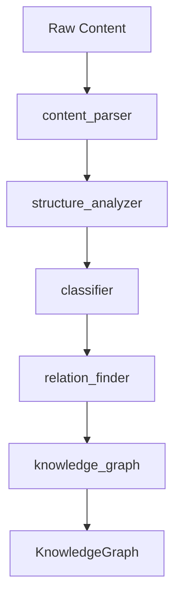

# Analyzers

> Analysis, diagnosis, and understanding capabilities

---

## 1. Overview

Analyzers extract meaning, structure, and relationships from content. They answer the question: "What is it?"


## Table of Contents

- [1. Overview](#1-overview)
- [2. Analyzer Capabilities](#2-analyzer-capabilities)
- [3. content_parser](#3-contentparser)
- [4. structure_analyzer](#4-structureanalyzer)
- [5. classifier](#5-classifier)
- [6. relation_finder](#6-relationfinder)
- [7. knowledge_graph](#7-knowledgegraph)
- [8. Analysis Pipeline](#8-analysis-pipeline)
- [9. Configuration](#9-configuration)
- [10. Extending Analyzers](#10-extending-analyzers)
- [Related](#related)

---

## 2. Analyzer Capabilities

| Capability | Purpose | Input | Output |
|------------|---------|-------|--------|
| `content_parser` | Parse document structure | Raw content | Parsed structure |
| `structure_analyzer` | Analyze organization | Parsed content | Structure map |
| `classifier` | Classify content type | Content | Classifications |
| `relation_finder` | Find relationships | Content set | Relations |
| `knowledge_graph` | Build knowledge graph | Analyzed content | Graph |

---

## 3. content_parser

### 3.1 Purpose

Parse raw content into structured representation.

### 3.2 Interface

```python
class ContentParser(Capability[str, ParsedContent]):
    name = "content_parser"
    family = "analyzers"
    
    def execute(self, content: str, context: Context) -> ParsedContent:
        # Parse markdown structure
        headings = self._extract_headings(content)
        sections = self._extract_sections(content)
        code_blocks = self._extract_code(content)
        tables = self._extract_tables(content)
        
        return ParsedContent(
            headings=headings,
            sections=sections,
            code_blocks=code_blocks,
            tables=tables
        )
```
### 3.3 Output Structure

```python
@dataclass
class ParsedContent:
    headings: list[Heading]
    sections: list[Section]
    code_blocks: list[CodeBlock]
    tables: list[Table]
    links: list[Link]
    metadata: dict[str, Any]
```
---

## 4. structure_analyzer

### 4.1 Purpose

Analyze document organization and hierarchy.

### 4.2 Interface

```python
class StructureAnalyzer(Capability[ParsedContent, StructureMap]):
    name = "structure_analyzer"
    family = "analyzers"
    
    def execute(self, parsed: ParsedContent, context: Context) -> StructureMap:
        return StructureMap(
            toc=self._build_toc(parsed.headings),
            depth=self._calculate_depth(parsed),
            sections=self._analyze_sections(parsed.sections)
        )
```
---

## 5. classifier

### 5.1 Purpose

Classify content by type, topic, and priority.

### 5.2 Interface

```python
class Classifier(Capability[ParsedContent, Classifications]):
    name = "classifier"
    family = "analyzers"
    
    def execute(self, parsed: ParsedContent, context: Context) -> Classifications:
        return Classifications(
            doc_type=self._classify_type(parsed),
            topics=self._classify_topics(parsed),
            priority=self._calculate_priority(parsed),
            tags=self._extract_tags(parsed),
            confidence=self._calculate_confidence()
        )
```
### 5.3 Classification Types

| Type | Values |
|------|--------|
| **doc_type** | guide, reference, tutorial, design, api |
| **topics** | architecture, config, api, tools |
| **priority** | ★★★★★ to ★☆☆☆☆ |

---

## 6. relation_finder

### 6.1 Purpose

Find relationships between content items.

### 6.2 Interface

```python
class RelationFinder(Capability[list[ParsedContent], list[Relation]]):
    name = "relation_finder"
    family = "analyzers"
    
    def execute(self, items: list[ParsedContent], context: Context) -> list[Relation]:
        relations = []
        
        # Explicit relations (links)
        relations.extend(self._find_explicit_relations(items))
        
        # Implicit relations (similarity)
        relations.extend(self._find_implicit_relations(items))
        
        # Hierarchical relations
        relations.extend(self._find_hierarchical_relations(items))
        
        return relations
```
### 6.3 Relation Types

| Type | Description | Example |
|------|-------------|---------|
| `references` | Explicit link | `[link](file.md)` |
| `hierarchy` | Parent-child | directory → file |
| `similarity` | Similar content | Same topic |
| `sequence` | Order | Step 1 → Step 2 |

---

## 7. knowledge_graph

### 7.1 Purpose

Build comprehensive knowledge graph.

### 7.2 Interface

```python
class KnowledgeGraphBuilder(Capability[AnalysisInput, KnowledgeGraph]):
    name = "knowledge_graph"
    family = "analyzers"
    
    def execute(self, input: AnalysisInput, context: Context) -> KnowledgeGraph:
        # Create nodes from content
        nodes = self._create_nodes(input.items)
        
        # Create edges from relations
        edges = self._create_edges(input.relations)
        
        # Add metadata
        metadata = self._compute_metadata(nodes, edges)
        
        return KnowledgeGraph(
            nodes=nodes,
            edges=edges,
            metadata=metadata
        )
```
---

## 8. Analysis Pipeline


---

## 9. Configuration

```yaml
capabilities:
  analyzers:
    content_parser:
      extract_code: true
      extract_tables: true
      max_depth: 6
    
    classifier:
      auto_tag: true
      confidence_threshold: 0.7
    
    relation_finder:
      find_implicit: true
      similarity_threshold: 0.8
```
---

## 10. Extending Analyzers

```python
class CustomAnalyzer(Capability[MyInput, MyOutput]):
    name = "custom_analyzer"
    family = "analyzers"
    
    def execute(self, input: MyInput, context: Context) -> MyOutput:
        # Custom analysis logic
        ...
```
---

## Related

- `CAPABILITY_MODEL.md` — Capability system
- `CHECKERS.md` — Validation capabilities
- `EXTENDING.md` — How to extend

---

*AI Collaboration Knowledge Base*
