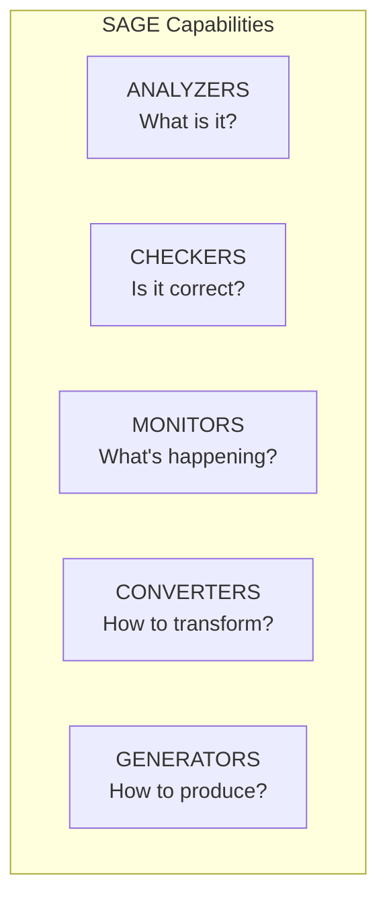
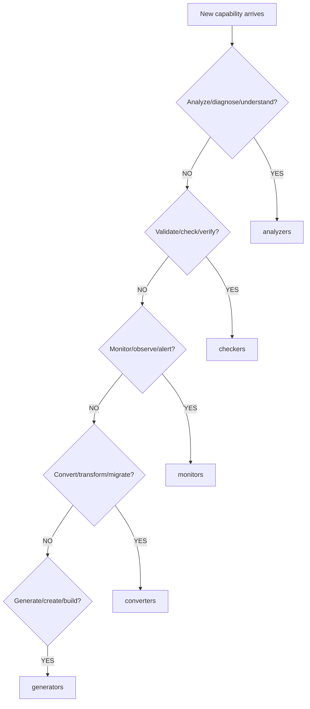

# Capability Model

> MECE capability families defining what SAGE can do

---

## 1. Overview

Capabilities are functional units organized into 5 mutually exclusive, collectively exhaustive (MECE) families that define SAGE's operational abilities.

---

## 2. Capability Families

| Family | Responsibility | Key Question |
|--------|---------------|--------------|
| **Analyzers** | Analysis, diagnosis, graph | What is it? |
| **Checkers** | Check, validate, verify | Is it correct? |
| **Monitors** | Monitor, observe, alert | What's happening? |
| **Converters** | Convert, migrate, adapt | How to transform? |
| **Generators** | Generate, build, create | How to produce? |

---

## 3. Family Diagram



---

## 4. Capability Interface

```python
from abc import ABC, abstractmethod
from typing import Generic, TypeVar

TInput = TypeVar('TInput')
TOutput = TypeVar('TOutput')

class Capability(ABC, Generic[TInput, TOutput]):
    """Base interface for all capabilities."""
    
    @property
    @abstractmethod
    def name(self) -> str:
        """Unique capability identifier."""
        ...
    
    @property
    @abstractmethod
    def family(self) -> str:
        """Capability family (analyzers, checkers, etc.)."""
        ...
    
    @property
    def version(self) -> str:
        """Capability version."""
        return "1.0.0"
    
    @abstractmethod
    def execute(self, input: TInput, context: Context) -> TOutput:
        """Execute the capability."""
        ...
    
    def can_handle(self, input: TInput) -> bool:
        """Check if capability can handle this input."""
        return True
```

---

## 5. Classification Decision Tree



---

## 6. Family Details

### 6.1 Analyzers

**Purpose:** Understand and extract meaning from content.

| Capability | Description |
|------------|-------------|
| `content_parser` | Parse document structure |
| `classifier` | Classify content type |
| `relation_finder` | Find relationships |
| `knowledge_graph` | Build knowledge graph |

### 6.2 Checkers

**Purpose:** Validate correctness and compliance.

| Capability | Description |
|------------|-------------|
| `format_checker` | Check document format |
| `link_checker` | Validate links |
| `schema_validator` | Validate schemas |
| `naming_checker` | Check naming conventions |

### 6.3 Monitors

**Purpose:** Observe system state and events.

| Capability | Description |
|------------|-------------|
| `health_monitor` | System health |
| `metrics_collector` | Collect metrics |
| `timeout_monitor` | Track timeouts |
| `resource_monitor` | Resource usage |

### 6.4 Converters

**Purpose:** Transform between formats.

| Capability | Description |
|------------|-------------|
| `format_converter` | Convert formats |
| `migration_tool` | Migrate content |
| `normalizer` | Normalize data |
| `adapter` | Adapt interfaces |

### 6.5 Generators

**Purpose:** Create new content.

| Capability | Description |
|------------|-------------|
| `index_generator` | Generate indexes |
| `template_generator` | Generate from templates |
| `report_generator` | Generate reports |
| `doc_generator` | Generate documentation |

---

## 7. Capability Registry

```python
class CapabilityRegistry:
    def __init__(self):
        self._capabilities: dict[str, dict[str, Capability]] = {
            "analyzers": {},
            "checkers": {},
            "monitors": {},
            "converters": {},
            "generators": {},
        }
    
    def register(self, capability: Capability) -> None:
        family = capability.family
        name = capability.name
        self._capabilities[family][name] = capability
    
    def get(self, family: str, name: str) -> Capability | None:
        return self._capabilities.get(family, {}).get(name)
    
    def list_family(self, family: str) -> list[Capability]:
        return list(self._capabilities.get(family, {}).values())
```

---

## 8. Capability Composition

Capabilities can be composed for complex operations:

```python
class ComposedCapability(Capability):
    def __init__(self, *capabilities: Capability):
        self.capabilities = capabilities
    
    def execute(self, input: Any, context: Context) -> Any:
        result = input
        for cap in self.capabilities:
            result = cap.execute(result, context)
        return result

# Example: Analyze then validate
pipeline = ComposedCapability(
    ContentParser(),
    FormatChecker(),
    LinkChecker()
)
```

---

## 9. Capability Metadata

```python
@dataclass
class CapabilityMetadata:
    name: str
    family: str
    version: str
    description: str
    input_types: list[str]
    output_type: str
    timeout_level: str  # T1-T5
    tags: list[str]
```

---

## 10. Best Practices

| Practice | Description |
|----------|-------------|
| **Single responsibility** | One capability, one purpose |
| **MECE compliance** | Fits exactly one family |
| **Clear interface** | Well-defined input/output |
| **Composable** | Can be combined with others |
| **Testable** | Unit testable in isolation |

---

## Related

- `ANALYZERS.md` — Analyzer capabilities
- `CHECKERS.md` — Checker capabilities
- `EXTENDING.md` — How to extend
- `.knowledge/practices/engineering/MECE.md` — MECE principle

---

*Part of SAGE Knowledge Base*
