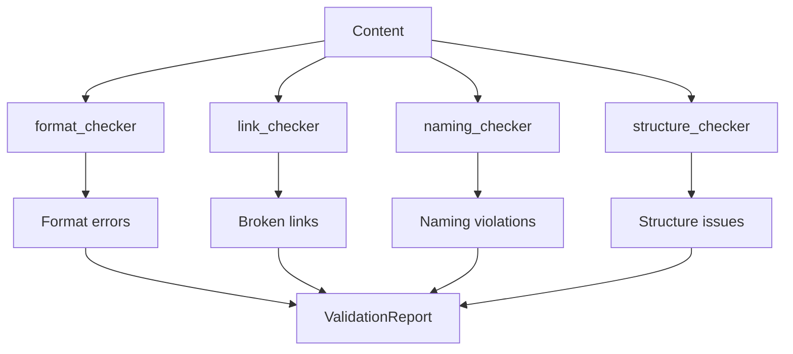

# Checkers

> Validation, verification, and compliance capabilities

---

## 1. Overview

Checkers validate correctness, compliance, and integrity. They answer the question: "Is it correct?"


## Table of Contents

- [1. Overview](#1-overview)
- [2. Checker Capabilities](#2-checker-capabilities)
- [3. format_checker](#3-formatchecker)
- [4. link_checker](#4-linkchecker)
- [5. schema_validator](#5-schemavalidator)
- [6. naming_checker](#6-namingchecker)
- [7. structure_checker](#7-structurechecker)
- [8. Validation Pipeline](#8-validation-pipeline)
- [9. Configuration](#9-configuration)
- [10. Validation Result](#10-validation-result)
- [Related](#related)

---

## 2. Checker Capabilities

| Capability | Purpose | Input | Output |
|------------|---------|-------|--------|
| `format_checker` | Check document format | Content | FormatResult |
| `link_checker` | Validate links | Content | LinkResult |
| `schema_validator` | Validate against schema | Data | SchemaResult |
| `naming_checker` | Check naming conventions | Path | NamingResult |
| `structure_checker` | Validate structure | Document | StructureResult |

---

## 3. format_checker

### 3.1 Purpose

Validate document format compliance.

### 3.2 Interface

```python
class FormatChecker(Capability[str, FormatResult]):
    name = "format_checker"
    family = "checkers"
    
    def execute(self, content: str, context: Context) -> FormatResult:
        errors = []
        warnings = []
        
        # Check frontmatter (should be none)
        if self._has_frontmatter(content):
            errors.append(FormatError("No frontmatter allowed"))
        
        # Check heading hierarchy
        errors.extend(self._check_headings(content))
        
        # Check line length
        warnings.extend(self._check_line_length(content))
        
        return FormatResult(
            valid=len(errors) == 0,
            errors=errors,
            warnings=warnings
        )
```
### 3.3 Format Rules

| Rule | Requirement | Severity |
|------|-------------|----------|
| No frontmatter | No `---` YAML blocks | Error |
| H1 only once | Single `#` heading | Error |
| H2 numbered | `## 1.`, `## 2.` | Warning |
| Line limit | < 300 lines | Warning |

---

## 4. link_checker

### 4.1 Purpose

Validate internal and external links.

### 4.2 Interface

```python
class LinkChecker(Capability[ParsedContent, LinkResult]):
    name = "link_checker"
    family = "checkers"
    
    def execute(self, content: ParsedContent, context: Context) -> LinkResult:
        broken = []
        valid = []
        
        for link in content.links:
            if link.is_internal:
                if self._check_internal(link, context):
                    valid.append(link)
                else:
                    broken.append(BrokenLink(link, "Target not found"))
            else:
                if self._check_external(link):
                    valid.append(link)
                else:
                    broken.append(BrokenLink(link, "URL unreachable"))
        
        return LinkResult(
            total=len(content.links),
            valid=len(valid),
            broken=broken
        )
```
### 4.3 Link Types

| Type | Check Method | Timeout |
|------|--------------|---------|
| Internal | File exists | T2 |
| External | HTTP HEAD | T4 |
| Anchor | Section exists | T1 |

---

## 5. schema_validator

### 5.1 Purpose

Validate data against defined schemas.

### 5.2 Interface

```python
class SchemaValidator(Capability[dict, SchemaResult]):
    name = "schema_validator"
    family = "checkers"
    
    def execute(self, data: dict, context: Context) -> SchemaResult:
        schema_name = context.get("schema")
        schema = self._load_schema(schema_name)
        
        errors = self._validate(data, schema)
        
        return SchemaResult(
            valid=len(errors) == 0,
            schema=schema_name,
            errors=errors
        )
```
---

## 6. naming_checker

### 6.1 Purpose

Validate naming conventions.

### 6.2 Interface

```python
class NamingChecker(Capability[Path, NamingResult]):
    name = "naming_checker"
    family = "checkers"
    
    def execute(self, path: Path, context: Context) -> NamingResult:
        errors = []
        
        # Check file naming
        if path.suffix == ".md":
            if not self._is_upper_snake_case(path.stem):
                errors.append(NamingError(
                    path, "Markdown must be UPPER_SNAKE_CASE"
                ))
        
        # Check no numeric prefix
        if self._has_numeric_prefix(path.stem):
            errors.append(NamingError(
                path, "No numeric prefixes allowed"
            ))
        
        return NamingResult(valid=len(errors) == 0, errors=errors)
```
### 6.3 Naming Rules

| Element | Convention | Example |
|---------|------------|---------|
| Markdown | `UPPER_SNAKE_CASE.md` | `SAGE_PROTOCOL.md` |
| Directory | `lower_snake_case/` | `core_engine/` |
| Python | `lower_snake_case.py` | `timeout_manager.py` |

---

## 7. structure_checker

### 7.1 Purpose

Validate document structure requirements.

### 7.2 Interface

```python
class StructureChecker(Capability[ParsedContent, StructureResult]):
    name = "structure_checker"
    family = "checkers"
    
    def execute(self, content: ParsedContent, context: Context) -> StructureResult:
        errors = []
        
        # Check required sections
        if not self._has_section("Related", content):
            errors.append(StructureError("Missing Related section"))
        
        # Check footer
        if not self._has_footer(content):
            errors.append(StructureError("Missing footer"))
        
        return StructureResult(valid=len(errors) == 0, errors=errors)
```
---

## 8. Validation Pipeline


---

## 9. Configuration

```yaml
capabilities:
  checkers:
    format_checker:
      strict: false
      max_line_length: 120
    
    link_checker:
      check_external: true
      timeout_ms: 5000
      ignore_patterns:
        - "http://localhost*"
    
    naming_checker:
      enforce_upper_snake: true
      allow_numeric_prefix: false
```
---

## 10. Validation Result

```python
@dataclass
class ValidationReport:
    valid: bool
    errors: list[ValidationError]
    warnings: list[ValidationWarning]
    checked_at: datetime
    duration_ms: float
    
    def summary(self) -> str:
        return f"{len(self.errors)} errors, {len(self.warnings)} warnings"
```
---

## Related

- `CAPABILITY_MODEL.md` — Capability system
- `ANALYZERS.md` — Analysis capabilities
- `EXTENDING.md` — How to extend

---

*AI Collaboration Knowledge Base*
