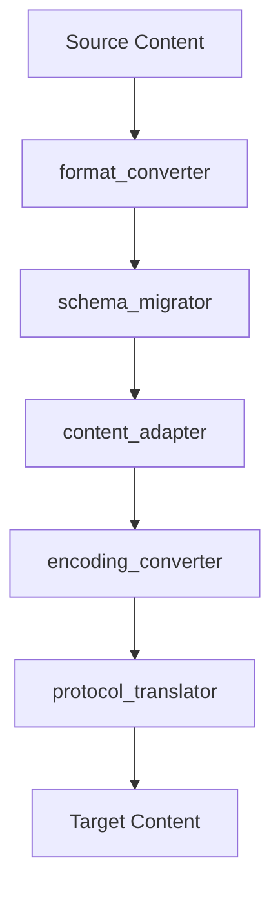

# Converters

> Conversion, migration, and adaptation capabilities

---

## 1. Overview

Converters transform data between formats, migrate content between versions, and adapt interfaces. They answer the question: "How to transform?"

---

## 2. Converter Capabilities

| Capability | Purpose | Input | Output |
|------------|---------|-------|--------|
| `format_converter` | Convert between formats | Source format | Target format |
| `schema_migrator` | Migrate data schemas | Old schema | New schema |
| `content_adapter` | Adapt content structure | Source structure | Target structure |
| `encoding_converter` | Convert encodings | Source encoding | Target encoding |
| `protocol_translator` | Translate protocols | Source protocol | Target protocol |

---

## 3. format_converter

### 3.1 Purpose

Convert content between different file formats.

### 3.2 Interface

```python
class FormatConverter(Capability[ConversionInput, ConversionOutput]):
    name = "format_converter"
    family = "converters"
    
    def execute(self, input: ConversionInput, context: Context) -> ConversionOutput:
        # Detect source format
        source_format = self._detect_format(input.content)
        
        # Get appropriate converter
        converter = self._get_converter(source_format, input.target_format)
        
        # Perform conversion
        converted = converter.convert(input.content)
        
        return ConversionOutput(
            content=converted,
            source_format=source_format,
            target_format=input.target_format,
            metadata=self._extract_metadata(converted)
        )
```

### 3.3 Supported Formats

| Category | Formats |
|----------|---------|
| **Markup** | Markdown, HTML, RST, AsciiDoc |
| **Data** | JSON, YAML, TOML, XML |
| **Config** | INI, ENV, Properties |
| **Document** | PDF, DOCX (read-only) |

---

## 4. schema_migrator

### 4.1 Purpose

Migrate data between schema versions.

### 4.2 Interface

```python
class SchemaMigrator(Capability[MigrationInput, MigrationOutput]):
    name = "schema_migrator"
    family = "converters"
    
    def execute(self, input: MigrationInput, context: Context) -> MigrationOutput:
        # Determine migration path
        path = self._find_migration_path(input.source_version, input.target_version)
        
        # Apply migrations sequentially
        data = input.data
        for migration in path:
            data = migration.apply(data)
        
        return MigrationOutput(
            data=data,
            migrations_applied=len(path),
            source_version=input.source_version,
            target_version=input.target_version
        )
```

### 4.3 Migration Strategy

| Strategy | Use Case | Risk |
|----------|----------|------|
| **forward** | Upgrade to newer version | Low |
| **backward** | Downgrade to older version | Medium |
| **transform** | Major restructure | High |

---

## 5. content_adapter

### 5.1 Purpose

Adapt content structure for different consumers.

### 5.2 Interface

```python
class ContentAdapter(Capability[AdaptInput, AdaptOutput]):
    name = "content_adapter"
    family = "converters"
    
    def execute(self, input: AdaptInput, context: Context) -> AdaptOutput:
        # Analyze source structure
        source_structure = self._analyze_structure(input.content)
        
        # Map to target structure
        mapping = self._create_mapping(source_structure, input.target_spec)
        
        # Apply transformation
        adapted = self._apply_mapping(input.content, mapping)
        
        return AdaptOutput(
            content=adapted,
            mapping=mapping,
            unmapped_fields=self._find_unmapped(mapping)
        )
```

### 5.3 Adaptation Modes

| Mode | Description | Example |
|------|-------------|---------|
| `strict` | Fail on unmapped fields | API contracts |
| `lenient` | Ignore unmapped fields | Logging |
| `transform` | Apply custom transforms | ETL pipelines |

---

## 6. encoding_converter

### 6.1 Purpose

Convert between character encodings.

### 6.2 Interface

```python
class EncodingConverter(Capability[EncodingInput, EncodingOutput]):
    name = "encoding_converter"
    family = "converters"
    
    def execute(self, input: EncodingInput, context: Context) -> EncodingOutput:
        # Detect source encoding if not specified
        source_encoding = input.source_encoding or self._detect_encoding(input.content)
        
        # Convert encoding
        converted = input.content.encode(source_encoding).decode(input.target_encoding)
        
        return EncodingOutput(
            content=converted,
            source_encoding=source_encoding,
            target_encoding=input.target_encoding,
            bytes_changed=self._count_changes(input.content, converted)
        )
```

---

## 7. protocol_translator

### 7.1 Purpose

Translate between communication protocols.

### 7.2 Interface

```python
class ProtocolTranslator(Capability[ProtocolInput, ProtocolOutput]):
    name = "protocol_translator"
    family = "converters"
    
    def execute(self, input: ProtocolInput, context: Context) -> ProtocolOutput:
        # Parse source protocol message
        parsed = self._parse_message(input.message, input.source_protocol)
        
        # Translate to target protocol
        translated = self._translate(parsed, input.target_protocol)
        
        # Serialize in target format
        serialized = self._serialize(translated, input.target_protocol)
        
        return ProtocolOutput(
            message=serialized,
            source_protocol=input.source_protocol,
            target_protocol=input.target_protocol
        )
```

### 7.3 Supported Protocols

| Protocol | Direction | Use Case |
|----------|-----------|----------|
| REST | ↔ | HTTP APIs |
| GraphQL | ↔ | Query APIs |
| gRPC | ↔ | Service mesh |
| WebSocket | ↔ | Real-time |

---

## 8. Conversion Pipeline



---

## 9. Configuration

```yaml
capabilities:
  converters:
    format_converter:
      preserve_metadata: true
      fallback_format: markdown
    
    schema_migrator:
      backup_before_migrate: true
      max_migration_steps: 10
    
    content_adapter:
      mode: lenient
      log_unmapped: true
    
    encoding_converter:
      default_encoding: utf-8
      detect_encoding: true
```

---

## 10. Extending Converters

```python
class CustomConverter(Capability[MyInput, MyOutput]):
    name = "custom_converter"
    family = "converters"
    
    def execute(self, input: MyInput, context: Context) -> MyOutput:
        # Custom conversion logic
        ...
```

---

## Related

- `CAPABILITY_MODEL.md` — Capability system
- `ANALYZERS.md` — Analysis capabilities
- `GENERATORS.md` — Generation capabilities

---

*Part of SAGE Knowledge Base*
