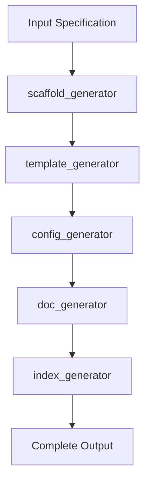

# Generators

> Generation, building, and creation capabilities

---

## 1. Overview

Generators produce new content, build artifacts, and create resources. They answer the question: "How to produce?"

---

## 2. Generator Capabilities

| Capability | Purpose | Input | Output |
|------------|---------|-------|--------|
| `index_generator` | Generate index files | Directory | INDEX.md |
| `template_generator` | Generate from templates | Template + data | Rendered content |
| `doc_generator` | Generate documentation | Source code | Documentation |
| `config_generator` | Generate configurations | Schema | Config files |
| `scaffold_generator` | Generate project scaffolds | Spec | Project structure |

---

## 3. index_generator

### 3.1 Purpose

Generate INDEX.md files for directories.

### 3.2 Interface

```python
class IndexGenerator(Capability[DirectoryInput, IndexOutput]):
    name = "index_generator"
    family = "generators"
    
    def execute(self, input: DirectoryInput, context: Context) -> IndexOutput:
        # Scan directory contents
        files = self._scan_directory(input.path)
        
        # Extract metadata from each file
        entries = [self._extract_entry(f) for f in files]
        
        # Generate index content
        content = self._render_index(
            title=input.title or self._derive_title(input.path),
            description=input.description,
            entries=entries
        )
        
        return IndexOutput(
            content=content,
            path=input.path / "INDEX.md",
            entries_count=len(entries)
        )
```

### 3.3 Index Structure

```markdown
# Directory Title

> Purpose description

---

## Documents

| Document | Description | Status |
|----------|-------------|--------|
| `FILE.md` | Description | Active |

---

## Related

- Links to related directories
```

---

## 4. template_generator

### 4.1 Purpose

Generate content from templates with data binding.

### 4.2 Interface

```python
class TemplateGenerator(Capability[TemplateInput, RenderedOutput]):
    name = "template_generator"
    family = "generators"
    
    def execute(self, input: TemplateInput, context: Context) -> RenderedOutput:
        # Load template
        template = self._load_template(input.template_path)
        
        # Validate data against schema
        self._validate_data(input.data, template.schema)
        
        # Render template
        rendered = template.render(input.data)
        
        return RenderedOutput(
            content=rendered,
            template_used=input.template_path,
            variables_bound=list(input.data.keys())
        )
```

### 4.3 Template Types

| Type | Extension | Use Case |
|------|-----------|----------|
| **Jinja2** | `.j2` | Complex logic |
| **Mustache** | `.mustache` | Simple substitution |
| **Markdown** | `.md.template` | Documentation |

---

## 5. doc_generator

### 5.1 Purpose

Generate documentation from source code.

### 5.2 Interface

```python
class DocGenerator(Capability[SourceInput, DocOutput]):
    name = "doc_generator"
    family = "generators"
    
    def execute(self, input: SourceInput, context: Context) -> DocOutput:
        # Parse source code
        parsed = self._parse_source(input.source_path)
        
        # Extract documentation elements
        modules = self._extract_modules(parsed)
        classes = self._extract_classes(parsed)
        functions = self._extract_functions(parsed)
        
        # Generate documentation
        docs = self._generate_docs(modules, classes, functions)
        
        return DocOutput(
            content=docs,
            modules_documented=len(modules),
            classes_documented=len(classes),
            functions_documented=len(functions)
        )
```

### 5.3 Documentation Formats

| Format | Output | Tool |
|--------|--------|------|
| **Markdown** | `.md` files | Native |
| **HTML** | Static site | MkDocs |
| **PDF** | Print-ready | Pandoc |

---

## 6. config_generator

### 6.1 Purpose

Generate configuration files from schemas.

### 6.2 Interface

```python
class ConfigGenerator(Capability[SchemaInput, ConfigOutput]):
    name = "config_generator"
    family = "generators"
    
    def execute(self, input: SchemaInput, context: Context) -> ConfigOutput:
        # Load schema definition
        schema = self._load_schema(input.schema_path)
        
        # Generate config with defaults
        config = self._generate_config(schema, input.overrides)
        
        # Format for target type
        formatted = self._format_config(config, input.format)
        
        return ConfigOutput(
            content=formatted,
            format=input.format,
            schema_version=schema.version
        )
```

### 6.3 Config Formats

| Format | Extension | Features |
|--------|-----------|----------|
| **YAML** | `.yaml` | Human-readable, comments |
| **JSON** | `.json` | Machine-readable |
| **TOML** | `.toml` | Clear sections |

---

## 7. scaffold_generator

### 7.1 Purpose

Generate project scaffolds and boilerplate.

### 7.2 Interface

```python
class ScaffoldGenerator(Capability[ScaffoldInput, ScaffoldOutput]):
    name = "scaffold_generator"
    family = "generators"
    
    def execute(self, input: ScaffoldInput, context: Context) -> ScaffoldOutput:
        # Load scaffold template
        scaffold = self._load_scaffold(input.scaffold_type)
        
        # Generate file structure
        files = self._generate_structure(scaffold, input.options)
        
        # Write files
        written = self._write_files(files, input.output_path)
        
        return ScaffoldOutput(
            files_created=written,
            scaffold_type=input.scaffold_type,
            output_path=input.output_path
        )
```

### 7.3 Scaffold Types

| Type | Creates | Use Case |
|------|---------|----------|
| **plugin** | Plugin structure | New plugins |
| **capability** | Capability boilerplate | New capabilities |
| **service** | Service scaffold | New services |
| **tool** | Tool structure | New tools |

---

## 8. Generation Pipeline



---

## 9. Configuration

```yaml
capabilities:
  generators:
    index_generator:
      include_status: true
      sort_entries: alphabetical
    
    template_generator:
      strict_mode: true
      undefined_behavior: error
    
    doc_generator:
      include_private: false
      include_examples: true
    
    config_generator:
      include_comments: true
      validate_output: true
```

---

## 10. Extending Generators

```python
class CustomGenerator(Capability[MyInput, MyOutput]):
    name = "custom_generator"
    family = "generators"
    
    def execute(self, input: MyInput, context: Context) -> MyOutput:
        # Custom generation logic
        ...
```

---

## Related

- `docs/design/capabilities/CAPABILITY_MODEL.md` — Capability system
- `docs/design/capabilities/CONVERTERS.md` — Conversion capabilities
- `docs/design/plugins/EXTENSION_POINTS.md` — Extension points

---

*AI Collaboration Knowledge Base*
