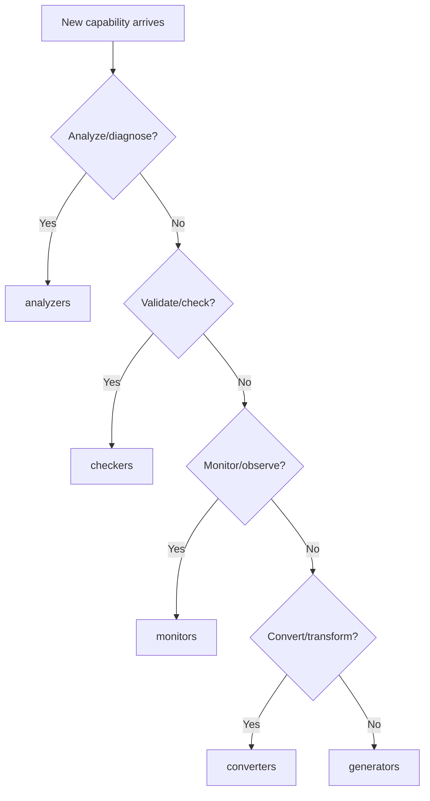

# Capabilities

> Capability families and extensibility model for SAGE

---

## 1. Overview

Capabilities are organized into 5 MECE families that define what SAGE can do.

## Table of Contents

- [1. Overview](#1-overview)
- [2. Documents](#2-documents)
- [3. Capability Families (MECE)](#3-capability-families-mece)
- [4. Classification Decision Tree](#4-classification-decision-tree)
- [5. Implementation Location](#5-implementation-location)

---
---

## 2. Documents

| Document | Description | Status |
|----------|-------------|--------|
| `CAPABILITY_MODEL.md` | Capability system overview | Active |
| `ANALYZERS.md` | Analysis capabilities | Active |
| `CHECKERS.md` | Validation capabilities | Active |
| `MONITORS.md` | Monitoring capabilities | Active |
| `CONVERTERS.md` | Conversion capabilities | Active |
| `GENERATORS.md` | Generation capabilities | Active |
| `EXTENDING.md` | How to extend capabilities | Active |

---

## 3. Capability Families (MECE)

| Family | Responsibility | Key Question |
|--------|---------------|--------------|
| **analyzers** | Analysis, diagnosis, graph | What is it? |
| **checkers** | Check, validate, verify | Is it correct? |
| **monitors** | Monitor, observe, alert | What's happening? |
| **converters** | Convert, migrate, adapt | How to transform? |
| **generators** | Generate, build, create | How to produce? |

---

## 4. Classification Decision Tree

---

## 5. Implementation Location

| Family | Source Code | Tools |
|--------|-------------|-------|
| analyzers | `src/sage/capabilities/analyzers/` | `tools/analyzers/` |
| checkers | `src/sage/capabilities/checkers/` | `tools/checkers/` |
| monitors | `src/sage/capabilities/monitors/` | `tools/monitors/` |
| converters | `src/sage/capabilities/converters/` | `tools/converters/` |
| generators | `src/sage/capabilities/generators/` | `tools/generators/` |

---

## Related

- `../plugins/INDEX.md` — Plugin system
- `../architecture/INDEX.md` — Architecture
- `.knowledge/practices/engineering/MECE.md` — MECE principle

---

*AI Collaboration Knowledge Base*
