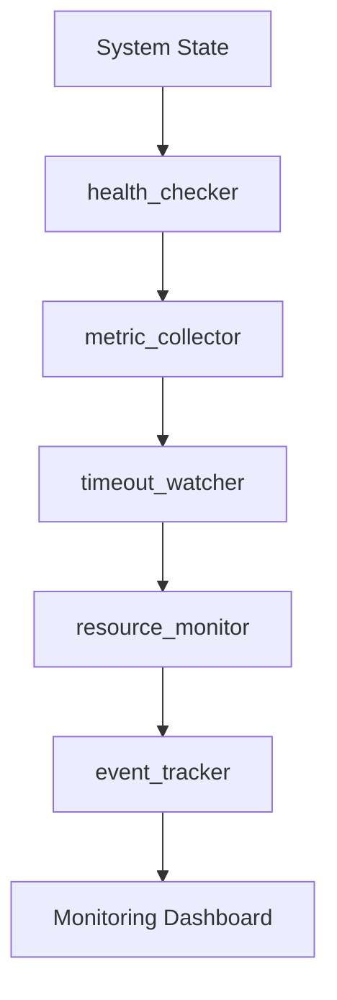

# Monitors

> Monitoring, observation, and alerting capabilities

---

## 1. Overview

Monitors observe system state, track metrics, and trigger alerts. They answer the question: "What's happening?"

## Table of Contents

- [1. Overview](#1-overview)
- [2. Monitor Capabilities](#2-monitor-capabilities)
- [3. health_checker](#3-healthchecker)
- [4. metric_collector](#4-metriccollector)
- [5. timeout_watcher](#5-timeoutwatcher)
- [6. resource_monitor](#6-resourcemonitor)
- [7. event_tracker](#7-eventtracker)
- [8. Monitoring Pipeline](#8-monitoring-pipeline)
- [9. Configuration](#9-configuration)
- [10. Extending Monitors](#10-extending-monitors)
- [Related](#related)

---

## 2. Monitor Capabilities

| Capability | Purpose | Input | Output |
|------------|---------|-------|--------|
| `health_checker` | Check system health | System state | Health status |
| `metric_collector` | Collect runtime metrics | Runtime data | Metrics |
| `timeout_watcher` | Watch for timeouts | Operations | Timeout events |
| `resource_monitor` | Monitor resource usage | Resources | Usage stats |
| `event_tracker` | Track system events | Event stream | Event log |

---

## 3. health_checker

### 3.1 Purpose

Check overall system health and component status.

### 3.2 Interface

```python
class HealthChecker(Capability[SystemState, HealthStatus]):
    name = "health_checker"
    family = "monitors"
    
    def execute(self, state: SystemState, context: Context) -> HealthStatus:
        components = self._check_components(state)
        dependencies = self._check_dependencies(state)
        resources = self._check_resources(state)
        
        return HealthStatus(
            status=self._aggregate_status(components, dependencies, resources),
            components=components,
            dependencies=dependencies,
            resources=resources,
            timestamp=datetime.now()
        )
```
### 3.3 Output Structure

```python
@dataclass
class HealthStatus:
    status: Literal["healthy", "degraded", "unhealthy"]
    components: dict[str, ComponentHealth]
    dependencies: dict[str, DependencyHealth]
    resources: ResourceHealth
    timestamp: datetime
```
---

## 4. metric_collector

### 4.1 Purpose

Collect and aggregate runtime metrics.

### 4.2 Interface

```python
class MetricCollector(Capability[RuntimeData, Metrics]):
    name = "metric_collector"
    family = "monitors"
    
    def execute(self, data: RuntimeData, context: Context) -> Metrics:
        return Metrics(
            operation_count=self._count_operations(data),
            latency=self._measure_latency(data),
            throughput=self._calculate_throughput(data),
            error_rate=self._calculate_error_rate(data)
        )
```
### 4.3 Metric Types

| Type | Description | Unit |
|------|-------------|------|
| **operation_count** | Number of operations | count |
| **latency** | Response time | ms |
| **throughput** | Operations per second | ops/s |
| **error_rate** | Error percentage | % |

---

## 5. timeout_watcher

### 5.1 Purpose

Monitor operations for timeout conditions.

### 5.2 Interface

```python
class TimeoutWatcher(Capability[Operation, TimeoutEvent]):
    name = "timeout_watcher"
    family = "monitors"
    
    def execute(self, operation: Operation, context: Context) -> TimeoutEvent | None:
        deadline = operation.started_at + operation.timeout
        
        if datetime.now() > deadline:
            return TimeoutEvent(
                operation_id=operation.id,
                timeout_ms=operation.timeout.total_seconds() * 1000,
                elapsed_ms=self._calculate_elapsed(operation),
                action=self._determine_action(operation)
            )
        return None
```
### 5.3 Timeout Actions

| Action | Trigger | Response |
|--------|---------|----------|
| `warn` | 80% of timeout | Log warning |
| `interrupt` | 100% of timeout | Cancel operation |
| `escalate` | Critical operation | Notify admin |

---

## 6. resource_monitor

### 6.1 Purpose

Monitor system resource usage.

### 6.2 Interface

```python
class ResourceMonitor(Capability[Resources, UsageStats]):
    name = "resource_monitor"
    family = "monitors"
    
    def execute(self, resources: Resources, context: Context) -> UsageStats:
        return UsageStats(
            memory=self._measure_memory(),
            cpu=self._measure_cpu(),
            disk=self._measure_disk(),
            network=self._measure_network(),
            alerts=self._check_thresholds()
        )
```
---

## 7. event_tracker

### 7.1 Purpose

Track and log system events.

### 7.2 Interface

```python
class EventTracker(Capability[EventStream, EventLog]):
    name = "event_tracker"
    family = "monitors"
    
    def execute(self, stream: EventStream, context: Context) -> EventLog:
        events = []
        for event in stream:
            processed = self._process_event(event)
            events.append(processed)
            
            if processed.severity >= Severity.ERROR:
                self._trigger_alert(processed)
        
        return EventLog(events=events, summary=self._summarize(events))
```
### 7.3 Event Severity

| Level | Value | Action |
|-------|-------|--------|
| DEBUG | 0 | Log only |
| INFO | 1 | Log only |
| WARNING | 2 | Log + metric |
| ERROR | 3 | Log + alert |
| CRITICAL | 4 | Log + alert + escalate |

---

## 8. Monitoring Pipeline


---

## 9. Configuration

```yaml
capabilities:
  monitors:
    health_checker:
      interval_seconds: 30
      include_dependencies: true
    
    metric_collector:
      collection_interval: 10
      retention_hours: 24
    
    timeout_watcher:
      warning_threshold: 0.8
      auto_cancel: true
    
    resource_monitor:
      memory_threshold: 0.9
      cpu_threshold: 0.8
```
---

## 10. Extending Monitors

```python
class CustomMonitor(Capability[MyInput, MyOutput]):
    name = "custom_monitor"
    family = "monitors"
    
    def execute(self, input: MyInput, context: Context) -> MyOutput:
        # Custom monitoring logic
        ...
```
---

## Related

- `docs/design/capabilities/CAPABILITY_MODEL.md` — Capability system
- `docs/design/capabilities/ANALYZERS.md` — Analysis capabilities
- `docs/design/timeout_resilience/INDEX.md` — Timeout patterns

---

*AI Collaboration Knowledge Base*
