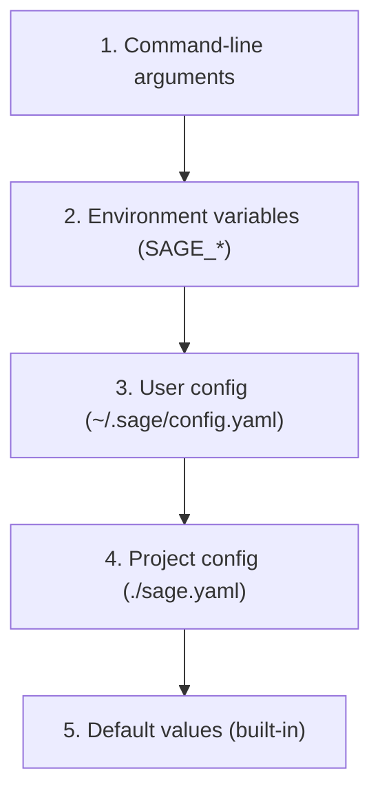

# Configuration

> Configuration system design for SAGE

---

## 1. Overview

The configuration system provides flexible, hierarchical configuration management for SAGE.

## Table of Contents

- [1. Overview](#1-overview)
- [2. Documents](#2-documents)
- [3. Configuration Hierarchy](#3-configuration-hierarchy)
- [4. Configuration Categories](#4-configuration-categories)
- [5. Environment Variables](#5-environment-variables)

---
---

## 2. Documents

| Document | Description | Status |
|----------|-------------|--------|
| `CONFIG_HIERARCHY.md` | Configuration hierarchy and precedence | Planned |
| `YAML_DSL.md` | YAML configuration DSL | Planned |
| `CONFIG_REFERENCE.md` | Complete configuration reference | Planned |

---

## 3. Configuration Hierarchy

Priority (highest to lowest):

---

## 4. Configuration Categories

| Category | Purpose | Example |
|----------|---------|---------|
| **Core** | Core settings | `sage.version` |
| **Timeout** | Timeout hierarchy | `timeout.cache_lookup` |
| **Loading** | Knowledge loading | `loading.strategy` |
| **Plugins** | Plugin settings | `plugins.enabled` |
| **Services** | Service config | `services.mcp.port` |

---

## 5. Environment Variables

| Pattern | Example | Description |
|---------|---------|-------------|
| `SAGE_*` | `SAGE_CONFIG_PATH` | Basic settings |
| `SAGE__*__*` | `SAGE__TIMEOUT__CACHE` | Nested settings |

---

## Related

- `../core_engine/INDEX.md` — Core engine
- `../knowledge_system/INDEX.md` — Knowledge system
- `.context/decisions/ADR_0007_CONFIGURATION.md` — Config ADR

---

*AI Collaboration Knowledge Base*
