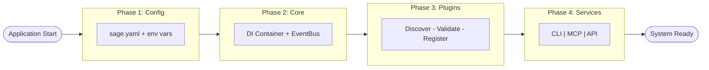

# Bootstrap

> Application startup and initialization process

---

## 1. Overview

The bootstrap process initializes SAGE, loading configuration, registering components, and preparing the system for operation.

---

## 2. Bootstrap Phases

| Phase | Purpose | Duration |
|-------|---------|----------|
| **1. Config** | Load configuration | ~50ms |
| **2. Core** | Initialize core components | ~100ms |
| **3. Plugins** | Load and register plugins | ~200ms |
| **4. Services** | Start service layer | ~100ms |
| **5. Ready** | System operational | - |

---

## 3. Bootstrap Flow



---

## 4. Configuration Loading

### 4.1 Config Sources (Priority Order)

```
1. Command-line arguments    (highest)
2. Environment variables
3. User config (~/.sage/config.yaml)
4. Project config (./sage.yaml)
5. Default values            (lowest)
```

### 4.2 Config Loading Code

```python
def load_config() -> Config:
    # Load defaults
    config = Config.defaults()
    
    # Layer project config
    if Path("sage.yaml").exists():
        config = config.merge(Config.from_yaml("sage.yaml"))
    
    # Layer user config
    user_config = Path.home() / ".sage" / "config.yaml"
    if user_config.exists():
        config = config.merge(Config.from_yaml(user_config))
    
    # Layer environment variables
    config = config.merge(Config.from_env())
    
    return config
```

---

## 5. Core Initialization

### 5.1 Component Order

```python
def init_core(config: Config) -> Container:
    container = Container()
    
    # 1. Register config (singleton)
    container.register_instance(Config, config)
    
    # 2. Register event bus (singleton)
    container.register(EventBus, EventBusImpl, Lifecycle.SINGLETON)
    
    # 3. Register logger
    container.register(Logger, LoggerImpl, Lifecycle.SINGLETON)
    
    # 4. Register core services
    CoreModule.register(container)
    
    return container
```

### 5.2 Event Bus Setup

```python
def setup_event_bus(container: Container) -> None:
    event_bus = container.resolve(EventBus)
    
    # Register system handlers
    event_bus.subscribe("system.*", system_event_handler)
    event_bus.subscribe("*", metrics_collector)
```

---

## 6. Plugin Loading

### 6.1 Plugin Discovery

```python
def discover_plugins(config: Config) -> list[PluginInfo]:
    plugins = []
    
    # Built-in plugins
    plugins.extend(discover_builtin_plugins())
    
    # User plugins from config
    for plugin_config in config.plugins:
        plugins.append(load_plugin_info(plugin_config))
    
    return plugins
```

### 6.2 Plugin Registration

```python
def register_plugins(container: Container, plugins: list[PluginInfo]) -> None:
    for plugin in plugins:
        # Validate plugin
        if not plugin.is_compatible():
            logger.warning(f"Skipping incompatible plugin: {plugin.name}")
            continue
        
        # Register plugin components
        plugin.register(container)
        
        logger.info(f"Loaded plugin: {plugin.name} v{plugin.version}")
```

---

## 7. Service Startup

### 7.1 Service Initialization

```python
def start_services(container: Container, mode: str) -> None:
    if mode == "cli":
        cli_service = container.resolve(CLIService)
        cli_service.start()
    
    elif mode == "server":
        api_service = container.resolve(APIService)
        mcp_service = container.resolve(MCPService)
        
        api_service.start()
        mcp_service.start()
```

### 7.2 Ready Signal

```python
def signal_ready(container: Container) -> None:
    event_bus = container.resolve(EventBus)
    config = container.resolve(Config)
    
    event_bus.publish(Event(
        topic="system.initialized",
        payload={
            "version": config.version,
            "mode": config.mode,
            "plugins_loaded": len(container.get_plugins())
        },
        timestamp=datetime.now(),
        source="bootstrap"
    ))
```

---

## 8. Complete Bootstrap

```python
def bootstrap(args: Args) -> Application:
    # Phase 1: Config
    config = load_config()
    config = config.merge(Config.from_args(args))
    
    # Phase 2: Core
    container = init_core(config)
    setup_event_bus(container)
    
    # Phase 3: Plugins
    plugins = discover_plugins(config)
    register_plugins(container, plugins)
    
    # Phase 4: Services
    start_services(container, config.mode)
    
    # Phase 5: Ready
    signal_ready(container)
    
    return Application(container)
```

---

## 9. Shutdown

### 9.1 Graceful Shutdown

```python
def shutdown(app: Application) -> None:
    container = app.container
    event_bus = container.resolve(EventBus)
    
    # Signal shutdown
    event_bus.publish(Event(
        topic="system.shutdown",
        payload={"reason": "requested"},
        timestamp=datetime.now(),
        source="bootstrap"
    ))
    
    # Stop services
    for service in container.get_services():
        service.stop()
    
    # Unload plugins
    for plugin in container.get_plugins():
        plugin.unload()
    
    # Cleanup
    container.dispose()
```

---

## 10. Error Handling

| Phase | On Error | Recovery |
|-------|----------|----------|
| Config | Log, use defaults | Continue with warnings |
| Core | Fatal error | Exit with error code |
| Plugins | Log, skip plugin | Continue without plugin |
| Services | Log, retry | Degrade gracefully |

---

## Related

- `DI_CONTAINER.md` — Dependency injection
- `EVENT_BUS.md` — Event system
- `../configuration/INDEX.md` — Configuration

---

*Part of SAGE Knowledge Base*
