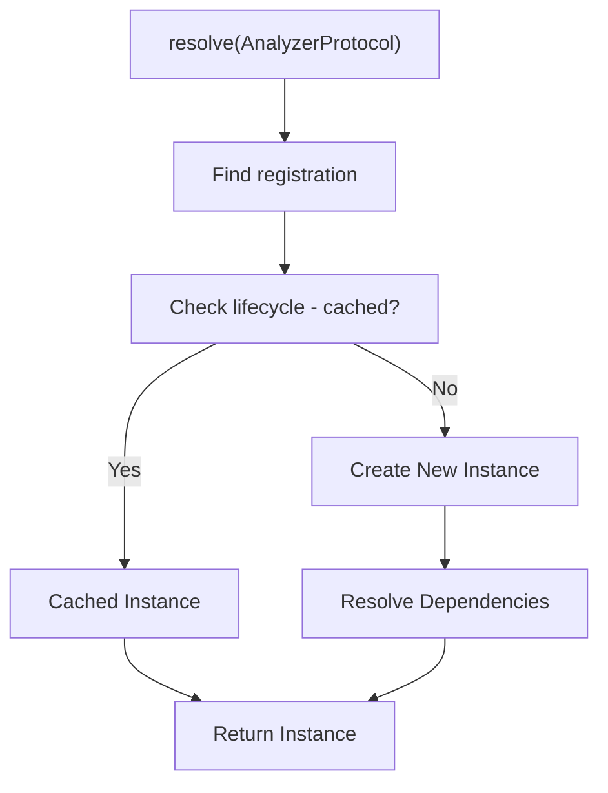

# Dependency Injection Container

> Centralized dependency management for SAGE

---

## 1. Overview

The DI Container manages object creation, lifecycle, and dependency resolution, enabling loose coupling and testability.

---

## 2. Core Concepts

| Concept | Description |
|---------|-------------|
| **Container** | Central registry for dependencies |
| **Registration** | Define how to create instances |
| **Resolution** | Get instances from container |
| **Lifecycle** | Singleton, transient, scoped |

---

## 3. Container Interface

```python
from typing import Protocol, TypeVar, Type

T = TypeVar('T')

class Container(Protocol):
    def register(self, 
                 interface: Type[T], 
                 implementation: Type[T],
                 lifecycle: Lifecycle = Lifecycle.TRANSIENT) -> None:
        """Register an implementation for an interface."""
        ...
    
    def resolve(self, interface: Type[T]) -> T:
        """Resolve an instance of the interface."""
        ...
    
    def register_instance(self, 
                          interface: Type[T], 
                          instance: T) -> None:
        """Register a pre-created instance."""
        ...
```

---

## 4. Lifecycle Management

### 4.1 Lifecycle Types

| Type | Behavior | Use Case |
|------|----------|----------|
| **Singleton** | One instance per container | Config, EventBus |
| **Transient** | New instance each time | Handlers, Processors |
| **Scoped** | One instance per scope | Request handlers |

### 4.2 Lifecycle Examples

```python
# Singleton - same instance always
container.register(EventBus, EventBusImpl, Lifecycle.SINGLETON)
bus1 = container.resolve(EventBus)
bus2 = container.resolve(EventBus)
assert bus1 is bus2  # True

# Transient - new instance each time
container.register(Handler, HandlerImpl, Lifecycle.TRANSIENT)
h1 = container.resolve(Handler)
h2 = container.resolve(Handler)
assert h1 is not h2  # True
```

---

## 5. Registration Patterns

### 5.1 Interface to Implementation

```python
# Register interface → implementation mapping
container.register(AnalyzerProtocol, ContentAnalyzer)
container.register(CheckerProtocol, FormatChecker)
```

### 5.2 Factory Registration

```python
# Register with factory function
def create_analyzer(container: Container) -> AnalyzerProtocol:
    config = container.resolve(Config)
    return ContentAnalyzer(config)

container.register_factory(AnalyzerProtocol, create_analyzer)
```

### 5.3 Instance Registration

```python
# Register pre-created instance
config = Config.load("sage.yaml")
container.register_instance(Config, config)
```

---

## 6. Dependency Resolution

### 6.1 Automatic Resolution

```python
class ContentAnalyzer:
    def __init__(self, config: Config, logger: Logger):
        self.config = config
        self.logger = logger

# Container auto-resolves Config and Logger
container.register(AnalyzerProtocol, ContentAnalyzer)
analyzer = container.resolve(AnalyzerProtocol)
```

### 6.2 Resolution Flow



---

## 7. Module System

### 7.1 Module Definition

```python
class CoreModule:
    @staticmethod
    def register(container: Container) -> None:
        container.register(EventBus, EventBusImpl, Lifecycle.SINGLETON)
        container.register(Config, ConfigImpl, Lifecycle.SINGLETON)

class CapabilitiesModule:
    @staticmethod
    def register(container: Container) -> None:
        container.register(AnalyzerProtocol, ContentAnalyzer)
        container.register(CheckerProtocol, FormatChecker)
```

### 7.2 Module Loading

```python
# Bootstrap loads modules
container = Container()
CoreModule.register(container)
CapabilitiesModule.register(container)
ServicesModule.register(container)
```

---

## 8. Testing Support

### 8.1 Mock Registration

```python
# In tests, register mocks
container.register_instance(AnalyzerProtocol, MockAnalyzer())
container.register_instance(Config, test_config)
```

### 8.2 Test Container

```python
@pytest.fixture
def container():
    c = Container()
    CoreModule.register(c)
    # Override with test doubles
    c.register_instance(Logger, NullLogger())
    return c
```

---

## 9. Best Practices

| Practice | Description |
|----------|-------------|
| **Program to interfaces** | Register protocols, not classes |
| **Constructor injection** | Declare deps in `__init__` |
| **Avoid service locator** | Don't pass container around |
| **Single responsibility** | Each class has focused deps |

---

## 10. Anti-Patterns

| Anti-Pattern | Problem | Solution |
|--------------|---------|----------|
| **God container** | Too many registrations | Split into modules |
| **Hidden deps** | Resolving inside methods | Constructor injection |
| **Circular deps** | A needs B, B needs A | Refactor design |

---

## Related

- `EVENT_BUS.md` — Event-driven communication
- `BOOTSTRAP.md` — Application startup
- `../architecture/DEPENDENCIES.md` — Dependency rules

---

*Part of SAGE Knowledge Base*
