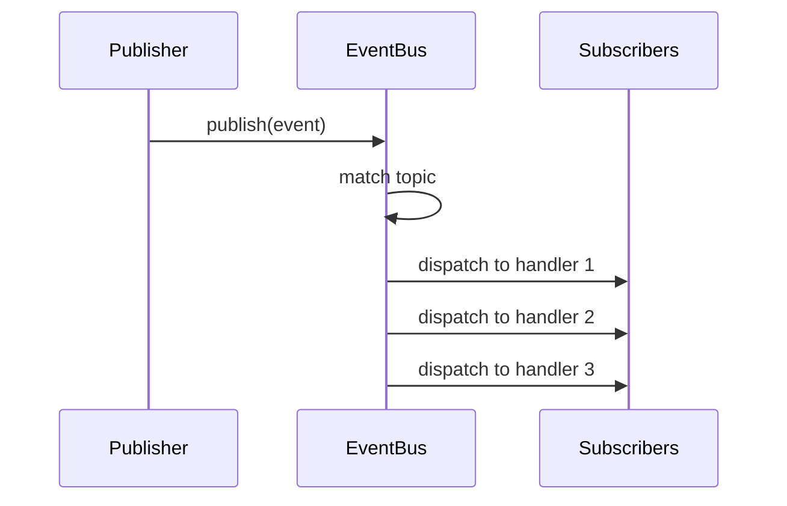

# Event Bus

> Decoupled communication through publish-subscribe pattern

---

## 1. Overview

The Event Bus enables loose coupling between components by allowing them to communicate through events without direct dependencies.

## Table of Contents

- [1. Overview](#1-overview)
- [2. Core Concepts](#2-core-concepts)
- [3. Event Structure](#3-event-structure)
- [4. Event Bus Interface](#4-event-bus-interface)
- [5. Topic Naming](#5-topic-naming)
- [6. Publishing Events](#6-publishing-events)
- [7. Subscribing to Events](#7-subscribing-to-events)
- [8. Event Flow](#8-event-flow)
- [9. Async Support](#9-async-support)
- [10. Error Handling](#10-error-handling)
- [11. Common Patterns](#11-common-patterns)
- [12. Configuration](#12-configuration)
- [Related](#related)

---

## 2. Core Concepts

| Concept | Description |
|---------|-------------|
| **Event** | Message describing something that happened |
| **Publisher** | Component that emits events |
| **Subscriber** | Component that handles events |
| **Topic** | Channel for routing events |

---

## 3. Event Structure

```python
from dataclasses import dataclass
from datetime import datetime
from typing import Any
@dataclass
class Event:
    topic: str
    payload: dict[str, Any]
    timestamp: datetime
    source: str
    correlation_id: str | None = None
```
---

## 4. Event Bus Interface

```python
from typing import Protocol, Callable
class EventBus(Protocol):
    def publish(self, event: Event) -> None:
        """Publish an event to all subscribers."""
        ...
    
    def subscribe(self, 
                  topic: str, 
                  handler: Callable[[Event], None]) -> Subscription:
        """Subscribe to events on a topic."""
        ...
    
    def unsubscribe(self, subscription: Subscription) -> None:
        """Remove a subscription."""
        ...
```
---

## 5. Topic Naming

### 5.1 Topic Pattern

```text
{domain}.{entity}.{action}
```
### 5.2 Standard Topics

| Topic | Description | Example Payload |
|-------|-------------|-----------------|
| `source.started` | Source operation started | `{sources: [...]}` |
| `source.completed` | Source operation done | `{count: 10}` |
| `analyze.completed` | Analysis finished | `{nodes: 50}` |
| `generate.delivered` | Output delivered | `{channel: "cli"}` |
| `system.initialized` | System startup complete | `{version: "0.1"}` |
| `system.error` | Error occurred | `{error: "..."}` |

---

## 6. Publishing Events

### 6.1 Simple Publish

```python
event_bus.publish(Event(
    topic="source.completed",
    payload={"count": 10, "duration_ms": 150},
    timestamp=datetime.now(),
    source="FileCollector"
))
```
### 6.2 Event Builder

```python
class EventBuilder:
    @staticmethod
    def source_completed(count: int, duration_ms: float) -> Event:
        return Event(
            topic="source.completed",
            payload={"count": count, "duration_ms": duration_ms},
            timestamp=datetime.now(),
            source="source"
        )
# Usage
event_bus.publish(EventBuilder.source_completed(10, 150))
```
---

## 7. Subscribing to Events

### 7.1 Function Handler

```python
def on_source_completed(event: Event) -> None:
    count = event.payload["count"]
    logger.info(f"Sourced {count} items")
subscription = event_bus.subscribe("source.completed", on_source_completed)
```
### 7.2 Class Handler

```python
class MetricsCollector:
    def __init__(self, event_bus: EventBus):
        event_bus.subscribe("source.*", self.on_source_event)
        event_bus.subscribe("analyze.*", self.on_analyze_event)
    
    def on_source_event(self, event: Event) -> None:
        self.record_metric("source", event)
    
    def on_analyze_event(self, event: Event) -> None:
        self.record_metric("analyze", event)
```
### 7.3 Wildcard Subscriptions

```python
# Subscribe to all source events
event_bus.subscribe("source.*", handler)
# Subscribe to all events
event_bus.subscribe("*", audit_handler)
```
---

## 8. Event Flow


---

## 9. Async Support

```python
class AsyncEventBus(Protocol):
    async def publish(self, event: Event) -> None:
        """Publish event asynchronously."""
        ...
    
    async def subscribe(self, 
                        topic: str, 
                        handler: Callable[[Event], Awaitable[None]]) -> Subscription:
        """Subscribe with async handler."""
        ...
```
---

## 10. Error Handling

### 10.1 Handler Errors

```python
# Errors in handlers don't stop other handlers
def safe_dispatch(handlers, event):
    for handler in handlers:
        try:
            handler(event)
        except Exception as e:
            logger.error(f"Handler error: {e}")
            # Continue with other handlers
```
### 10.2 Dead Letter Queue

```python
# Events that fail all handlers go to dead letter
event_bus.subscribe("__dead_letter__", handle_failed_events)
```
---

## 11. Common Patterns

### 11.1 Request-Response

```python
# Pseudo request-response using correlation ID
correlation_id = str(uuid4())
response_received = asyncio.Event()
def on_response(event: Event):
    if event.correlation_id == correlation_id:
        response_received.set()
event_bus.subscribe("response.topic", on_response)
event_bus.publish(Event(
    topic="request.topic",
    correlation_id=correlation_id,
    ...
))
await response_received.wait()
```
### 11.2 Event Sourcing

```python
# Store all events for replay
class EventStore:
    def append(self, event: Event) -> None: ...
    def replay(self, from_time: datetime) -> Iterator[Event]: ...
```
---

## 12. Configuration

```yaml
event_bus:
  async: true
  max_handlers_per_topic: 100
  dead_letter_enabled: true
  metrics_enabled: true
```
---

## Related

- `DI_CONTAINER.md` — Dependency injection
- `../protocols/EVOLVE_PROTOCOL.md` — Metrics collection
- `BOOTSTRAP.md` — System startup

---

*AI Collaboration Knowledge Base*
