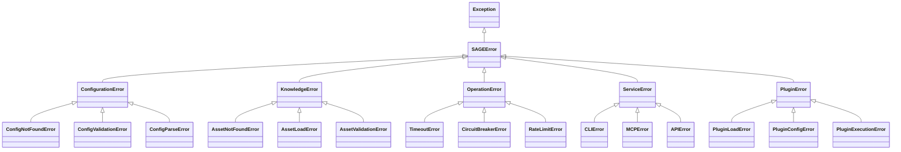

# Exceptions

> Exception hierarchy and error handling for SAGE

---

## 1. Overview

SAGE uses a structured exception hierarchy to provide clear error categorization, consistent handling, and useful debugging information.


## Table of Contents

- [1. Overview](#1-overview)
- [2. Exception Hierarchy](#2-exception-hierarchy)
- [3. Base Exception](#3-base-exception)
- [4. Exception Categories](#4-exception-categories)
- [5. Error Handling Patterns](#5-error-handling-patterns)
- [6. Error Codes](#6-error-codes)
- [7. Logging Integration](#7-logging-integration)
- [8. API Error Responses](#8-api-error-responses)
- [9. Best Practices](#9-best-practices)
- [10. Anti-Patterns](#10-anti-patterns)
- [Related](#related)

---

## 2. Exception Hierarchy


---

## 3. Base Exception

```python
class SAGEError(Exception):
    """Base exception for all SAGE errors."""
    
    def __init__(
        self,
        message: str,
        code: str | None = None,
        details: dict | None = None,
        cause: Exception | None = None
    ):
        super().__init__(message)
        self.message = message
        self.code = code or self.__class__.__name__
        self.details = details or {}
        self.cause = cause
    
    def to_dict(self) -> dict:
        return {
            "error": self.code,
            "message": self.message,
            "details": self.details
        }
```
---

## 4. Exception Categories

### 4.1 Configuration Errors

```python
class ConfigurationError(SAGEError):
    """Configuration-related errors."""
    pass

class ConfigNotFoundError(ConfigurationError):
    """Config file not found."""
    def __init__(self, path: str):
        super().__init__(f"Configuration not found: {path}")
        self.details["path"] = path

class ConfigValidationError(ConfigurationError):
    """Config validation failed."""
    def __init__(self, errors: list[str]):
        super().__init__(f"Invalid configuration: {len(errors)} errors")
        self.details["errors"] = errors
```
### 4.2 Knowledge Errors

```python
class KnowledgeError(SAGEError):
    """Knowledge operation errors."""
    pass

class AssetNotFoundError(KnowledgeError):
    """Knowledge asset not found."""
    def __init__(self, asset_id: str):
        super().__init__(f"Asset not found: {asset_id}")
        self.details["asset_id"] = asset_id

class AssetLoadError(KnowledgeError):
    """Failed to load knowledge asset."""
    def __init__(self, path: str, reason: str):
        super().__init__(f"Failed to load {path}: {reason}")
        self.details["path"] = path
        self.details["reason"] = reason
```
### 4.3 Operation Errors

```python
class OperationError(SAGEError):
    """Operation execution errors."""
    pass

class TimeoutError(OperationError):
    """Operation timed out."""
    def __init__(self, operation: str, timeout_ms: int):
        super().__init__(f"{operation} timed out after {timeout_ms}ms")
        self.details["operation"] = operation
        self.details["timeout_ms"] = timeout_ms

class CircuitBreakerError(OperationError):
    """Circuit breaker is open."""
    def __init__(self, service: str):
        super().__init__(f"Circuit breaker open for {service}")
        self.details["service"] = service
```
### 4.4 Service Errors

```python
class ServiceError(SAGEError):
    """Service layer errors."""
    pass

class CLIError(ServiceError):
    """CLI service error."""
    exit_code: int = 1

class MCPError(ServiceError):
    """MCP protocol error."""
    pass

class APIError(ServiceError):
    """API service error."""
    status_code: int = 500
```
---

## 5. Error Handling Patterns

### 5.1 Try-Except Pattern

```python
try:
    result = load_asset(asset_id)
except AssetNotFoundError as e:
    logger.warning(f"Asset not found: {e.details['asset_id']}")
    return default_asset
except AssetLoadError as e:
    logger.error(f"Load failed: {e}")
    raise
except SAGEError as e:
    logger.error(f"SAGE error: {e.code} - {e.message}")
    raise
```
### 5.2 Result Pattern

```python
def safe_load(asset_id: str) -> Result[KnowledgeAsset]:
    try:
        asset = load_asset(asset_id)
        return Result.ok(asset)
    except SAGEError as e:
        return Result.fail(str(e))
```
### 5.3 Context Manager

```python
@contextmanager
def handle_errors(operation: str):
    try:
        yield
    except SAGEError:
        raise
    except Exception as e:
        raise OperationError(
            f"Unexpected error in {operation}",
            cause=e
        )
```
---

## 6. Error Codes

| Code | Category | Description |
|------|----------|-------------|
| `CONFIG_NOT_FOUND` | Configuration | Config file missing |
| `CONFIG_INVALID` | Configuration | Validation failed |
| `ASSET_NOT_FOUND` | Knowledge | Asset doesn't exist |
| `ASSET_LOAD_FAILED` | Knowledge | Failed to load asset |
| `TIMEOUT` | Operation | Operation timed out |
| `CIRCUIT_OPEN` | Operation | Circuit breaker open |
| `SERVICE_ERROR` | Service | Service layer error |
| `PLUGIN_ERROR` | Plugin | Plugin operation failed |

---

## 7. Logging Integration

```python
class SAGEError(Exception):
    def log(self, logger: Logger) -> None:
        logger.error(
            f"{self.code}: {self.message}",
            extra={
                "error_code": self.code,
                "details": self.details,
                "cause": str(self.cause) if self.cause else None
            }
        )
```
---

## 8. API Error Responses

```python
# FastAPI error handler
@app.exception_handler(SAGEError)
async def sage_error_handler(request: Request, exc: SAGEError):
    status_code = getattr(exc, 'status_code', 500)
    return JSONResponse(
        status_code=status_code,
        content=exc.to_dict()
    )
```
```json
{
    "error": "AssetNotFoundError",
    "message": "Asset not found: doc-123",
    "details": {
        "asset_id": "doc-123"
    }
}
```
---

## 9. Best Practices

| Practice | Description |
|----------|-------------|
| **Specific exceptions** | Use specific types, not generic |
| **Include context** | Add details dict with useful info |
| **Chain causes** | Preserve original exception |
| **Log appropriately** | Error for failures, warning for handled |
| **Fail fast** | Raise early, handle at boundaries |

---

## 10. Anti-Patterns

| Anti-Pattern | Problem | Solution |
|--------------|---------|----------|
| **Catch all** | `except Exception` | Catch specific types |
| **Silent fail** | `except: pass` | Log and handle |
| **String errors** | `raise Exception("msg")` | Use typed exceptions |
| **Deep nesting** | Many try blocks | Use Result pattern |

---

## Related

- `DATA_MODELS.md` — Result type
- `../timeout_resilience/INDEX.md` — Timeout errors
- `../services/INDEX.md` — Service errors

---

*AI Collaboration Knowledge Base*
