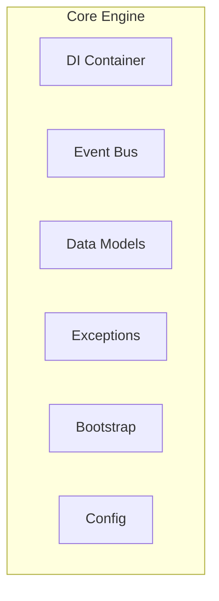

# Core Engine

> Core components and infrastructure for SAGE

---

## 1. Overview

The core engine provides foundational infrastructure including dependency injection, event bus, data models, and bootstrap process.

## Table of Contents

- [1. Overview](#1-overview)
- [2. Documents](#2-documents)
- [3. Component Overview](#3-component-overview)
- [4. Key Responsibilities](#4-key-responsibilities)

---
---

## 2. Documents

| Document | Description | Status |
|----------|-------------|--------|
| `DI_CONTAINER.md` | Dependency injection container | Planned |
| `EVENT_BUS.md` | Event-driven communication | Planned |
| `DATA_MODELS.md` | Core data models and types | Planned |
| `EXCEPTIONS.md` | Exception hierarchy | Planned |
| `BOOTSTRAP.md` | Application bootstrap process | Planned |

---

## 3. Component Overview

---

## 4. Key Responsibilities

| Component | Responsibility |
|-----------|---------------|
| **DI Container** | Manage dependencies and lifecycles |
| **Event Bus** | Decouple components via events |
| **Data Models** | Define core types and structures |
| **Bootstrap** | Initialize and wire up system |

---

## Related

- `../architecture/INDEX.md` — Architecture overview
- `../plugins/INDEX.md` — Plugin system
- `.context/decisions/ADR_0004_DEPENDENCY_INJECTION.md` — DI ADR

---

*AI Collaboration Knowledge Base*
