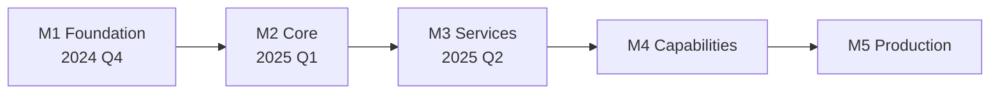

# Milestones

> Project milestones and deliverables

---

## 1. Overview

This document defines the milestones for SAGE development, tracking progress and deliverables for each major phase.

## Table of Contents

- [1. Overview](#1-overview)
- [2. Milestone Summary](#2-milestone-summary)
- [3. M1: Foundation](#3-m1-foundation)
- [4. M2: Core Engine](#4-m2-core-engine)
- [5. M3: Services](#5-m3-services)
- [6. M4: Capabilities](#6-m4-capabilities)
- [7. M5: Production](#7-m5-production)
- [8. Documentation Milestones](#8-documentation-milestones)
- [9. Quality Gates](#9-quality-gates)
- [10. Timeline](#10-timeline)
- [Related](#related)

---

## 2. Milestone Summary

| Milestone | Version | Status | Completion |
|-----------|---------|--------|------------|
| M1: Foundation | 0.1.0 | ✓ Complete | 100% |
| M2: Core Engine | 0.2.0 | ✓ Complete | 100% |
| M3: Services | 0.3.0 | ✓ Complete | 100% |
| M4: Capabilities | 0.4.0 | In Progress | 80% |
| M5: Production | 1.0.0 | Planned | 0% |

---

## 3. M1: Foundation

### 3.1 Objectives

- Establish project structure
- Define core architecture
- Create initial documentation

### 3.2 Deliverables

| Deliverable | Status |
|-------------|--------|
| Project skeleton | ✓ |
| Directory structure | ✓ |
| Initial docs/design | ✓ |
| Development setup | ✓ |
| CI/CD pipeline | ✓ |

### 3.3 Acceptance Criteria

- [x] Project builds without errors
- [x] Tests pass
- [x] Documentation structure in place
- [x] Development workflow documented

---

## 4. M2: Core Engine

### 4.1 Objectives

- Implement core protocols
- Build DI container
- Create event bus

### 4.2 Deliverables

| Deliverable | Status |
|-------------|--------|
| SAGE protocol | ✓ |
| Source protocol | ✓ |
| Analyze protocol | ✓ |
| Generate protocol | ✓ |
| Evolve protocol | ✓ |
| DI container | ✓ |
| Event bus | ✓ |
| Bootstrap system | ✓ |

### 4.3 Acceptance Criteria

- [x] All protocols implemented
- [x] DI container functional
- [x] Event bus operational
- [x] Unit tests >80% coverage

---

## 5. M3: Services

### 5.1 Objectives

- Implement CLI service
- Build MCP service
- Create API service framework

### 5.2 Deliverables

| Deliverable | Status |
|-------------|--------|
| CLI commands | ✓ |
| MCP tools | ✓ |
| API endpoints | ✓ |
| Service layer | ✓ |
| Error handling | ✓ |

### 5.3 Acceptance Criteria

- [x] CLI commands functional
- [x] MCP integration working
- [x] API endpoints accessible
- [x] Consistent error handling

---

## 6. M4: Capabilities

### 6.1 Objectives

- Implement capability families
- Build plugin system
- Create timeout resilience

### 6.2 Deliverables

| Deliverable | Status |
|-------------|--------|
| Analyzers family | ✓ |
| Checkers family | ✓ |
| Monitors family | In Progress |
| Converters family | In Progress |
| Generators family | In Progress |
| Plugin architecture | ✓ |
| Timeout hierarchy | ✓ |
| Circuit breaker | ✓ |

### 6.3 Acceptance Criteria

- [x] All 5 capability families defined
- [ ] Plugin system operational
- [x] Timeout patterns implemented
- [ ] Integration tests passing

---

## 7. M5: Production

### 7.1 Objectives

- Production-grade quality
- Complete documentation
- Performance optimization

### 7.2 Deliverables

| Deliverable | Status |
|-------------|--------|
| Full test coverage | Planned |
| Performance tuning | Planned |
| Security audit | Planned |
| Documentation complete | In Progress |
| Release packaging | Planned |

### 7.3 Acceptance Criteria

- [ ] Test coverage >85%
- [ ] Response time p99 <500ms
- [ ] Zero critical bugs
- [ ] Documentation 100% complete
- [ ] Security review passed

---

## 8. Documentation Milestones

| Milestone | Target | Status |
|-----------|--------|--------|
| Design docs skeleton | M1 | ✓ |
| Protocol documentation | M2 | ✓ |
| Service documentation | M3 | ✓ |
| Capability documentation | M4 | In Progress |
| Complete reference | M5 | Planned |

---

## 9. Quality Gates

| Gate | Requirement | Enforced |
|------|-------------|----------|
| Code review | 1+ approver | ✓ |
| Unit tests | >80% coverage | ✓ |
| Integration tests | All passing | ✓ |
| Documentation | Updated | ✓ |
| Performance | No regression | Planned |

---

## 10. Timeline

---

## Related

- `ROADMAP.md` — Feature roadmap
- `EVALUATION_CRITERIA.md` — Quality criteria
- `CHANGELOG.md` — Release history

---

*AI Collaboration Knowledge Base*
