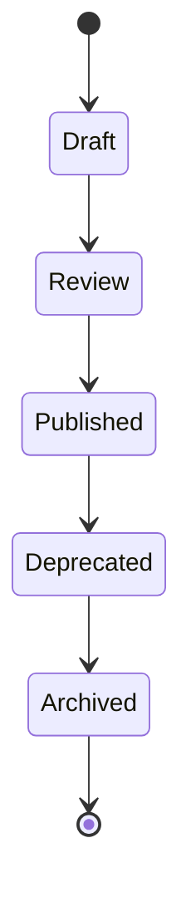

# Content Taxonomy

> Classification system for knowledge content

---

## 1. Overview

Content taxonomy defines how knowledge is classified, tagged, and organized for efficient retrieval and context management.

---

## 2. Content Types

| Type | Purpose | Extension | Location |
|------|---------|-----------|----------|
| **Principle** | Core values, philosophy | `.md` | `.knowledge/core/` |
| **Guideline** | Standards, rules | `.md` | `.knowledge/guidelines/` |
| **Framework** | Deep concepts, models | `.md` | `.knowledge/frameworks/` |
| **Practice** | How-to, patterns | `.md` | `.knowledge/practices/` |
| **Convention** | Project-specific rules | `.md` | `.context/conventions/` |
| **Decision** | ADRs | `.md` | `.context/decisions/` |
| **Design** | Architecture docs | `.md` | `docs/design/` |
| **Reference** | API, specs | `.md` | `docs/api/` |

---

## 3. Classification Dimensions

### 3.1 By Scope

| Scope | Description | Example |
|-------|-------------|---------|
| **Universal** | Applies to all projects | MECE principle |
| **Domain** | Specific to a domain | Python patterns |
| **Project** | Project-specific | Naming conventions |
| **Session** | Current session only | Task context |

### 3.2 By Stability

| Stability | Change Frequency | Example |
|-----------|------------------|---------|
| **Core** | Rarely changes | Principles |
| **Stable** | Quarterly updates | Guidelines |
| **Active** | Weekly updates | Practices |
| **Dynamic** | Per-session | Context |

### 3.3 By Audience

| Audience | Content Focus |
|----------|---------------|
| **AI** | Behavior guidelines, context |
| **Developer** | Code standards, patterns |
| **Architect** | Design decisions, ADRs |
| **User** | Guides, tutorials |

---

## 4. Tagging System

### 4.1 Primary Tags

| Tag | Meaning |
|-----|---------|
| `#core` | Core principle content |
| `#guide` | Guideline content |
| `#practice` | Best practice |
| `#adr` | Architecture decision |
| `#api` | API documentation |

### 4.2 Topic Tags

| Tag | Domain |
|-----|--------|
| `#architecture` | System architecture |
| `#coding` | Code patterns |
| `#testing` | Test strategies |
| `#deployment` | CI/CD, deployment |
| `#security` | Security concerns |

### 4.3 Priority Tags

| Tag | Loading Priority |
|-----|------------------|
| `#always` | Always load |
| `#demand` | Load on demand |
| `#selective` | Selective loading |

---

## 5. Document Structure

### 5.1 Required Sections

| Section | Purpose | Required |
|---------|---------|----------|
| Title | Document name | ✓ |
| Description | One-line purpose | ✓ |
| Overview | Brief introduction | ✓ |
| Content | Main content | ✓ |
| Related | Cross-references | ✓ |

### 5.2 Optional Sections

| Section | When to Include |
|---------|-----------------|
| TOC | >100 lines or >5 H2 sections |
| Configuration | Configurable features |
| Examples | Complex concepts |
| Troubleshooting | Common issues |

---

## 6. Naming Conventions

### 6.1 File Names

| Type | Convention | Example |
|------|------------|---------|
| Standard | UPPER_SNAKE_CASE.md | `LAYER_HIERARCHY.md` |
| Index | INDEX.md | `INDEX.md` |
| ADR | ADR_NNNN_TOPIC.md | `ADR_0001_ARCHITECTURE.md` |

### 6.2 Directory Names

| Type | Convention | Example |
|------|------------|---------|
| Standard | lower_snake_case | `knowledge_system/` |
| Root special | dot prefix | `.knowledge/` |

---

## 7. Content Lifecycle

### 7.1 Status Definitions

| Status | Description | Action |
|--------|-------------|--------|
| **Draft** | Work in progress | Not loaded |
| **Review** | Under review | Not loaded |
| **Published** | Active use | Loaded |
| **Deprecated** | Being phased out | Warning on load |
| **Archived** | No longer used | Not loaded |

---

## 8. Search and Discovery

### 8.1 Search Targets

| Target | Search Method |
|--------|---------------|
| File name | Exact match, glob |
| Title | Full-text search |
| Tags | Tag filter |
| Content | Full-text search |

### 8.2 Discovery Paths

| Path | Use Case |
|------|----------|
| Index navigation | Browse structure |
| Tag browsing | Find by topic |
| Full-text search | Find specific content |
| Related links | Explore connections |

---

## Related

- `LAYER_HIERARCHY.md` — Knowledge layers
- `LOADING_STRATEGY.md` — Smart loading
- `../architecture/DIRECTORY_LAYOUT.md` — Directory structure

---

*Part of SAGE Knowledge Base*
