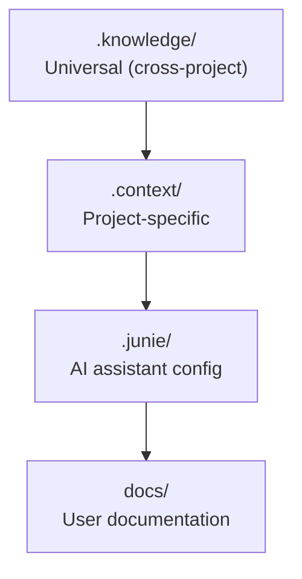

# Knowledge System

> Knowledge management and organization for SAGE

---

## 1. Overview

The knowledge system manages how knowledge is organized, loaded, and delivered within SAGE.

---

## 2. Documents

| Document | Description | Status |
|----------|-------------|--------|
| `LAYER_HIERARCHY.md` | Knowledge layer structure | Planned |
| `CONTENT_TAXONOMY.md` | Content classification | Planned |
| `LOADING_STRATEGY.md` | Smart loading strategies | Planned |
| `TOKEN_BUDGET.md` | Token budget management | Planned |

---

## 3. Knowledge Layers

Priority: `.knowledge/` → `.context/` → `.junie/` → `docs/`

---

## 4. Layer Responsibilities

| Layer | Scope | Content Type |
|-------|-------|--------------|
| `.knowledge/` | Universal | Reusable patterns, frameworks |
| `.context/` | Project | Conventions, decisions, policies |
| `.junie/` | AI | Assistant configuration |
| `docs/` | Users | Design, guides, API reference |

---

## 5. Loading Strategy

| Strategy | Use Case | Token Cost |
|----------|----------|------------|
| **Eager** | Core knowledge | High |
| **Lazy** | On-demand content | Medium |
| **Deferred** | Reference material | Low |

---

## Related

- `../configuration/INDEX.md` — Configuration system
- `../memory_state/INDEX.md` — State persistence
- `.context/conventions/DIRECTORY_STRUCTURE.md` — Directory layout

---

*Part of SAGE Knowledge Base*
