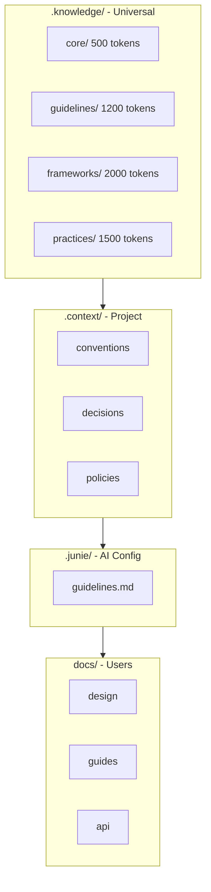

# Layer Hierarchy

> Knowledge layer structure and priority system

---

## 1. Overview

SAGE organizes knowledge into hierarchical layers with defined priorities, token budgets, and loading strategies. This ensures efficient context management for AI interactions.


## Table of Contents

- [1. Overview](#1-overview)
- [2. Layer Structure](#2-layer-structure)
- [3. Layer Definitions](#3-layer-definitions)
- [4. Layer 1: .knowledge/](#4-layer-1-knowledge)
- [5. Layer 2: .context/](#5-layer-2-context)
- [6. Layer 3: .junie/](#6-layer-3-junie)
- [7. Layer 4: docs/](#7-layer-4-docs)
- [8. Priority Resolution](#8-priority-resolution)
- [9. Navigation](#9-navigation)
- [Related](#related)
- [Related](#related)

---

## 2. Layer Structure

Priority: `.knowledge/` → `.context/` → `.junie/` → `docs/`

---

## 3. Layer Definitions

| Layer | Directory | Scope | Priority | Token Budget |
|-------|-----------|-------|----------|--------------|
| 1 | `.knowledge/` | Universal | ★★★★★ | 5,500 |
| 2 | `.context/` | Project | ★★★★☆ | 2,000 |
| 3 | `.junie/` | AI Config | ★★★☆☆ | 500 |
| 4 | `docs/` | Users | ★★☆☆☆ | Variable |

---

## 4. Layer 1: .knowledge/

### 4.1 Purpose

Universal knowledge that applies across all projects. Contains principles, guidelines, and best practices.

### 4.2 Subdirectories

| Directory | Content | Load Strategy | Tokens |
|-----------|---------|---------------|--------|
| `core/` | Principles, defaults, quick ref | Always | ~500 |
| `guidelines/` | Engineering standards | On-demand | ~1,200 |
| `frameworks/` | Deep frameworks | On-demand | ~2,000 |
| `practices/` | Best practices | On-demand | ~1,500 |
| `scenarios/` | Context presets | Selective | ~500 |
| `templates/` | Reusable templates | Selective | ~300 |

### 4.3 Core Files (Always Loaded)

| File | Purpose | Tokens |
|------|---------|--------|
| `PRINCIPLES.md` | Xin-Da-Ya philosophy | ~200 |
| `QUICK_REFERENCE.md` | Critical questions | ~150 |
| `DEFAULTS.md` | Default behaviors | ~150 |

---

## 5. Layer 2: .context/

### 5.1 Purpose

Project-specific knowledge including conventions, architectural decisions, and runtime policies.

### 5.2 Subdirectories

| Directory | Content | Load Strategy |
|-----------|---------|---------------|
| `conventions/` | Naming, templates, patterns | On-demand |
| `decisions/` | ADRs (Architecture Decision Records) | On-demand |
| `policies/` | Runtime settings, timeouts | On-demand |
| `intelligence/` | Learning, optimizations | Selective |

---

## 6. Layer 3: .junie/

### 6.1 Purpose

AI assistant-specific configuration and guidelines.

### 6.2 Content

| File | Purpose |
|------|---------|
| `guidelines.md` | AI behavior guidelines |
| `context.md` | Project context for AI |

---

## 7. Layer 4: docs/

### 7.1 Purpose

End-user documentation including design documents, guides, and API references.

### 7.2 Subdirectories

| Directory | Content | Audience |
|-----------|---------|----------|
| `design/` | Architecture, protocols | Developers |
| `guides/` | How-to guides | Users |
| `api/` | API documentation | Integrators |

---

## 8. Priority Resolution

When content exists in multiple layers:

```text
.knowledge/ > .context/ > .junie/ > docs/

Example:
- .knowledge/guidelines/CODE_STYLE.md  ← Universal default
- .context/conventions/CODE_STYLE.md   ← Project override
```
### 8.1 Override Rules

| Scenario | Resolution |
|----------|------------|
| Same topic, different layers | Higher priority wins |
| Complementary content | Merge, prefer higher |
| Conflicting content | Higher priority wins |

---

## 9. Navigation

### 9.1 Entry Points

| Entry | Path | Purpose |
|-------|------|---------|
| Root | `index.md` | Main navigation |
| Knowledge | `.knowledge/INDEX.md` | Knowledge index |
| Context | `.context/INDEX.md` | Project index |
| Design | `docs/design/INDEX.md` | Design index |

### 9.2 Cross-References

```markdown
## Related

- `.knowledge/guidelines/CODE_STYLE.md` — Universal style guide
- `.context/conventions/NAMING.md` — Project naming conventions
```
---

## Related

- `CONTENT_TAXONOMY.md` — Content classification
- `LOADING_STRATEGY.md` — Smart loading
- `TOKEN_BUDGET.md` — Token management

---

*AI Collaboration Knowledge Base*
