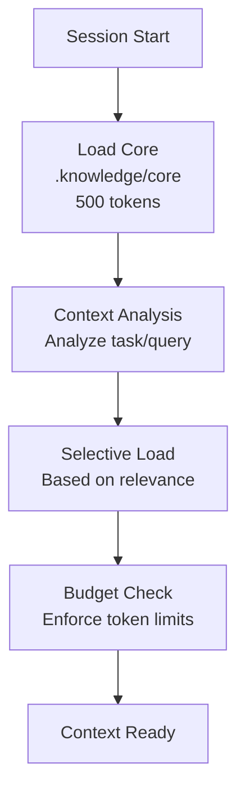

# Loading Strategy

> Smart loading patterns for efficient context management

---

## 1. Overview

Loading strategy defines how knowledge content is loaded into AI context based on relevance, priority, and token budget constraints.

## Table of Contents

- [1. Overview](#1-overview)
- [2. Loading Modes](#2-loading-modes)
- [3. Loading Pipeline](#3-loading-pipeline)
- [4. Always-Load Content](#4-always-load-content)
- [5. On-Demand Loading](#5-on-demand-loading)
- [6. Selective Loading](#6-selective-loading)
- [7. Lazy Loading](#7-lazy-loading)
- [8. Priority Resolution](#8-priority-resolution)
- [9. Caching Strategy](#9-caching-strategy)
- [10. Performance Optimization](#10-performance-optimization)
- [11. Configuration](#11-configuration)
- [Related](#related)

---

## 2. Loading Modes

| Mode | Description | Trigger |
|------|-------------|---------|
| **Always** | Loaded at session start | Core principles |
| **On-Demand** | Loaded when requested | Specific queries |
| **Selective** | Loaded based on context | Scenario matching |
| **Lazy** | Loaded only if needed | Reference content |

---

## 3. Loading Pipeline


---

## 4. Always-Load Content

### 4.1 Core Files

| File | Purpose | Tokens |
|------|---------|--------|
| `.knowledge/core/PRINCIPLES.md` | Philosophy | ~200 |
| `.knowledge/core/QUICK_REFERENCE.md` | Critical refs | ~150 |
| `.knowledge/core/DEFAULTS.md` | Default behaviors | ~150 |

### 4.2 Loading at Session Start

```python
class CoreLoader:
    ALWAYS_LOAD = [
        ".knowledge/core/PRINCIPLES.md",
        ".knowledge/core/QUICK_REFERENCE.md",
        ".knowledge/core/DEFAULTS.md",
    ]
    
    def load_core(self) -> list[Content]:
        return [self.load_file(f) for f in self.ALWAYS_LOAD]
```
---

## 5. On-Demand Loading

### 5.1 Trigger Patterns

| Pattern | Content Loaded |
|---------|----------------|
| Code review request | CODE_STYLE.md, QUALITY.md |
| Architecture question | ARCHITECTURE.md, ADRs |
| Python task | PYTHON.md, PATTERNS.md |
| Testing task | TESTING_STRATEGY.md |

### 5.2 Implementation

```python
class DemandLoader:
    TRIGGERS = {
        "code review": ["CODE_STYLE.md", "QUALITY.md"],
        "architecture": ["ARCHITECTURE.md"],
        "python": ["PYTHON.md", "PATTERNS.md"],
        "test": ["TESTING_STRATEGY.md"],
    }
    
    def load_for_context(self, query: str) -> list[Content]:
        relevant = self._match_triggers(query)
        return self._load_within_budget(relevant)
```
---

## 6. Selective Loading

### 6.1 Scenario-Based Selection

| Scenario | Pre-loaded Content |
|----------|-------------------|
| `python_backend` | Python guidelines, API patterns |
| `typescript_frontend` | TS guidelines, React patterns |
| `documentation` | Doc standards, templates |
| `devops` | CI/CD, deployment guides |

### 6.2 Scenario Configuration

```yaml
scenarios:
  python_backend:
    preload:
      - .knowledge/guidelines/PYTHON.md
      - .knowledge/practices/engineering/API_DESIGN.md
      - .context/conventions/CODE_PATTERNS.md
    token_budget: 2000
  documentation:
    preload:
      - .knowledge/guidelines/DOCUMENTATION.md
      - .knowledge/templates/
    token_budget: 1500
```
---

## 7. Lazy Loading

### 7.1 Deferred Content

| Content Type | Load Condition |
|--------------|----------------|
| API reference | Explicit request |
| Deep frameworks | Complex questions |
| Historical ADRs | Architecture review |
| Templates | Generation tasks |

### 7.2 Implementation

```python
class LazyLoader:
    def __init__(self):
        self._cache: dict[str, Content] = {}
    
    def get(self, path: str) -> Content:
        if path not in self._cache:
            self._cache[path] = self._load(path)
        return self._cache[path]
```
---

## 8. Priority Resolution

### 8.1 Loading Order

```text
1. Core (Always)        → Highest priority
2. Context-matched      → Based on query
3. Scenario preloads    → Based on scenario
4. Related content      → Cross-references
5. Fallback             → Default content
```
### 8.2 Conflict Resolution

| Conflict | Resolution |
|----------|------------|
| Token budget exceeded | Prioritize by relevance score |
| Multiple matches | Load highest priority first |
| Duplicate content | Deduplicate, keep newest |

---

## 9. Caching Strategy

### 9.1 Cache Levels

| Level | Scope | TTL |
|-------|-------|-----|
| **Session** | Current session | Session end |
| **Memory** | In-memory cache | 1 hour |
| **Disk** | File system | 24 hours |

### 9.2 Cache Invalidation

| Event | Action |
|-------|--------|
| File modified | Invalidate file cache |
| Session end | Clear session cache |
| Manual refresh | Clear all caches |

---

## 10. Performance Optimization

### 10.1 Strategies

| Strategy | Benefit |
|----------|---------|
| **Precompute tokens** | Fast budget checks |
| **Index content** | Fast search |
| **Compress similar** | Reduce redundancy |
| **Batch loading** | Reduce I/O |

### 10.2 Metrics

| Metric | Target |
|--------|--------|
| Core load time | <100ms |
| On-demand load | <200ms |
| Cache hit rate | >80% |

---

## 11. Configuration

```yaml
loading:
  core:
    always_load: true
    paths:
      - .knowledge/core/
  
  on_demand:
    enabled: true
    max_files: 10
    timeout_ms: 500
  
  caching:
    enabled: true
    session_ttl: 3600
    disk_ttl: 86400
```
---

## Related

- `LAYER_HIERARCHY.md` — Knowledge layers
- `TOKEN_BUDGET.md` — Token management
- `../timeout_resilience/SMART_LOADING.md` — Timeout-aware loading

---

*AI Collaboration Knowledge Base*
