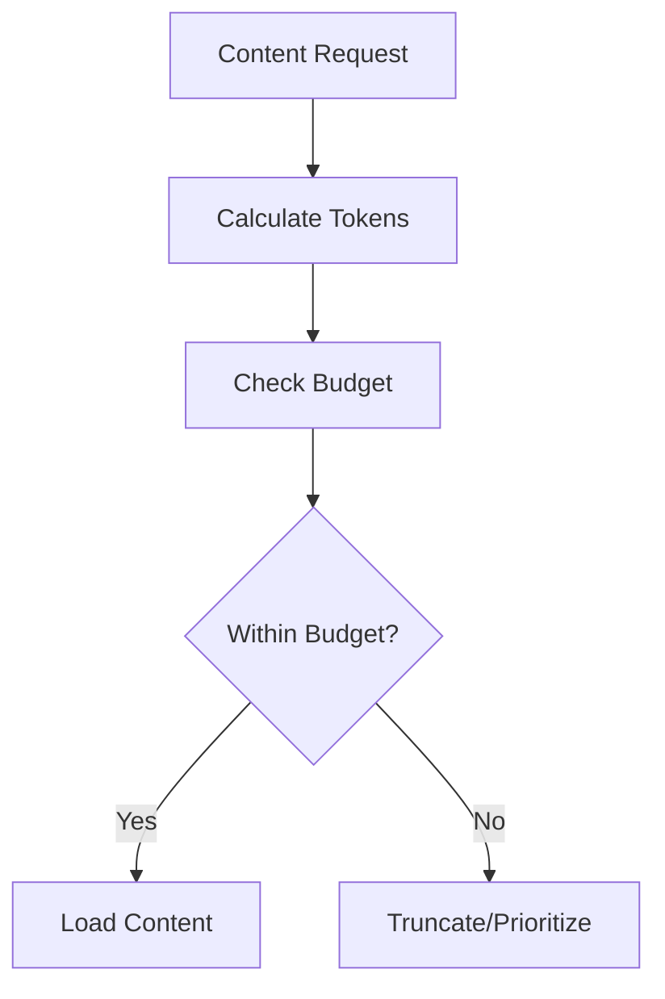

# Token Budget

> Token allocation and management for AI context

---

## 1. Overview

Token budget management ensures efficient use of limited AI context window by allocating tokens strategically across knowledge layers and content types.

---

## 2. Budget Allocation

### 2.1 Total Budget

| Context Size | Available | Reserved | Usable |
|--------------|-----------|----------|--------|
| 8K tokens | 8,000 | 2,000 | 6,000 |
| 32K tokens | 32,000 | 4,000 | 28,000 |
| 128K tokens | 128,000 | 8,000 | 120,000 |

### 2.2 Layer Allocation

| Layer | Directory | Budget | Percentage |
|-------|-----------|--------|------------|
| Core | `.knowledge/core/` | 500 | 8% |
| Guidelines | `.knowledge/guidelines/` | 1,200 | 20% |
| Frameworks | `.knowledge/frameworks/` | 2,000 | 33% |
| Practices | `.knowledge/practices/` | 1,500 | 25% |
| Context | `.context/` | 500 | 8% |
| Dynamic | Session content | 300 | 5% |
| **Total** | | **6,000** | **100%** |

---

## 3. Content Token Estimates

### 3.1 By Directory

| Directory | Files | Tokens | Load Strategy |
|-----------|-------|--------|---------------|
| `.knowledge/core/` | 3 | ~500 | Always |
| `.knowledge/guidelines/` | 11 | ~1,200 | On-demand |
| `.knowledge/frameworks/` | 5+ | ~2,000 | On-demand |
| `.knowledge/practices/` | 10+ | ~1,500 | On-demand |
| `.knowledge/scenarios/` | 10+ | ~500 | Selective |
| `.knowledge/templates/` | 15+ | ~300 | Selective |

### 3.2 By File Type

| Type | Avg Tokens | Range |
|------|------------|-------|
| Principle | 150-200 | 100-300 |
| Guideline | 100-150 | 80-200 |
| Framework | 300-500 | 200-800 |
| Practice | 150-250 | 100-400 |
| Template | 50-100 | 30-150 |

---

## 4. Budget Enforcement

### 4.1 Enforcement Strategy



### 4.2 Implementation

```python
class TokenBudget:
    def __init__(self, total: int = 6000):
        self.total = total
        self.used = 0
        self.allocations: dict[str, int] = {}
    
    def can_allocate(self, tokens: int) -> bool:
        return self.used + tokens <= self.total
    
    def allocate(self, source: str, tokens: int) -> bool:
        if not self.can_allocate(tokens):
            return False
        self.used += tokens
        self.allocations[source] = tokens
        return True
    
    def remaining(self) -> int:
        return self.total - self.used
```

---

## 5. Overflow Handling

### 5.1 Strategies

| Strategy | Description | Use Case |
|----------|-------------|----------|
| **Truncate** | Cut content at limit | Low-priority content |
| **Summarize** | Compress content | Large documents |
| **Prioritize** | Load high-priority only | Budget exceeded |
| **Defer** | Load later if needed | Reference content |

### 5.2 Priority Rules

```
Priority Order (highest first):
1. Core principles (always load)
2. Active context (current task)
3. Matched guidelines (query-relevant)
4. Related practices
5. Reference content
```

---

## 6. Dynamic Adjustment

### 6.1 Runtime Adjustment

| Condition | Action |
|-----------|--------|
| Simple task | Reduce budget, faster response |
| Complex task | Expand budget if available |
| Multiple topics | Balance across topics |
| Deep dive | Reallocate to focus area |

### 6.2 Adjustment Algorithm

```python
class DynamicBudget:
    def adjust_for_task(self, task_complexity: str) -> int:
        multipliers = {
            "simple": 0.5,
            "moderate": 1.0,
            "complex": 1.5,
            "expert": 2.0,
        }
        return int(self.base_budget * multipliers.get(task_complexity, 1.0))
```

---

## 7. Monitoring

### 7.1 Metrics

| Metric | Description | Target |
|--------|-------------|--------|
| Utilization | Used / Total | 70-90% |
| Overflow rate | Exceeded / Requests | <5% |
| Truncation rate | Truncated / Loaded | <10% |

### 7.2 Reporting

```python
class BudgetMonitor:
    def report(self) -> dict:
        return {
            "total": self.budget.total,
            "used": self.budget.used,
            "remaining": self.budget.remaining(),
            "utilization": self.budget.used / self.budget.total,
            "allocations": self.budget.allocations,
        }
```

---

## 8. Token Counting

### 8.1 Estimation Methods

| Method | Accuracy | Speed |
|--------|----------|-------|
| Exact (tiktoken) | 100% | Slow |
| Word-based (~1.3) | 90% | Fast |
| Character-based | 85% | Fastest |

### 8.2 Implementation

```python
def estimate_tokens(text: str, method: str = "word") -> int:
    if method == "exact":
        import tiktoken
        enc = tiktoken.get_encoding("cl100k_base")
        return len(enc.encode(text))
    elif method == "word":
        return int(len(text.split()) * 1.3)
    else:  # character
        return len(text) // 4
```

---

## 9. Configuration

```yaml
token_budget:
  total: 6000
  reserved: 1000
  
  layer_limits:
    core: 500
    guidelines: 1200
    frameworks: 2000
    practices: 1500
    context: 500
    dynamic: 300
  
  overflow:
    strategy: prioritize
    truncate_threshold: 0.9
  
  counting:
    method: word
    cache_estimates: true
```

---

## 10. Best Practices

| Practice | Benefit |
|----------|---------|
| Keep files under 300 tokens | Easier budget management |
| Use summaries for large docs | Fit more content |
| Precompute token counts | Faster allocation |
| Monitor utilization | Optimize budgets |

---

## Related

- `LAYER_HIERARCHY.md` — Knowledge layers
- `LOADING_STRATEGY.md` — Smart loading
- `../timeout_resilience/GRACEFUL_DEGRADATION.md` — Degradation patterns

---

*Part of SAGE Knowledge Base*
