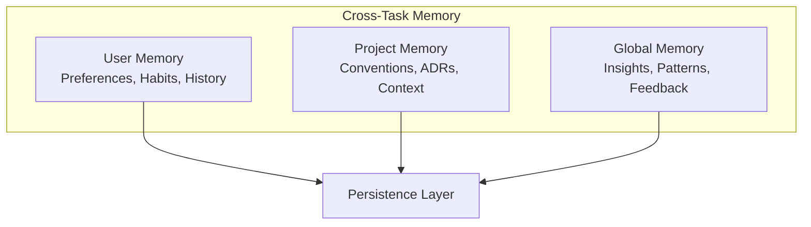

# Cross-Task Memory

> Persistent memory across sessions and tasks

---

## 1. Overview

Cross-task memory enables SAGE to retain and utilize learned patterns, user preferences, and optimization insights across multiple sessions and tasks.


## Table of Contents

- [1. Overview](#1-overview)
- [2. Memory Types](#2-memory-types)
- [3. Architecture](#3-architecture)
- [4. User Memory](#4-user-memory)
- [5. Project Memory](#5-project-memory)
- [6. Global Insights](#6-global-insights)
- [7. Memory Operations](#7-memory-operations)
- [8. Memory Recall](#8-memory-recall)
- [9. Memory Maintenance](#9-memory-maintenance)
- [10. Configuration](#10-configuration)
- [Related](#related)

---

## 2. Memory Types

| Type | Scope | Persistence | Use Case |
|------|-------|-------------|----------|
| **User Patterns** | Per user | Permanent | Preferences, habits |
| **Project Context** | Per project | Permanent | Conventions, decisions |
| **Learned Insights** | Global | Permanent | Optimizations |
| **Task History** | Per user | 30 days | Recent context |

---

## 3. Architecture


---

## 4. User Memory

### 4.1 Preferences

```python
@dataclass
class UserPreferences:
    user_id: str
    preferred_format: str  # rich, json, markdown
    default_layer: int
    default_scenario: str
    custom_shortcuts: dict
    ui_settings: dict
```
### 4.2 Usage Patterns

```python
@dataclass
class UsagePatterns:
    user_id: str
    common_queries: list[str]
    frequently_accessed: list[str]
    typical_session_length: int
    peak_usage_hours: list[int]
```
### 4.3 Learning User Patterns

```python
class UserPatternLearner:
    def learn(self, user_id: str, session: Session) -> None:
        patterns = self._load_patterns(user_id)
        
        # Update common queries
        for query in session.context.query_history:
            patterns.common_queries.append(query.text)
        
        # Update frequently accessed content
        for path in session.context.loaded_knowledge:
            self._increment_access(patterns, path)
        
        self._save_patterns(user_id, patterns)
```
---

## 5. Project Memory

### 5.1 Project Context

```python
@dataclass
class ProjectMemory:
    project_id: str
    conventions: dict
    decisions: list[ADR]
    custom_rules: list[str]
    last_updated: datetime
```
### 5.2 Convention Tracking

```python
class ConventionTracker:
    def record_convention(self, project_id: str, convention: str) -> None:
        memory = self._load_project(project_id)
        memory.conventions[convention.name] = convention.value
        memory.last_updated = datetime.now()
        self._save_project(memory)
    
    def get_conventions(self, project_id: str) -> dict:
        memory = self._load_project(project_id)
        return memory.conventions
```
---

## 6. Global Insights

### 6.1 Learned Optimizations

```python
@dataclass
class Optimization:
    id: str
    category: str
    pattern: str
    improvement: float
    confidence: float
    learned_from: int  # Number of observations
```
### 6.2 Pattern Recognition

```python
class InsightLearner:
    def analyze_feedback(self, feedback: list[Feedback]) -> list[Optimization]:
        optimizations = []
        
        # Group by pattern
        patterns = self._group_by_pattern(feedback)
        
        for pattern, instances in patterns.items():
            if len(instances) >= self.min_observations:
                opt = self._create_optimization(pattern, instances)
                if opt.confidence >= self.confidence_threshold:
                    optimizations.append(opt)
        
        return optimizations
```
---

## 7. Memory Operations

### 7.1 Store Memory

```python
class CrossTaskMemory:
    def store(self, key: str, value: Any, scope: str = "user") -> None:
        storage_key = f"{scope}:{key}"
        self.persistence.save(storage_key, {
            "value": value,
            "stored_at": datetime.now().isoformat(),
            "version": self.version,
        })
```
### 7.2 Retrieve Memory

```python
def retrieve(self, key: str, scope: str = "user") -> Any | None:
    storage_key = f"{scope}:{key}"
    data = self.persistence.load(storage_key)
    
    if data and self._is_valid(data):
        return data["value"]
    return None
```
### 7.3 Merge Memories

```python
def merge(self, old: dict, new: dict, strategy: str = "newer_wins") -> dict:
    if strategy == "newer_wins":
        return {**old, **new}
    elif strategy == "merge_lists":
        result = old.copy()
        for key, value in new.items():
            if isinstance(value, list) and key in result:
                result[key] = list(set(result[key] + value))
            else:
                result[key] = value
        return result
```
---

## 8. Memory Recall

### 8.1 Context-Aware Recall

```python
class MemoryRecaller:
    def recall_for_task(self, task: Task, user_id: str) -> MemoryContext:
        # Recall user preferences
        preferences = self.retrieve(f"preferences:{user_id}", "user")
        
        # Recall project context
        project = self.retrieve(f"context:{task.project_id}", "project")
        
        # Recall relevant insights
        insights = self._find_relevant_insights(task)
        
        return MemoryContext(
            preferences=preferences,
            project=project,
            insights=insights
        )
```
### 8.2 Predictive Loading

```python
def predict_needs(self, user_id: str, context: str) -> list[str]:
    patterns = self._load_patterns(user_id)
    
    # Analyze context for likely needs
    predictions = []
    for pattern in patterns.common_queries:
        if self._matches_context(pattern, context):
            predictions.extend(self._get_related_content(pattern))
    
    return predictions[:10]  # Top 10 predictions
```
---

## 9. Memory Maintenance

### 9.1 Cleanup Policy

| Memory Type | Retention | Cleanup Action |
|-------------|-----------|----------------|
| User preferences | Permanent | Update only |
| Task history | 30 days | Delete old |
| Project context | Permanent | Archive inactive |
| Insights | 90 days | Validate & prune |

### 9.2 Maintenance Tasks

```python
class MemoryMaintenance:
    def run_cleanup(self) -> CleanupReport:
        # Remove expired task history
        expired = self._find_expired_history()
        self._delete_batch(expired)
        
        # Archive inactive projects
        inactive = self._find_inactive_projects(days=180)
        self._archive_batch(inactive)
        
        # Validate insights
        invalid = self._validate_insights()
        self._remove_batch(invalid)
        
        return CleanupReport(deleted=len(expired), archived=len(inactive))
```
---

## 10. Configuration

```yaml
cross_task_memory:
  user:
    enabled: true
    max_history_days: 30
    max_patterns: 100
  
  project:
    enabled: true
    archive_after_days: 180
  
  insights:
    enabled: true
    min_observations: 5
    confidence_threshold: 0.8
    retention_days: 90
  
  cleanup:
    schedule: daily
    batch_size: 100
```
---

## Related

- `PERSISTENCE.md` — Storage mechanisms
- `SESSION_MANAGEMENT.md` — Session handling
- `../knowledge_system/LOADING_STRATEGY.md` — Smart loading

---

*AI Collaboration Knowledge Base*
