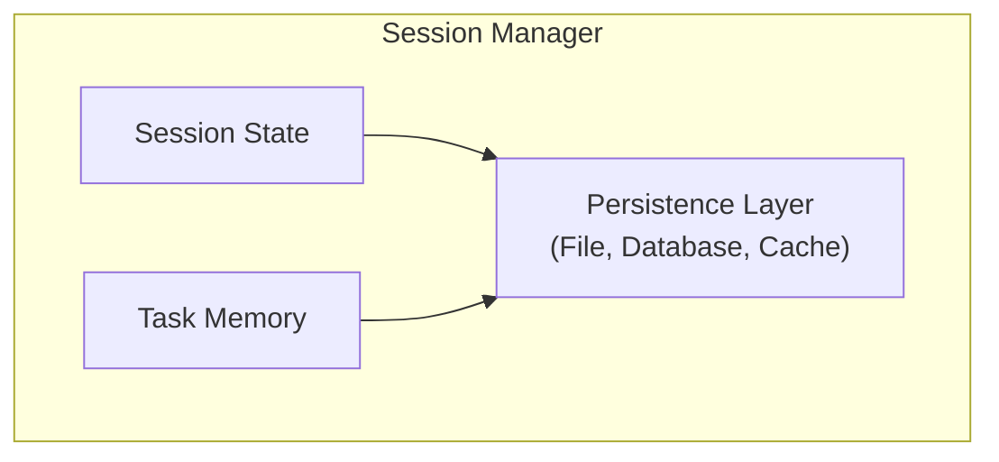

# Memory & State

> State persistence and session management for SAGE

---

## 1. Overview

This directory documents how SAGE manages state, sessions, and cross-task memory.

---

## 2. Documents

| Document | Description | Status |
|----------|-------------|--------|
| `PERSISTENCE.md` | State persistence mechanisms | Planned |
| `SESSION_MANAGEMENT.md` | Session lifecycle | Planned |
| `CROSS_TASK_MEMORY.md` | Memory across tasks | Planned |

---

## 3. State Architecture

---

## 4. State Types

| Type | Scope | Lifetime | Storage |
|------|-------|----------|---------|
| **Session** | Single session | Session duration | Memory |
| **Task** | Single task | Task duration | Memory |
| **Persistent** | Cross-session | Permanent | File/DB |
| **Cache** | Temporary | TTL-based | Memory/File |

---

## 5. Memory Management

| Strategy | Purpose | Implementation |
|----------|---------|----------------|
| **LRU Cache** | Recent access | In-memory cache |
| **Checkpointing** | Recovery | Periodic saves |
| **Lazy Loading** | Memory efficiency | On-demand load |

---

## Related

- `../knowledge_system/INDEX.md` — Knowledge system
- `../configuration/INDEX.md` — Configuration
- `../core_engine/INDEX.md` — Core engine

---

*Part of SAGE Knowledge Base*
