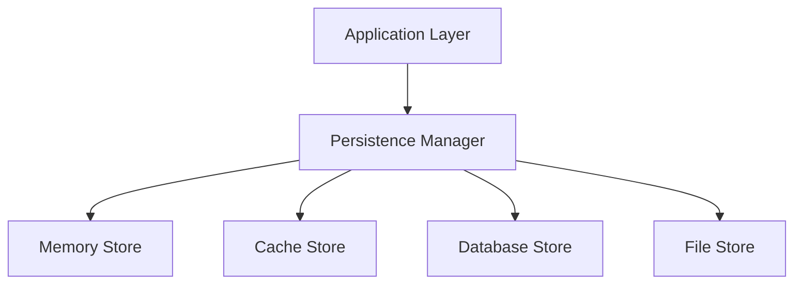

# Persistence

> State persistence mechanisms for SAGE

---

## 1. Overview

Persistence layer manages durable storage of state, session data, and learned patterns across system restarts and sessions.

## Table of Contents

- [1. Overview](#1-overview)
- [2. Persistence Layers](#2-persistence-layers)
- [3. Architecture](#3-architecture)
- [4. Data Categories](#4-data-categories)
- [5. Storage Backends](#5-storage-backends)
- [6. Persistence Interface](#6-persistence-interface)
- [7. Data Models](#7-data-models)
- [8. Serialization](#8-serialization)
- [9. Transactions](#9-transactions)
- [10. Configuration](#10-configuration)
- [Related](#related)

---

## 2. Persistence Layers

| Layer | Storage | Durability | Use Case |
|-------|---------|------------|----------|
| **Memory** | RAM | Session | Fast access, temporary |
| **Cache** | Redis/File | Hours | Frequently accessed |
| **Database** | SQLite/PostgreSQL | Permanent | Structured data |
| **File** | File system | Permanent | Documents, configs |

---

## 3. Architecture


---

## 4. Data Categories

### 4.1 Session Data

| Data | Storage | TTL |
|------|---------|-----|
| Context state | Memory | Session |
| Query history | Cache | 24h |
| Preferences | Database | Permanent |

### 4.2 Knowledge State

| Data | Storage | TTL |
|------|---------|-----|
| Loaded content | Memory | Session |
| Token usage | Cache | 1h |
| Access patterns | Database | 30 days |

### 4.3 Learning Data

| Data | Storage | TTL |
|------|---------|-----|
| User patterns | Database | Permanent |
| Optimizations | Database | Permanent |
| Feedback | Database | Permanent |

---

## 5. Storage Backends

### 5.1 SQLite (Default)

```python
from sage.persistence import SQLiteStore
store = SQLiteStore(path="~/.sage/sage.db")
# Save state
store.save("session:123", session_data)
# Load state
data = store.load("session:123")
```
### 5.2 Redis (Production)

```python
from sage.persistence import RedisStore
store = RedisStore(url="redis://localhost:6379")
# With TTL
store.save("cache:key", data, ttl=3600)
```
### 5.3 File Store

```python
from sage.persistence import FileStore
store = FileStore(base_path="~/.sage/data")
# Save as JSON
store.save("config/settings", config_data)
```
---

## 6. Persistence Interface

### 6.1 Base Interface

```python
from abc import ABC, abstractmethod
from typing import Any, Optional
class PersistenceStore(ABC):
    @abstractmethod
    def save(self, key: str, value: Any, ttl: int = None) -> bool:
        """Save data with optional TTL."""
        pass
    
    @abstractmethod
    def load(self, key: str) -> Optional[Any]:
        """Load data by key."""
        pass
    
    @abstractmethod
    def delete(self, key: str) -> bool:
        """Delete data by key."""
        pass
    
    @abstractmethod
    def exists(self, key: str) -> bool:
        """Check if key exists."""
        pass
```
### 6.2 Persistence Manager

```python
class PersistenceManager:
    def __init__(self):
        self.stores = {
            "memory": MemoryStore(),
            "cache": CacheStore(),
            "database": DatabaseStore(),
            "file": FileStore(),
        }
    
    def save(self, key: str, value: Any, store: str = "database"):
        return self.stores[store].save(key, value)
    
    def load(self, key: str, store: str = "database"):
        return self.stores[store].load(key)
```
---

## 7. Data Models

### 7.1 Session State

```python
@dataclass
class SessionState:
    session_id: str
    user_id: str
    started_at: datetime
    context: dict
    preferences: dict
    history: list[str]
```
### 7.2 Knowledge Cache

```python
@dataclass
class KnowledgeCache:
    content_hash: str
    content: str
    tokens: int
    loaded_at: datetime
    access_count: int
```
---

## 8. Serialization

### 8.1 Formats

| Format | Use Case | Size |
|--------|----------|------|
| JSON | Human-readable | Large |
| MessagePack | Binary, fast | Small |
| Pickle | Python objects | Medium |

### 8.2 Implementation

```python
import json
import msgpack
class Serializer:
    @staticmethod
    def serialize(data: Any, format: str = "json") -> bytes:
        if format == "json":
            return json.dumps(data).encode()
        elif format == "msgpack":
            return msgpack.packb(data)
    
    @staticmethod
    def deserialize(data: bytes, format: str = "json") -> Any:
        if format == "json":
            return json.loads(data.decode())
        elif format == "msgpack":
            return msgpack.unpackb(data)
```
---

## 9. Transactions

### 9.1 Transaction Support

```python
class TransactionalStore:
    def transaction(self):
        return Transaction(self)
# Usage
with store.transaction() as tx:
    tx.save("key1", value1)
    tx.save("key2", value2)
    # Commits on exit, rolls back on exception
```
---

## 10. Configuration

```yaml
persistence:
  default_store: sqlite
  
  sqlite:
    path: ~/.sage/sage.db
    
  redis:
    url: redis://localhost:6379
    ttl_default: 3600
    
  file:
    base_path: ~/.sage/data
    format: json
    
  backup:
    enabled: true
    interval: daily
    retention: 7
```
---

## Related

- `SESSION_MANAGEMENT.md` — Session handling
- `CROSS_TASK_MEMORY.md` — Cross-task memory
- `../configuration/CONFIG_HIERARCHY.md` — Configuration

---

*AI Collaboration Knowledge Base*
