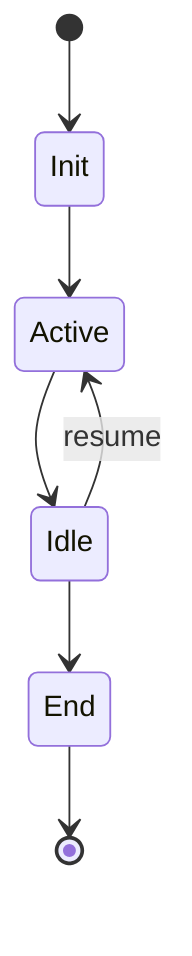

# Session Management

> Session lifecycle and state management

---

## 1. Overview

Session management handles the lifecycle of user sessions, maintaining context and state throughout interactions with SAGE.

---

## 2. Session Lifecycle



### 2.1 States

| State | Description | Duration |
|-------|-------------|----------|
| **Init** | Session creation | <1s |
| **Active** | User interacting | Variable |
| **Idle** | No activity | Up to timeout |
| **End** | Session terminated | — |

---

## 3. Session Model

### 3.1 Session Data

```python
@dataclass
class Session:
    id: str
    user_id: str
    started_at: datetime
    last_activity: datetime
    state: SessionState
    context: SessionContext
    preferences: dict
    metadata: dict
```

### 3.2 Session Context

```python
@dataclass
class SessionContext:
    loaded_knowledge: list[str]
    token_usage: int
    query_history: list[Query]
    active_scenario: str | None
    custom_data: dict
```

---

## 4. Session Operations

### 4.1 Create Session

```python
class SessionManager:
    def create(self, user_id: str, options: dict = None) -> Session:
        session = Session(
            id=generate_session_id(),
            user_id=user_id,
            started_at=datetime.now(),
            last_activity=datetime.now(),
            state=SessionState.INIT,
            context=SessionContext(),
            preferences=self._load_preferences(user_id),
            metadata=options or {}
        )
        
        # Load core knowledge
        session.context.loaded_knowledge = self._load_core()
        session.state = SessionState.ACTIVE
        
        self._persist(session)
        return session
```

### 4.2 Update Session

```python
def update(self, session_id: str, updates: dict) -> Session:
    session = self.get(session_id)
    
    for key, value in updates.items():
        if hasattr(session, key):
            setattr(session, key, value)
    
    session.last_activity = datetime.now()
    self._persist(session)
    return session
```

### 4.3 End Session

```python
def end(self, session_id: str, save_state: bool = True) -> None:
    session = self.get(session_id)
    session.state = SessionState.ENDED
    
    if save_state:
        self._save_for_resume(session)
    
    self._cleanup(session)
    self._persist(session)
```

---

## 5. Context Management

### 5.1 Loading Context

```python
def load_context(self, session: Session, query: str) -> None:
    # Analyze query for relevant content
    relevant = self._analyze_query(query)
    
    # Load within token budget
    for content in relevant:
        if session.context.token_usage + content.tokens <= self.budget:
            session.context.loaded_knowledge.append(content.path)
            session.context.token_usage += content.tokens
```

### 5.2 Context Switching

```python
def switch_scenario(self, session: Session, scenario: str) -> None:
    # Clear non-core content
    self._clear_scenario_content(session)
    
    # Load new scenario content
    scenario_config = self._get_scenario(scenario)
    for path in scenario_config.preload:
        self._load_content(session, path)
    
    session.context.active_scenario = scenario
```

---

## 6. Query History

### 6.1 Recording Queries

```python
@dataclass
class Query:
    text: str
    timestamp: datetime
    response_tokens: int
    knowledge_used: list[str]

def record_query(self, session: Session, query: Query) -> None:
    session.context.query_history.append(query)
    
    # Trim history if too long
    max_history = self.config.max_query_history
    if len(session.context.query_history) > max_history:
        session.context.query_history = session.context.query_history[-max_history:]
```

### 6.2 History Analysis

```python
def analyze_history(self, session: Session) -> dict:
    return {
        "total_queries": len(session.context.query_history),
        "common_topics": self._extract_topics(session),
        "token_usage": sum(q.response_tokens for q in session.context.query_history),
        "most_used_knowledge": self._rank_knowledge(session),
    }
```

---

## 7. Session Timeout

### 7.1 Timeout Configuration

| Timeout | Default | Description |
|---------|---------|-------------|
| **Idle** | 30 min | No activity |
| **Absolute** | 8 hours | Max session length |
| **Warning** | 25 min | Warn before idle |

### 7.2 Timeout Handling

```python
class TimeoutHandler:
    def check_timeout(self, session: Session) -> TimeoutStatus:
        idle_time = datetime.now() - session.last_activity
        
        if idle_time > self.absolute_timeout:
            return TimeoutStatus.EXPIRED
        elif idle_time > self.idle_timeout:
            return TimeoutStatus.IDLE
        elif idle_time > self.warning_threshold:
            return TimeoutStatus.WARNING
        
        return TimeoutStatus.ACTIVE
```

---

## 8. Session Resume

### 8.1 Save State for Resume

```python
def _save_for_resume(self, session: Session) -> None:
    resume_data = {
        "session_id": session.id,
        "context": session.context,
        "preferences": session.preferences,
        "saved_at": datetime.now().isoformat(),
    }
    self.persistence.save(f"resume:{session.user_id}", resume_data)
```

### 8.2 Resume Session

```python
def resume(self, user_id: str) -> Session | None:
    resume_data = self.persistence.load(f"resume:{user_id}")
    
    if not resume_data:
        return None
    
    # Create new session with restored context
    session = self.create(user_id)
    session.context = resume_data["context"]
    session.preferences = resume_data["preferences"]
    
    return session
```

---

## 9. Multi-Session Support

### 9.1 Concurrent Sessions

```python
class MultiSessionManager:
    def __init__(self):
        self.active_sessions: dict[str, Session] = {}
    
    def get_user_sessions(self, user_id: str) -> list[Session]:
        return [s for s in self.active_sessions.values() 
                if s.user_id == user_id]
    
    def enforce_limit(self, user_id: str, max_sessions: int = 3):
        sessions = self.get_user_sessions(user_id)
        if len(sessions) >= max_sessions:
            oldest = min(sessions, key=lambda s: s.last_activity)
            self.end(oldest.id)
```

---

## 10. Configuration

```yaml
session:
  timeout:
    idle_minutes: 30
    absolute_hours: 8
    warning_minutes: 25
  
  limits:
    max_per_user: 3
    max_query_history: 100
    max_context_tokens: 6000
  
  resume:
    enabled: true
    retention_days: 7
  
  persistence:
    store: database
    auto_save_interval: 60
```

---

## Related

- `PERSISTENCE.md` — Storage mechanisms
- `CROSS_TASK_MEMORY.md` — Cross-task memory
- `../knowledge_system/TOKEN_BUDGET.md` — Token management

---

*Part of SAGE Knowledge Base*
