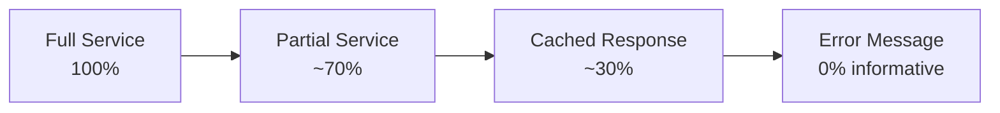
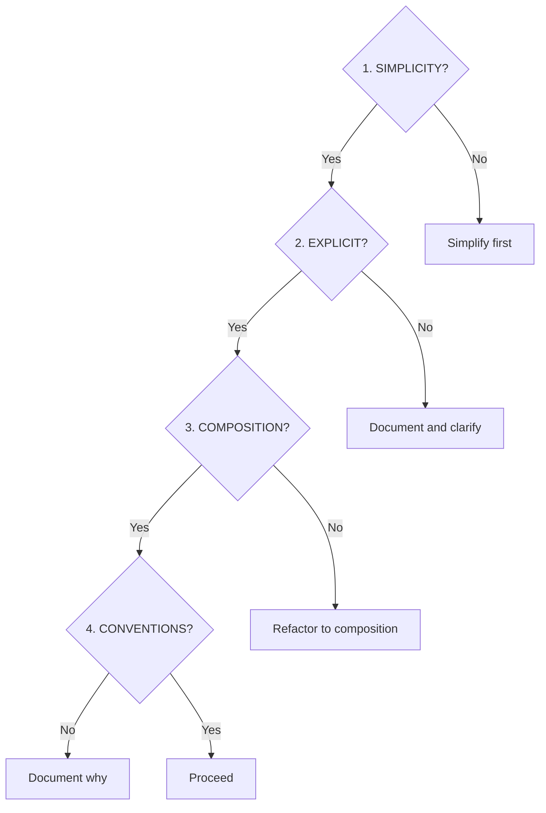

# Design Axioms

> Core design principles that guide all SAGE decisions

---

## 1. Overview

Design axioms are fundamental principles that cannot be compromised. They serve as the foundation for all architectural and implementation decisions.

---

## 2. Core Axioms

### 2.1 Simplicity Over Complexity

| Aspect | Guideline |
|--------|-----------|
| **Principle** | Choose the simplest solution that works |
| **Rationale** | Simple systems are easier to understand, maintain, and debug |
| **Application** | Avoid premature optimization and over-engineering |

```
✅ Do: Start simple, add complexity only when needed
❌ Don't: Build for imaginary future requirements
```

### 2.2 Explicit Over Implicit

| Aspect | Guideline |
|--------|-----------|
| **Principle** | Make behavior visible and predictable |
| **Rationale** | Explicit code is self-documenting and debuggable |
| **Application** | Prefer clear names, avoid magic, document assumptions |

```
✅ Do: timeout_seconds=30
❌ Don't: t=30  # what is t?
```

### 2.3 Composition Over Inheritance

| Aspect | Guideline |
|--------|-----------|
| **Principle** | Build systems from composable parts |
| **Rationale** | Composition is more flexible and testable |
| **Application** | Use protocols, dependency injection, and mixins |

```
✅ Do: class Service(HasLogger, HasMetrics)
❌ Don't: class Service(BaseService(AbstractService))
```

### 2.4 Convention Over Configuration

| Aspect | Guideline |
|--------|-----------|
| **Principle** | Establish sensible defaults |
| **Rationale** | Reduces cognitive load and setup time |
| **Application** | Make common cases easy, rare cases possible |

```
✅ Do: Works out of the box with zero config
❌ Don't: Require 50 settings before first use
```

---

## 3. Architectural Axioms

### 3.1 Single Responsibility

Each component should have one clear purpose.

| Component | Responsibility |
|-----------|---------------|
| Service | Handle one interface (CLI/MCP/API) |
| Capability | Perform one type of operation |
| Plugin | Extend one aspect of functionality |

### 3.2 Dependency Inversion

Depend on abstractions, not implementations.

```python
# ✅ Good: Depend on protocol
def process(loader: LoaderProtocol) -> Result:
    return loader.load()

# ❌ Bad: Depend on concrete class
def process(loader: FileLoader) -> Result:
    return loader.load()
```

### 3.3 Fail Fast

Detect and report errors as early as possible.

| Stage | Action |
|-------|--------|
| **Startup** | Validate configuration |
| **Input** | Validate parameters |
| **Processing** | Check preconditions |
| **Output** | Verify results |

### 3.4 Graceful Degradation

Continue operating with reduced functionality when possible.



---

## 4. Implementation Axioms

### 4.1 Testability First

Design for testing from the start.

| Principle | Implementation |
|-----------|----------------|
| Dependency Injection | All dependencies injectable |
| Pure Functions | Side-effect-free where possible |
| Small Units | Each function does one thing |
| Clear Contracts | Well-defined inputs and outputs |

### 4.2 Observability Built-in

Make the system's behavior visible.

| Aspect | Mechanism |
|--------|-----------|
| **Logging** | Structured, leveled logging |
| **Metrics** | Key performance indicators |
| **Tracing** | Request flow tracking |
| **Health** | System health endpoints |

### 4.3 Security by Default

Build security into the foundation.

| Principle | Application |
|-----------|-------------|
| Least Privilege | Minimal required permissions |
| Defense in Depth | Multiple security layers |
| Secure Defaults | Safe configuration out of box |
| Input Validation | Never trust external input |

---

## 5. Decision Framework

When facing design decisions, apply axioms in order:



---

## 6. Axiom Violations

### 6.1 When to Violate

Axioms may be violated when:

1. **Performance critical** — Measured, not assumed
2. **External constraints** — Third-party requirements
3. **Trade-off justified** — Documented decision

### 6.2 Violation Process

| Step | Action |
|------|--------|
| 1 | Document the violation |
| 2 | Explain the rationale |
| 3 | Define containment scope |
| 4 | Plan future resolution |

---

## Related

- `XIN_DA_YA.md` — 信达雅 philosophy
- `../architecture/INDEX.md` — Architecture design
- `.knowledge/frameworks/design/AXIOMS.md` — Design framework

---

*Part of SAGE Knowledge Base*
