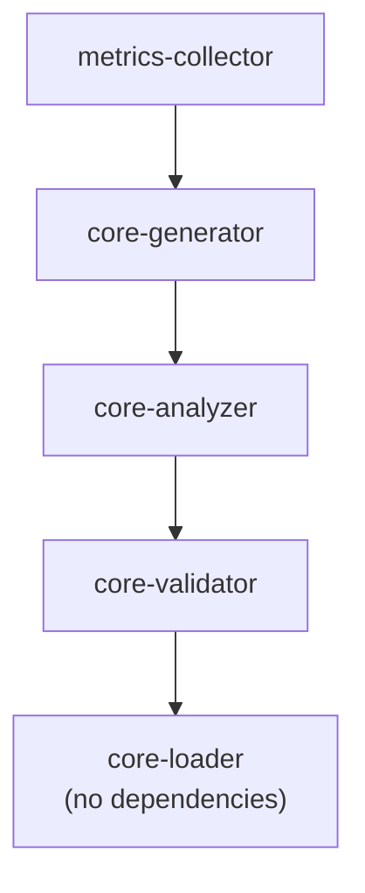

# Bundled Plugins

> Built-in plugins shipped with SAGE

---

## 1. Overview

SAGE includes several bundled plugins that provide core functionality. These plugins are automatically loaded and can be disabled if needed.


## Table of Contents

- [1. Overview](#1-overview)
- [2. Bundled Plugin List](#2-bundled-plugin-list)
- [3. core-loader](#3-core-loader)
- [4. core-analyzer](#4-core-analyzer)
- [5. core-validator](#5-core-validator)
- [6. core-generator](#6-core-generator)
- [7. metrics-collector](#7-metrics-collector)
- [8. Plugin Dependencies](#8-plugin-dependencies)
- [9. Disabling Bundled Plugins](#9-disabling-bundled-plugins)
- [10. Extending Bundled Plugins](#10-extending-bundled-plugins)
- [Related](#related)

---

## 2. Bundled Plugin List

| Plugin | Category | Purpose |
|--------|----------|---------|
| `core-loader` | Knowledge | Knowledge loading system |
| `core-analyzer` | Analysis | Content analysis |
| `core-validator` | Validation | Format and link checking |
| `core-generator` | Output | Content generation |
| `metrics-collector` | Monitoring | System metrics |

---

## 3. core-loader

### 3.1 Description

Handles loading knowledge from various sources.

### 3.2 Capabilities

| Capability | Family | Description |
|------------|--------|-------------|
| `file_loader` | analyzers | Load from filesystem |
| `url_loader` | analyzers | Load from URLs |
| `cache_manager` | monitors | Manage knowledge cache |

### 3.3 Configuration

```yaml
plugins:
  core-loader:
    paths:
      - .knowledge/
      - .context/
      - docs/
    cache:
      enabled: true
      ttl_seconds: 3600
```
---

## 4. core-analyzer

### 4.1 Description

Provides content analysis and knowledge graph building.

### 4.2 Capabilities

| Capability | Family | Description |
|------------|--------|-------------|
| `content_parser` | analyzers | Parse document content |
| `structure_analyzer` | analyzers | Analyze document structure |
| `relation_builder` | analyzers | Build knowledge relations |
| `classifier` | analyzers | Classify content |

### 4.3 Configuration

```yaml
plugins:
  core-analyzer:
    parsing:
      extract_code: true
      extract_tables: true
    classification:
      auto_tag: true
```
---

## 5. core-validator

### 5.1 Description

Validates knowledge base integrity and format compliance.

### 5.2 Capabilities

| Capability | Family | Description |
|------------|--------|-------------|
| `format_checker` | checkers | Check document format |
| `link_checker` | checkers | Validate internal links |
| `schema_validator` | checkers | Validate against schemas |
| `naming_checker` | checkers | Check naming conventions |

### 5.3 Configuration

```yaml
plugins:
  core-validator:
    strict: false
    checks:
      format: true
      links: true
      naming: true
    ignore_patterns:
      - "*.draft.md"
```
---

## 6. core-generator

### 6.1 Description

Generates output content for various channels.

### 6.2 Capabilities

| Capability | Family | Description |
|------------|--------|-------------|
| `markdown_generator` | generators | Generate Markdown |
| `index_generator` | generators | Generate index files |
| `template_renderer` | generators | Render templates |
| `toc_generator` | generators | Generate TOC |

### 6.3 Configuration

```yaml
plugins:
  core-generator:
    templates:
      path: templates/
    output:
      format: markdown
      line_limit: 300
```
---

## 7. metrics-collector

### 7.1 Description

Collects and exposes system metrics.

### 7.2 Capabilities

| Capability | Family | Description |
|------------|--------|-------------|
| `operation_metrics` | monitors | Track operation performance |
| `resource_metrics` | monitors | Monitor resource usage |
| `health_checker` | monitors | System health checks |

### 7.3 Configuration

```yaml
plugins:
  metrics-collector:
    enabled: true
    interval_seconds: 30
    exporters:
      - type: prometheus
        port: 9000
```
---

## 8. Plugin Dependencies


---

## 9. Disabling Bundled Plugins

```yaml
plugins:
  disabled:
    - metrics-collector  # Disable metrics
```
**Note:** Core plugins (`core-loader`, `core-analyzer`) cannot be disabled as they provide essential functionality.

---

## 10. Extending Bundled Plugins

Bundled plugins can be extended via hooks:

```python
class MyExtension(Plugin):
    def register(self, container: Container) -> None:
        # Add hook to core-analyzer
        container.register_hook(
            point="post_analyze",
            handler=self._enhance_analysis
        )
    
    def _enhance_analysis(self, context: Context, result: AnalysisResult) -> AnalysisResult:
        # Enhance the result
        return result.with_extra_metadata(...)
```
---

## Related

- `PLUGIN_ARCHITECTURE.md` — Plugin system design
- `EXTENSION_POINTS.md` — Extension points
- `../capabilities/INDEX.md` — Capability families

---

*AI Collaboration Knowledge Base*
