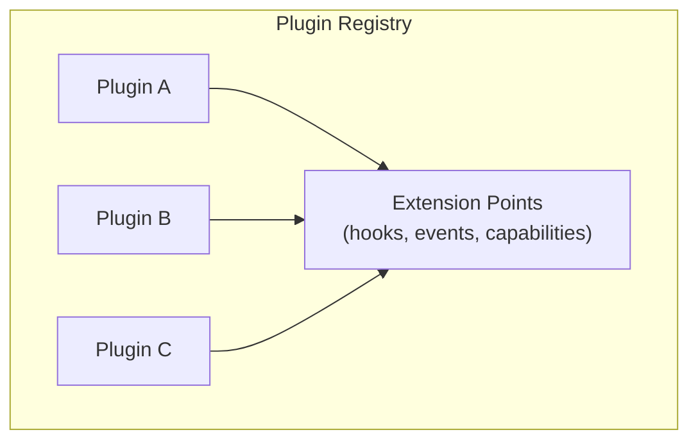

# Plugins

> Plugin system architecture for SAGE extensibility

---

## 1. Overview

The plugin system provides a standardized way to extend SAGE functionality without modifying core code.

## Table of Contents

- [1. Overview](#1-overview)
- [2. Documents](#2-documents)
- [3. Plugin Architecture](#3-plugin-architecture)
- [4. Plugin Lifecycle](#4-plugin-lifecycle)
- [5. Extension Points](#5-extension-points)

---
---

## 2. Documents

| Document | Description | Status |
|----------|-------------|--------|
| `PLUGIN_ARCHITECTURE.md` | Plugin system design | Planned |
| `EXTENSION_POINTS.md` | Available extension points | Planned |
| `PLUGIN_LIFECYCLE.md` | Plugin lifecycle management | Planned |
| `BUNDLED_PLUGINS.md` | Built-in plugins | Planned |

---

## 3. Plugin Architecture

---

## 4. Plugin Lifecycle

---

## 5. Extension Points

| Extension Point | Purpose | Example |
|-----------------|---------|---------|
| **Capability** | Add new capabilities | Custom analyzer |
| **Hook** | Intercept operations | Pre-process hook |
| **Event** | React to events | On-load handler |
| **Config** | Custom configuration | Plugin settings |

---

## Related

- `../capabilities/INDEX.md` — Capability system
- `../core_engine/INDEX.md` — Core engine
- `.context/decisions/ADR_0008_PLUGIN_SYSTEM.md` — Plugin ADR

---

*AI Collaboration Knowledge Base*
