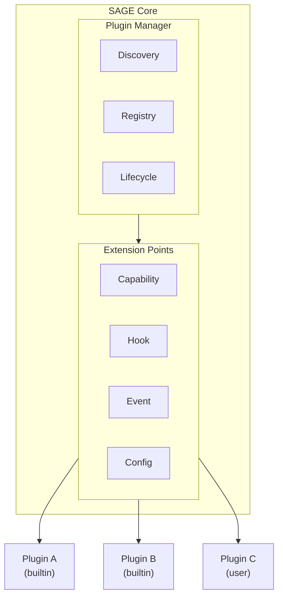

# Plugin Architecture

> Extensible plugin system design for SAGE

---

## 1. Overview

The plugin architecture enables extending SAGE functionality without modifying core code, supporting custom capabilities, integrations, and behaviors.

## Table of Contents

- [1. Overview](#1-overview)
- [2. Architecture Diagram](#2-architecture-diagram)
- [3. Core Components](#3-core-components)
- [4. Plugin Interface](#4-plugin-interface)
- [5. Plugin Manifest](#5-plugin-manifest)
- [6. Plugin Manager](#6-plugin-manager)
- [7. Plugin Discovery](#7-plugin-discovery)
- [8. Dependency Resolution](#8-dependency-resolution)
- [9. Plugin Isolation](#9-plugin-isolation)
- [10. Configuration](#10-configuration)
- [Related](#related)

---

## 2. Architecture Diagram


---

## 3. Core Components

| Component | Responsibility |
|-----------|---------------|
| **Plugin Manager** | Orchestrates plugin lifecycle |
| **Discovery** | Finds available plugins |
| **Registry** | Stores plugin metadata |
| **Lifecycle** | Manages enable/disable/update |
| **Extension Points** | Defines where plugins can hook |

---

## 4. Plugin Interface

```python
from abc import ABC, abstractmethod
from typing import Any
class Plugin(ABC):
    """Base class for all SAGE plugins."""
    
    @property
    @abstractmethod
    def name(self) -> str:
        """Unique plugin identifier."""
        ...
    
    @property
    @abstractmethod
    def version(self) -> str:
        """Plugin version (semver)."""
        ...
    
    @property
    def dependencies(self) -> list[str]:
        """List of required plugin names."""
        return []
    
    @abstractmethod
    def register(self, container: Container) -> None:
        """Register plugin components with DI container."""
        ...
    
    def on_load(self) -> None:
        """Called when plugin is loaded."""
        pass
    
    def on_unload(self) -> None:
        """Called when plugin is unloaded."""
        pass
```
---

## 5. Plugin Manifest

```yaml
# plugin.yaml
name: my-custom-plugin
version: 1.0.0
description: A custom SAGE plugin
author: Developer Name
sage:
  min_version: "0.1.0"
  max_version: "1.0.0"
dependencies:
  - core-utils >= 1.0
entry_point: my_plugin:MyPlugin
capabilities:
  - type: analyzer
    name: custom_analyzer
config:
  settings:
    option_a:
      type: string
      default: "value"
    option_b:
      type: integer
      default: 100
```
---

## 6. Plugin Manager

```python
class PluginManager:
    def __init__(self, container: Container):
        self.container = container
        self.registry: dict[str, PluginInfo] = {}
        self.loaded: dict[str, Plugin] = {}
    
    def discover(self, paths: list[Path]) -> list[PluginInfo]:
        """Discover plugins in specified paths."""
        plugins = []
        for path in paths:
            for manifest in path.glob("**/plugin.yaml"):
                info = PluginInfo.from_manifest(manifest)
                plugins.append(info)
        return plugins
    
    def load(self, plugin_name: str) -> Plugin:
        """Load and initialize a plugin."""
        info = self.registry[plugin_name]
        
        # Check dependencies
        for dep in info.dependencies:
            if dep not in self.loaded:
                self.load(dep)
        
        # Load plugin
        plugin = info.load()
        plugin.register(self.container)
        plugin.on_load()
        
        self.loaded[plugin_name] = plugin
        return plugin
    
    def unload(self, plugin_name: str) -> None:
        """Unload a plugin."""
        plugin = self.loaded.pop(plugin_name)
        plugin.on_unload()
```
---

## 7. Plugin Discovery

### 7.1 Discovery Paths

| Path | Type | Priority |
|------|------|----------|
| `src/sage/plugins/` | Built-in | Highest |
| `~/.sage/plugins/` | User | Medium |
| `./plugins/` | Project | Lowest |

### 7.2 Discovery Process

```text
1. Scan discovery paths
2. Find plugin.yaml manifests
3. Parse and validate manifests
4. Check version compatibility
5. Register in plugin registry
```
---

## 8. Dependency Resolution

```python
class DependencyResolver:
    def resolve(self, plugins: list[PluginInfo]) -> list[PluginInfo]:
        """Return plugins in load order (dependencies first)."""
        resolved = []
        seen = set()
        
        def visit(plugin: PluginInfo):
            if plugin.name in seen:
                return
            seen.add(plugin.name)
            
            for dep_name in plugin.dependencies:
                dep = self._find_plugin(dep_name)
                visit(dep)
            
            resolved.append(plugin)
        
        for plugin in plugins:
            visit(plugin)
        
        return resolved
```
---

## 9. Plugin Isolation

### 9.1 Namespace Isolation

```python
# Each plugin gets its own namespace
plugin_namespace = f"sage.plugins.{plugin.name}"
```
### 9.2 Resource Limits

| Resource | Limit | Configurable |
|----------|-------|--------------|
| Memory | 100 MB | Yes |
| CPU time | 5s per call | Yes |
| File access | Plugin dir only | No |

---

## 10. Configuration

```yaml
plugins:
  # Discovery paths
  paths:
    - ~/.sage/plugins
    - ./plugins
  
  # Enabled plugins
  enabled:
    - core-analyzer
    - custom-checker
  
  # Disabled plugins
  disabled:
    - experimental-feature
  
  # Plugin-specific config
  config:
    custom-checker:
      strict_mode: true
```
---

## Related

- `EXTENSION_POINTS.md` — Where plugins hook in
- `PLUGIN_LIFECYCLE.md` — Plugin states
- `BUNDLED_PLUGINS.md` — Built-in plugins

---

*AI Collaboration Knowledge Base*
