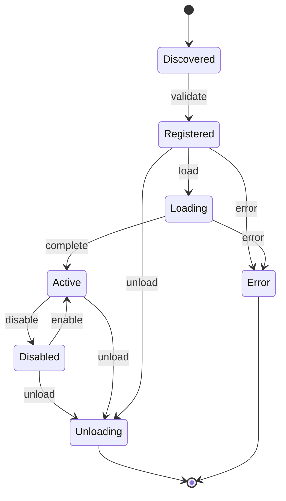
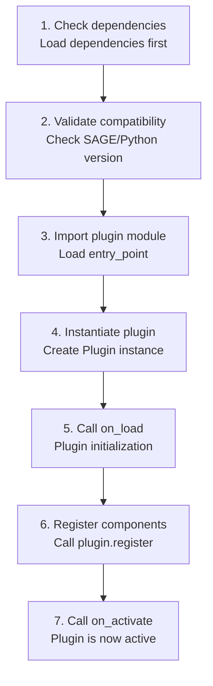

# Plugin Lifecycle

> Plugin states and lifecycle management

---

## 1. Overview

Plugins go through a defined lifecycle from discovery to unload, with clear states and transitions managed by the Plugin Manager.


## Table of Contents

- [1. Overview](#1-overview)
- [2. Lifecycle States](#2-lifecycle-states)
- [3. State Diagram](#3-state-diagram)
- [4. Lifecycle Events](#4-lifecycle-events)
- [5. Lifecycle Hooks](#5-lifecycle-hooks)
- [6. State Management](#6-state-management)
- [7. Loading Process](#7-loading-process)
- [8. Unloading Process](#8-unloading-process)
- [9. Error Handling](#9-error-handling)
- [10. Configuration](#10-configuration)
- [Related](#related)

---

## 2. Lifecycle States

| State | Description |
|-------|-------------|
| **Discovered** | Found but not validated |
| **Registered** | Validated and in registry |
| **Loading** | Being initialized |
| **Active** | Fully operational |
| **Disabled** | Temporarily inactive |
| **Unloading** | Being shut down |
| **Error** | Failed state |

---

## 3. State Diagram


---

## 4. Lifecycle Events

| Event | From State | To State | Trigger |
|-------|------------|----------|---------|
| `validate` | Discovered | Registered | Manifest OK |
| `load` | Registered | Loading | User/config |
| `complete` | Loading | Active | Init success |
| `disable` | Active | Disabled | User request |
| `enable` | Disabled | Active | User request |
| `unload` | Any | Unloading | Shutdown |
| `error` | Any | Error | Exception |

---

## 5. Lifecycle Hooks

```python
class Plugin(ABC):
    """Plugin lifecycle hooks."""
    
    def on_discover(self) -> None:
        """Called when plugin is discovered."""
        pass
    
    def on_validate(self) -> ValidationResult:
        """Validate plugin before registration."""
        return ValidationResult(valid=True)
    
    def on_load(self) -> None:
        """Called when plugin is being loaded."""
        pass
    
    def on_activate(self) -> None:
        """Called when plugin becomes active."""
        pass
    
    def on_disable(self) -> None:
        """Called when plugin is disabled."""
        pass
    
    def on_enable(self) -> None:
        """Called when plugin is re-enabled."""
        pass
    
    def on_unload(self) -> None:
        """Called when plugin is being unloaded."""
        pass
    
    def on_error(self, error: Exception) -> None:
        """Called when plugin encounters an error."""
        pass
```
---

## 6. State Management

```python
class PluginState(Enum):
    DISCOVERED = "discovered"
    REGISTERED = "registered"
    LOADING = "loading"
    ACTIVE = "active"
    DISABLED = "disabled"
    UNLOADING = "unloading"
    ERROR = "error"

class PluginLifecycleManager:
    def __init__(self):
        self.states: dict[str, PluginState] = {}
        self.errors: dict[str, Exception] = {}
    
    def transition(self, plugin_name: str, to_state: PluginState) -> bool:
        current = self.states.get(plugin_name, PluginState.DISCOVERED)
        
        if not self._is_valid_transition(current, to_state):
            raise InvalidTransitionError(current, to_state)
        
        self.states[plugin_name] = to_state
        self._emit_event(plugin_name, current, to_state)
        return True
    
    def _is_valid_transition(self, from_state: PluginState, to_state: PluginState) -> bool:
        valid_transitions = {
            PluginState.DISCOVERED: [PluginState.REGISTERED, PluginState.ERROR],
            PluginState.REGISTERED: [PluginState.LOADING, PluginState.UNLOADING],
            PluginState.LOADING: [PluginState.ACTIVE, PluginState.ERROR],
            PluginState.ACTIVE: [PluginState.DISABLED, PluginState.UNLOADING, PluginState.ERROR],
            PluginState.DISABLED: [PluginState.ACTIVE, PluginState.UNLOADING],
        }
        return to_state in valid_transitions.get(from_state, [])
```
---

## 7. Loading Process


---

## 8. Unloading Process

```python
async def unload_plugin(self, plugin_name: str) -> None:
    plugin = self.loaded[plugin_name]
    
    # 1. Check dependents
    dependents = self._get_dependents(plugin_name)
    for dep in dependents:
        await self.unload_plugin(dep)
    
    # 2. Transition state
    self.lifecycle.transition(plugin_name, PluginState.UNLOADING)
    
    # 3. Call on_unload hook
    try:
        plugin.on_unload()
    except Exception as e:
        logger.error(f"Error unloading {plugin_name}: {e}")
    
    # 4. Unregister components
    self._unregister_components(plugin)
    
    # 5. Remove from loaded
    del self.loaded[plugin_name]
```
---

## 9. Error Handling

| Error Type | Handling | Recovery |
|------------|----------|----------|
| **Load failure** | Log, skip | Try again on restart |
| **Runtime error** | Log, disable | Re-enable manually |
| **Dependency missing** | Log, skip | Install dependency |
| **Version mismatch** | Log, skip | Update plugin/SAGE |

```python
def handle_plugin_error(self, plugin_name: str, error: Exception) -> None:
    # Transition to error state
    self.lifecycle.transition(plugin_name, PluginState.ERROR)
    self.lifecycle.errors[plugin_name] = error
    
    # Notify plugin
    if plugin := self.loaded.get(plugin_name):
        try:
            plugin.on_error(error)
        except Exception:
            pass
    
    # Emit event
    self.event_bus.publish(Event(
        topic="plugin.error",
        payload={"name": plugin_name, "error": str(error)}
    ))
```
---

## 10. Configuration

```yaml
plugins:
  lifecycle:
    # Auto-load on startup
    auto_load: true
    
    # Retry failed loads
    retry_failed: true
    retry_count: 3
    retry_delay_ms: 1000
    
    # Unload timeout
    unload_timeout_ms: 5000
```
---

## Related

- `PLUGIN_ARCHITECTURE.md` — Plugin system design
- `EXTENSION_POINTS.md` — Extension points
- `../core_engine/BOOTSTRAP.md` — System startup

---

*AI Collaboration Knowledge Base*
